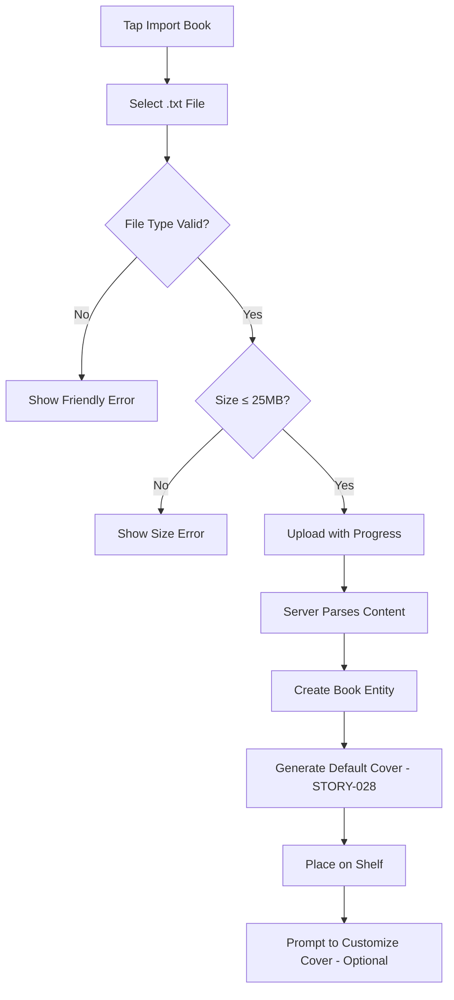

# STORY-045: TXT File Import

**Epic**: EPIC-005
**Persona**: Julia — The Young Author
**Priority**: Could Have (V1.1 per PM-HANDOFF)
**Story Points**: 5
**Dependencies**: STORY-004 (Data Model), STORY-005 (Core API), STORY-009 (Bookshelf Grid)

## User Story
As a young author, I want to import a .txt file from my device and see it appear as a book on my shelf, so I can add stories I wrote elsewhere or downloaded to my library.

## Description
Implement the TXT file import pipeline: Julia selects a .txt file from her device via a file picker, the system uploads it to the server for parsing and content extraction, and a new imported book appears on her shelf with the filename as the title and a default cover (STORY-028). The book is read-only (imported content cannot be edited). The flow includes a progress indicator and friendly error messages.

## Context
TXT is the simplest format and should be the first import format implemented. This story establishes the import pipeline architecture that PDF (STORY-046) and EPUB (STORY-047) will build on. Import must not block STORY-028 (Default Cover Generation) — imported books use the same default cover system.

## Acceptance Criteria (Verifiable)
- [ ] GIVEN Julia taps "Import Book" from the shelf or menu
      WHEN the file picker opens
      THEN she can select a .txt file from her device and only .txt files are offered (or validated post-selection)
- [ ] GIVEN Julia selects a .txt file named "my-dragon-story.txt"
      WHEN the import completes
      THEN a new book appears on her shelf with title "my-dragon-story" and a default cover
- [ ] GIVEN a .txt import is in progress
      WHEN the file is being uploaded and parsed
      THEN Julia sees a progress indicator (progress bar or spinner with percentage)
- [ ] GIVEN Julia selects a file that is not .txt (e.g., .docx, .exe)
      WHEN the validation runs
      THEN she sees a friendly message: "Oops! This file type isn't supported yet. Try a .txt file!"
- [ ] GIVEN Julia selects a .txt file larger than 25MB
      WHEN the file size is checked
      THEN she sees: "This file is too big. Maximum size is 25MB."
- [ ] GIVEN a .txt file is imported
      WHEN Julia opens the book in the reader
      THEN the text content displays correctly with line breaks and paragraphs preserved

## NFRs
- NFR-SEC-04: File content validated and sanitized before storage
- NFR-SEC-05: File MIME type validated; non-txt rejected server-side
- NFR-PERF-07: Import completes within 60s for files up to 25MB
- NFR-ACC-07: Error messages in Portuguese (primary) and English

## Definition of Done (DoD)
- [ ] Code reviewed by CodeReviewer
- [ ] Tests with coverage >= 90%
- [ ] Integration tests passing
- [ ] QA approved by QAAnalyst
- [ ] Documentation updated
- [ ] PR created by MergeRequestCreator

## Technical Notes
- File picker: `<input type="file" accept=".txt,text/plain">`
- Server-side parsing: read file content, extract title from filename (strip extension), store as `Book` with `source: "imported"` and format: `"txt"`
- Content storage: paragraphs split by double newline (`\n\n`), preserved as `Chapter` entities with a single default chapter
- Default cover: delegate to STORY-028 cover generation system with title text and auto-assigned color
- Book `isEditable` flag set to `false` for imported books (per EPIC-005 business rules)
- Progress: use `XMLHttpRequest` upload `progress` event or fetch with `ReadableStream` for progress reporting
- Size check: client-side (`file.size`) before upload + server-side max content-length validation

## User Flow

## Test Scenarios
- Scenario 1: Import small .txt file → appears on shelf with filename title and default cover
- Scenario 2: Import .txt with long content → paragraphs split correctly; readable in reader
- Scenario 3: Attempt .docx import → friendly rejection message
- Scenario 4: Attempt >25MB file → size error message
- Scenario 5: Import progress indicator visible during upload
