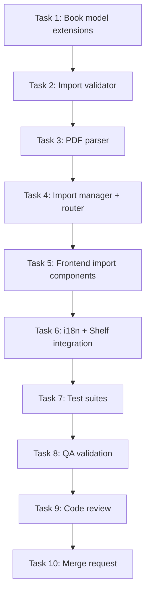

# STORY-046 Implementation Plan: PDF File Import

**Epic**: EPIC-005 | **Persona**: Julia — The Young Author
**Dependencies**: STORY-045 (TXT Import), STORY-009 (Bookshelf Grid), STORY-028 (Default Cover), STORY-006 (Asset Storage)
**Technical Analysis**: `/docs/stories/STORY-046-technical-analysis.md`

---

## Overview

Extend the import pipeline (STORY-045) to support PDF files. Julia selects a PDF, the system uploads it for server-side parsing via `pdfjs-dist`, extracts text content, renders the first page as a thumbnail cover, and creates an imported book. Scanned/image PDFs produce a friendly error message.

**Key constraint**: STORY-045 (TXT Import) is not yet implemented. STORY-046 must create the shared `backend/src/app/import/` domain module that both stories will use.

---

## Subtask Breakdown

### Task 1: Backend — Book Model Extensions + Migration

**Files to modify:**
- `backend/src/app/book/book-model.js`
- **New**: `backend/migrations/scripts/add-import-fields.js`

**Changes to `bookSchema`:**
```javascript
source: {
  type: String,
  enum: ['created', 'imported'],
  default: 'created',
},
format: {
  type: String,
  enum: ['txt', 'pdf', 'epub'],
  default: null,
},
isEditable: {
  type: Boolean,
  default: true,
},
```

**Migration**: Set all existing books to `source: 'created'`, `isEditable: true`, `format: null`.

**Test coverage:**
- Book with `source: 'imported'` persists correctly
- Book with `format: 'pdf'` and `isEditable: false` persists correctly
- Default values for existing books (no source/format/isEditable set)

---

### Task 2: Backend — Import Validator

**Files to create:**
- `backend/src/app/import/import-validator.js`
- `backend/src/app/import/__tests__/import-validator.test.js`

**Implementation:**
```javascript
const MAX_IMPORT_SIZE_BYTES = 25 * 1024 * 1024; // 25MB

const FORMAT_MIME_MAP = {
  pdf: { mimes: ['application/pdf'], magic: Buffer.from('%PDF-') },
  txt: { mimes: ['text/plain'], magic: null },
};

export function validateImportFile(file, format) {
  // 1. File exists
  // 2. MIME whitelist per format
  // 3. Magic bytes check (%PDF- for PDF)
  // 4. Size ≤ 25MB
  // 5. Reject executable MIME types (application/x-executable, etc.)
}
```

**Security checks:**
- PDF magic bytes: buffer starts with `%PDF-` (bytes `0x25 0x50 0x44 0x46 0x2D`)
- Reject double-extension spoofing (e.g., `file.pdf.exe`)
- Reject dangerous MIME types: `application/x-javascript`, `application/x-executable`, `application/x-msdownload`

**Test cases (10):**
1. Valid PDF file → passes
2. Non-PDF MIME → 400 INVALID_FILE_TYPE
3. Spoofed MIME (non-PDF with application/pdf) → 400 INVALID_FILE_TYPE
4. PDF >25MB → 413 PAYLOAD_TOO_LARGE
5. PDF at exactly 25MB → passes
6. File with no magic bytes match → 400
7. Null/undefined file → 400
8. Executable MIME type → 400
9. Valid TXT file → passes (shared validator)
10. TXT >25MB → 413

---

### Task 3: Backend — PDF Parser

**Files to create:**
- `backend/src/app/import/pdf-parser.js`
- `backend/src/app/import/__tests__/pdf-parser.test.js`

**Dependencies to add:** `pdfjs-dist`, `canvas`

**Implementation:**

```javascript
import { getDocument } from 'pdfjs-dist/legacy/build/pdf.js';
import { createCanvas } from 'canvas';

const SCANNED_THRESHOLD_CHARS = 50;

/**
 * Extract text and metadata from a PDF buffer.
 * @param {Buffer} buffer
 * @returns {{ text: string, title: string|null, author: string|null, numPages: number, isScanned: boolean }}
 */
export async function extractPdfContent(buffer) {
  const doc = await getDocument({
    data: new Uint8Array(buffer),
    disableJavaScript: true,
    disableAutoFetch: true,
  }).promise;

  let fullText = '';
  for (let i = 1; i <= doc.numPages; i++) {
    const page = await doc.getPage(i);
    const content = await page.getTextContent();
    const pageText = content.items.map(item => item.str).join(' ');
    fullText += pageText + '\n';
  }

  // Metadata
  const metadata = await doc.getMetadata();
  const info = metadata?.info || {};
  const title = info.Title || null;
  const author = info.Author || null;

  const isScanned = fullText.trim().length < SCANNED_THRESHOLD_CHARS;

  return {
    text: isScanned ? '' : fullText,
    title,
    author,
    numPages: doc.numPages,
    isScanned,
  };
}

/**
 * Render the first page of a PDF to a PNG buffer.
 * @param {Buffer} buffer
 * @param {{ width?: number, height?: number }} options
 * @returns {Promise<{ buffer: Buffer, width: number, height: number }>}
 */
export async function renderPdfThumbnail(buffer, { width = 200, height = 280 } = {}) {
  const doc = await getDocument({
    data: new Uint8Array(buffer),
    disableJavaScript: true,
    disableAutoFetch: true,
  }).promise;

  const page = await doc.getPage(1);
  const viewport = page.getViewport({ scale: 1 });
  
  // Calculate scale to fit target dimensions
  const scale = Math.min(width / viewport.width, height / viewport.height);
  const scaledViewport = page.getViewport({ scale });

  const canvas = createCanvas(scaledViewport.width, scaledViewport.height);
  const ctx = canvas.getContext('2d');

  await page.render({ canvasContext: ctx, viewport: scaledViewport }).promise;
  
  const pngBuffer = canvas.toBuffer('image/png');
  return { buffer: pngBuffer, width: scaledViewport.width, height: scaledViewport.height };
}
```

**Test cases (8):**
1. Text-based PDF → text extracted, `isScanned: false`
2. Scanned PDF (empty text) → `isScanned: true`, `text: ''`
3. PDF with metadata → title and author extracted
4. PDF without metadata → title/author null
5. Multi-page PDF → all pages concatenated
6. PDF thumbnail render → returns PNG buffer with correct dimensions
7. Corrupt PDF → throws error with `CORRUPT_PDF` code
8. PDF with JavaScript embedded → JS not executed (`disableJavaScript: true`)

**Test fixtures needed:**
- Small text-based PDF (1 page)
- Small text-based PDF (multi-page)
- Scanned/image PDF (no text layer)
- PDF with metadata (Title, Author)
- Corrupt/invalid PDF file

---

### Task 4: Backend — Import Manager + Router

**Files to create:**
- `backend/src/app/import/import-manager.js`
- `backend/src/app/import/import-router.js`
- `backend/src/app/import/__tests__/import-manager.test.js`
- `backend/src/app/import/__tests__/import-router.test.js`

**Files to modify:**
- `backend/src/app.js` — mount import router

**import-router.js:**
```javascript
import { Router } from 'express';
import multer from 'multer';

const importUpload = multer({
  storage: multer.memoryStorage(),
  limits: { fileSize: 25 * 1024 * 1024 }, // 25MB for imports
});

const router = Router();

// POST /pdf — Import PDF file
router.post('/pdf', importUpload.single('file'), async (req, res) => {
  // validate → parse → create book → return
});

// POST /txt — Import TXT file (STORY-045)
router.post('/txt', importUpload.single('file'), async (req, res) => {
  // STORY-045 implementation
});
```

**import-manager.js:**
```javascript
export async function importPdfManager({ childId, file }) {
  // 1. Validate (MIME + magic bytes + size)
  // 2. Parse PDF (extractPdfContent)
  // 3. If scanned → throw SCANNED_PDF error
  // 4. Sanitize text + metadata (DOMPurify)
  // 5. Determine title: PDF metadata → filename (strip .pdf)
  // 6. Create Book (source: 'imported', format: 'pdf', isEditable: false)
  // 7. Create single Chapter with extracted text (paragraphs split by \n\n)
  // 8. Render first page as thumbnail (renderPdfThumbnail)
  // 9. Process thumbnail through sharp (200x280 cover)
  // 10. Upload thumbnail to MinIO → create Asset → link book.coverAssetId
  // 11. Return { book, coverUrl }
}
```

**Mount in `app.js`:**
```javascript
import importRouter from './app/import/import-router.js';
app.use('/api/v1/import', importRouter); // after authMiddleware + rateLimitMiddleware
```

**import-router.test.js (12 tests):**
1. POST /import/pdf with valid text-based PDF → 201 + book created
2. POST /import/pdf with scanned PDF → 422 SCANNED_PDF
3. POST /import/pdf with non-PDF file → 400 INVALID_FILE_TYPE
4. POST /import/pdf >25MB → 413 PAYLOAD_TOO_LARGE
5. POST /import/pdf with no file → 400
6. POST /import/pdf corrupt file → 400 CORRUPT_PDF
7. POST /import/pdf creates chapter with extracted text
8. POST /import/pdf sets book source='imported', format='pdf', isEditable=false
9. POST /import/pdf with metadata → title extracted from PDF metadata
10. POST /import/pdf without metadata → title from filename
11. POST /import/pdf creates cover asset from first page thumbnail
12. POST /import/pdf without auth → 401

---

### Task 5: Frontend — Import Hooks + Components

**Files to create:**
- `frontend/src/hooks/useImportBook.js`
- `frontend/src/components/import/ImportDialog.jsx`
- `frontend/src/components/import/ImportProgressBar.jsx`
- `frontend/src/components/import/ImportError.jsx`
- `frontend/src/__tests__/useImportBook.test.js`
- `frontend/src/__tests__/ImportDialog.test.jsx`

**useImportBook.js:**
```javascript
import { useMutation, useQueryClient } from '@tanstack/react-query';
import apiClient from '../lib/api-client';

export default function useImportBook(format = 'pdf') {
  const queryClient = useQueryClient();

  return useMutation({
    mutationFn: async ({ file, onProgress }) => {
      return new Promise((resolve, reject) => {
        const xhr = new XMLHttpRequest();
        const formData = new FormData();
        formData.append('file', file);

        xhr.upload.onprogress = (e) => {
          if (e.lengthComputable && onProgress) {
            onProgress(Math.round((e.loaded / e.total) * 100));
          }
        };

        xhr.onload = () => {
          if (xhr.status >= 200 && xhr.status < 300) {
            resolve(JSON.parse(xhr.responseText));
          } else {
            const err = JSON.parse(xhr.responseText);
            reject(new Error(err.error?.message || 'Import failed'));
          }
        };

        xhr.onerror = () => reject(new Error('UPLOAD_FAILED'));
        xhr.open('POST', `/api/v1/import/${format}`);
        // Auth header from stored token
        xhr.setRequestHeader('Authorization', `Bearer ${getToken()}`);
        xhr.send(formData);
      });
    },
    onSuccess: () => {
      queryClient.invalidateQueries({ queryKey: ['books'] });
    },
  });
}
```

**ImportDialog.jsx:**
- Flowbite `Modal` component, accessible (focus trap, Escape close)
- File picker: `<input type="file" accept=".pdf,application/pdf">`
- Shows ImportProgressBar during upload
- Shows ImportError on failure
- Shows success → auto-closes after book appears on shelf
- Handles scanned-PDF specific error message
- Respects `prefers-reduced-motion` for any animation

**ImportProgressBar.jsx:**
- Linear progress bar (Flowbite `Progress`)
- Shows percentage during upload
- Transitions to "Processing..." after upload completes (server-side parsing)
- Respects `prefers-reduced-motion`

**ImportError.jsx:**
- Displays error message from API response
- Special handling for `SCANNED_PDF` code
- "Try again" button
- i18n-translated messages

**Test cases (8):**
1. Hook: successful import → calls API, invalidates cache
2. Hook: scanned PDF → returns error
3. Hook: upload failure → UPLOAD_FAILED error
4. Dialog: renders file picker with PDF accept
5. Dialog: shows progress bar during upload
6. Dialog: shows scanned PDF error message
7. Dialog: closes on success
8. Dialog: accessible — focus trap, Escape close

---

### Task 6: Frontend — i18n + Shelf Integration

**Files to create:**
- `frontend/src/i18n/locales/en/import.json`
- `frontend/src/i18n/locales/pt-BR/import.json`

**Files to modify:**
- `frontend/src/app/shelf/ShelfPage.jsx` — Add "Import Book" button
- `frontend/src/i18n/locales/en/errors.json` — Add PDF error codes
- `frontend/src/i18n/locales/pt-BR/errors.json` — Add PDF error codes

**English import strings (`en/import.json`):**
```json
{
  "title": "Import Book",
  "button": "Import a Book",
  "buttonPdf": "Import PDF",
  "buttonTxt": "Import Text File",
  "selectFile": "Choose a file from your device",
  "uploading": "Uploading…",
  "processing": "Processing your book…",
  "progress": "{{percent}}% uploaded",
  "success": "Your book is on the shelf!",
  "scannedPdf": "This PDF has no text to read. It might be a scanned image. Try a text-based PDF!",
  "unsupportedType": "Oops! This file type isn't supported yet. Try a PDF file!",
  "fileTooBig": "This file is too big. Maximum size is 25MB.",
  "uploadFailed": "Upload failed. Check your connection and try again!",
  "corruptPdf": "This PDF seems broken. Try a different file!"
}
```

**Portuguese strings (`pt-BR/import.json`):**
```json
{
  "title": "Importar Livro",
  "button": "Importar um Livro",
  "buttonPdf": "Importar PDF",
  "buttonTxt": "Importar Arquivo de Texto",
  "selectFile": "Escolha um arquivo do seu dispositivo",
  "uploading": "Enviando…",
  "processing": "Processando seu livro…",
  "progress": "{{percent}}% enviado",
  "success": "Seu livro está na prateleira!",
  "scannedPdf": "Este PDF não tem texto para ler. Pode ser uma imagem escaneada. Tente um PDF com texto!",
  "unsupportedType": "Ops! Esse tipo de arquivo não é suportado ainda. Tente um arquivo PDF!",
  "fileTooBig": "Esse arquivo é grande demais. O tamanho máximo é 25MB.",
  "uploadFailed": "Falha no envio. Verifique sua conexão e tente novamente!",
  "corruptPdf": "Esse PDF parece estar com problema. Tente outro arquivo!"
}
```

**ShelfPage changes:**
- Add "Import Book" button (floating action button or menu item)
- On click: open ImportDialog
- After successful import: book appears on shelf via cache invalidation

---

### Task 7: Test Suites — Comprehensive Coverage

**Backend tests:**
- `pdf-parser.test.js` — 8 test cases (see Task 3)
- `import-validator.test.js` — 10 test cases (see Task 2)
- `import-manager.test.js` — 8 unit tests
- `import-router.test.js` — 12 integration tests (see Task 4)

**Frontend tests:**
- `useImportBook.test.js` — 3 unit tests
- `ImportDialog.test.jsx` — 5 component tests
- `ImportProgressBar.test.jsx` — 2 component tests
- `ImportError.test.jsx` — 2 component tests

**Target:** ≥90% coverage for all new modules

---

### Task 8: QA Validation

**Acceptance Criteria verification:**

| AC | Test | Expected |
|----|------|----------|
| AC1 | Import text-based PDF → book on shelf with extracted title | Book appears with PDF metadata title or filename |
| AC2 | Import text-based PDF → first page thumbnail as cover | Cover shows PDF first page (not default cover) |
| AC3 | Import scanned PDF → friendly message | "This PDF has no text to read…" message, no book created |
| AC4 | Import pipeline validates: size ≤25MB, progress, error for unsupported types | All validations work for PDF |
| AC5 | Network failure mid-upload → partial discarded, retry message | "Upload failed. Check your connection…" message |

**NFR checks:**
- NFR-SEC-04: PDF with embedded JS → no execution, content sanitized
- NFR-SEC-05: Non-PDF with spoofed MIME → rejected server-side
- NFR-PERF-07: 25MB PDF import ≤60s
- NFR-ACC-07: All messages available in pt-BR and en

---

## Execution Order



**Sequential**: Tasks 1→2→3→4 (model → validator → parser → manager/router)
**Parallel possible**: Tasks 3 + 5 (PDF parser backend + frontend components are independent)
**After Task 4**: Tasks 5+6 can start when backend API is contract-defined
**Sequential**: Tasks 7→8→9→10

**Recommended parallelization:**
- Phase 1: Tasks 1→2 (sequential backend foundation)
- Phase 2: Tasks 3 + 5 (parallel: backend parser + frontend components) — **max 2 agents**
- Phase 3: Task 4 (backend manager/router depends on Task 3)
- Phase 4: Task 6 (frontend integration)
- Phase 5: Tasks 7→8→9→10 (test → QA → review → MR)

---

## New Dependencies

**Backend:**
- `pdfjs-dist` (v4.x) — PDF rendering engine
- `canvas` (node-canvas) — Server-side canvas for thumbnail rendering

**Frontend:** None (all needed deps already in `package.json`)

**Dockerfile changes:** `canvas` requires `cairo`, `pango`, `libjpeg` — add build deps:
```dockerfile
RUN apk add --no-cache cairo pango libpng libjpeg-turbo
```

---

## Documents Referenced

- PM Story: `/docs/stories/STORY-046.md`
- Dependent Story: `/docs/stories/STORY-045.md`
- Technical Analysis: `/docs/stories/STORY-046-technical-analysis.md`
- Tech Stack: `/docs/architecture/TECH-STACK.md`