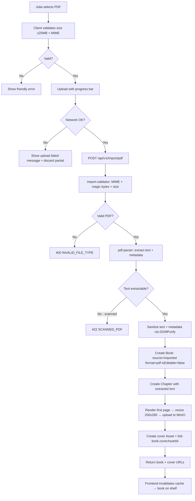
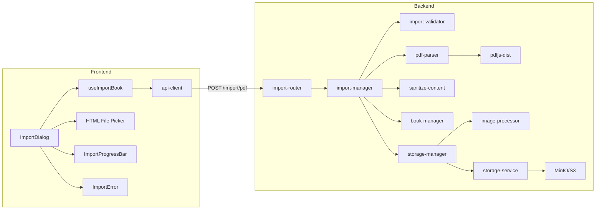
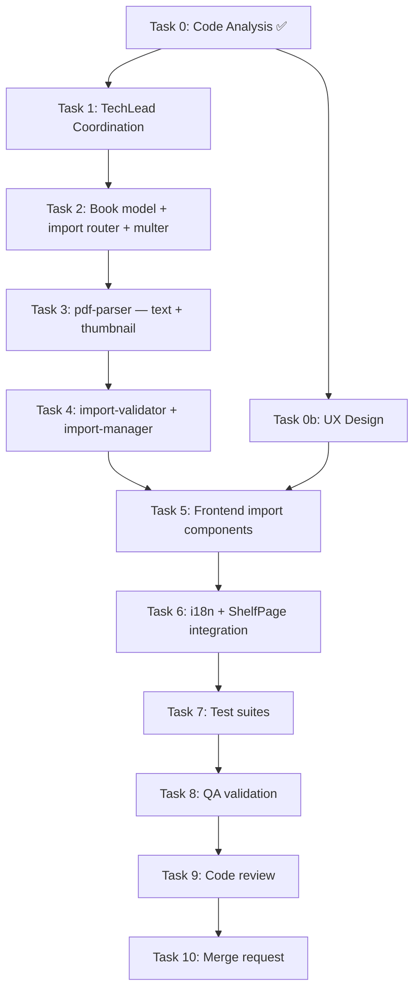

# STORY-046: PDF File Import — Technical Analysis

**Epic**: EPIC-005 | **Persona**: Julia — The Young Author | **Priority**: Could Have | **Points**: 5
**Dependencies**: STORY-045 (TXT Import — establishes pipeline), STORY-009 (Bookshelf Grid), STORY-028 (Default Cover), STORY-006 (Asset Storage), STORY-027 (Image Upload)

**Stack**: Node.js 22 + Express 4 + MongoDB 7 / Mongoose 8 + MinIO + React 18 + Vite 5 + Tailwind + Zustand + TanStack Query
**Source**: `docs/architecture/TECH-STACK.md`

---

## 1. Code Analysis Summary

- **No import pipeline exists yet** — STORY-045 (TXT Import) not yet implemented. STORY-046 must either co-develop or layer on top of STORY-045's shared infrastructure.
- **Book model** (`book-model.js`): No `source`, `format`, or `isEditable` fields exist. Must add migration for `source: "imported"|"created"`, `format: "txt"|"pdf"|"epub"`, `isEditable: boolean`.
- **Asset model**: `type` enum = `['cover', 'cover_thumbnail', 'spine', 'edge', 'upload']`. Need to add `'import_file'` or extend `'upload'` with metadata.
- **File validator** (`file-validator.js`): Currently only accepts image MIME types (`image/png`, `image/jpeg`, `image/webp`). Must extend or create parallel validator for document imports (`.pdf`, `.txt`).
- **Storage router** (`storage-router.js`): `multer` configured at 5MB limit. PDF import needs 25MB. Must create separate import multer instance.
- **Image processor** (`image-processor.js`): `sharp` used for thumbnail/cover generation at 300x450 and 600x900. PDF thumbnail (first-page render) can be piped through `sharp` after canvas→PNG conversion.
- **DOMPurify + jsdom** already in backend (`sanitize-content.js`) — reusable for PDF text sanitization.
- **Frontend**: No import components, file picker, or import-related hooks exist yet. Full import UI needs creation (shared with STORY-045).
- **i18n**: No `import` namespace exists in locale files. Must add `frontend/src/i18n/locales/{en,pt-BR}/import.json`.

---

## 2. Impacted Components

| File | Change Type | Description |
|------|-------------|-------------|
| **New**: `backend/src/app/import/import-router.js` | **Create** | Import API routes: `POST /api/v1/import/pdf`, `POST /api/v1/import/txt` |
| **New**: `backend/src/app/import/import-manager.js` | **Create** | Import business logic: PDF parsing, text extraction, thumbnail generation, book creation |
| **New**: `backend/src/app/import/pdf-parser.js` | **Create** | PDF text extraction + metadata + first-page thumbnail rendering using `pdf-parse` |
| **New**: `backend/src/app/import/import-validator.js` | **Create** | Document import validator: MIME check, magic bytes for PDF, size ≤25MB |
| **New**: `backend/src/app/import/__tests__/import-router.test.js` | **Create** | Router integration tests |
| **New**: `backend/src/app/import/__tests__/import-manager.test.js` | **Create** | Manager unit tests |
| **New**: `backend/src/app/import/__tests__/pdf-parser.test.js` | **Create** | PDF parser unit tests (text-based PDF, scanned PDF, metadata extraction) |
| **New**: `backend/src/app/import/__tests__/import-validator.test.js` | **Create** | Validator unit tests |
| `backend/src/app/book/book-model.js` | **Modify** | Add `source`, `format`, `isEditable` fields to Book schema |
| `backend/src/app/book/book-dao.js` | **Modify** | Support creating Book with `source: "imported"`, `isEditable: false` |
| `backend/src/app/storage/storage-router.js` | **Modify** | Separate multer for imports (25MB limit) or route through import router |
| `backend/src/app.js` | **Modify** | Mount import router at `/api/v1/import` |
| **New**: `frontend/src/hooks/useImportBook.js` | **Create** | TanStack Query mutation for importing books (TXT + PDF) |
| **New**: `frontend/src/components/import/ImportDialog.jsx` | **Create** | File picker modal + progress indicator + error display |
| **New**: `frontend/src/components/import/ImportProgressBar.jsx` | **Create** | Upload progress bar component |
| **New**: `frontend/src/components/import/ImportError.jsx` | **Create** | Friendly error message display for import failures |
| `frontend/src/app/shelf/ShelfPage.jsx` | **Modify** | Add "Import Book" button/trigger |
| `frontend/src/i18n/locales/en/import.json` | **Create** | English import UI strings |
| `frontend/src/i18n/locales/pt-BR/import.json` | **Create** | Portuguese import UI strings |
| `frontend/src/i18n/locales/en/errors.json` | **Modify** | Add PDF-specific error strings |
| `frontend/src/i18n/locales/pt-BR/errors.json` | **Modify** | Add PDF-specific error strings |

---

## 3. Technical Approach

### 3.1 New `import` Domain Module (Shared with STORY-045)

Story notes explicitly state STORY-046 "reuses the same pipeline as STORY-045". Create a shared `backend/src/app/import/` domain module that handles all import formats:

- **`import-router.js`**: Two routes + one shared upload middleware
  - `POST /api/v1/import/txt` — TXT import (STORY-045)
  - `POST /api/v1/import/pdf` — PDF import (STORY-046)
  - Or: `POST /api/v1/import` with `format` field — single endpoint, format-specific parsing downstream
- **`import-manager.js`**: Orchestrates: validate → parse (format-specific) → create book → generate cover → return
- **`pdf-parser.js`**: PDF-specific logic (this story's core)
- **`import-validator.js`**: Format-aware validation (MIME whitelist per format, 25MB limit, magic bytes)

### 3.2 PDF Text Extraction

**Library choice**: `pdf-parse` (lightweight, pure JS, wraps `pdf.js`) over raw `pdf.js` (lower-level, more config).

```javascript
import pdf from 'pdf-parse';

export async function extractPdfText(buffer) {
  const data = await pdf(buffer);
  return {
    text: data.text,
    metadata: data.info || {},   // { Title, Author, etc. }
    numPages: data.numpages,
  };
}
```

**Scanned PDF detection**: If `data.text.trim().length === 0` → classify as scanned/image PDF → return friendly error, no book created.

### 3.3 PDF First-Page Thumbnail

`pdf-parse` does not render pages to images. For thumbnail:

**Option A (Recommended)**: Use `pdfjs-dist` (Mozilla PDF.js) for first-page canvas rendering → PNG buffer → pipe through `sharp` for 200x280px cover thumbnail → upload to MinIO.

```javascript
import { getDocument } from 'pdfjs-dist/legacy/build/pdf.js';

export async function renderPdfFirstPage(buffer) {
  const doc = await getDocument({ data: new Uint8Array(buffer), disableJavaScript: true }).promise;
  const page = await doc.getPage(1);
  const viewport = page.getViewport({ scale: 0.5 }); // ~200px wide for A4
  const canvasFactory = new NodeCanvasFactory();
  const canvasAndCtx = canvasFactory.create(viewport.width, viewport.height);
  await page.render({ canvasContext: canvasAndCtx.ctx, viewport }).promise;
  // canvas → PNG buffer → sharp for exact 200x280 sizing
  const pngBuffer = canvasAndCtx.canvas.toBuffer();
  return { buffer: pngBuffer, width: viewport.width, height: viewport.height };
}
```

**Option B (Simpler, less accurate)**: If no PDF rendering available, skip thumbnail → use default cover (STORY-028) as fallback.

**Decision**: Use Option A with `pdfjs-dist` + `canvas` (node-canvas) for server-side rendering. Add `pdfjs-dist` and `canvas` as backend dependencies.

### 3.4 Security: PDF Sanitization (NFR-SEC-04, NFR-SEC-05)

- **Disable JavaScript execution**: `pdfjs-dist` config: `{ disableJavaScript: true, disableAutoFetch: true }`
- **MIME validation**: Accept only `application/pdf`; verify magic bytes `%PDF-` at buffer start
- **Content sanitization**: Extracted text runs through existing `sanitize-content.js` (DOMPurify) — strip all tags, keep only plain text
- **Metadata sanitization**: PDF metadata (title, author) sanitized via DOMPurify plain-text mode
- **No embedded script execution**: `pdf-parse`/`pdfjs-dist` with JS disabled; no form field execution

### 3.5 Book Model Extensions

Add to `bookSchema`:

```javascript
source: {
  type: String,
  enum: ['created', 'imported'],
  default: 'created',
},
format: {
  type: String,
  enum: ['txt', 'pdf', 'epub'],
  default: null,
},
isEditable: {
  type: Boolean,
  default: true,
},
```

**Migration**: Existing books get `source: 'created'`, `isEditable: true`, `format: null`.

### 3.6 Import Flow (End-to-End)

1. **Frontend**: Julia opens Import dialog → selects PDF → file picker filters `application/pdf`
2. **Frontend**: Client-side check: `file.size ≤ 25MB`, MIME type
3. **Frontend**: `XMLHttpRequest.upload.progress` → progress bar
4. **Backend**: `POST /api/v1/import/pdf` with `multer` (25MB limit, `application/pdf` MIME filter)
5. **Backend**: `import-validator.js` — validate MIME, magic bytes `%PDF-`, size
6. **Backend**: `pdf-parser.js` — extract text + metadata, detect scanned
7. **Backend**: If scanned → return `422 SCANNED_PDF` with friendly message
8. **Backend**: If text-based → sanitize text, create Book (`source: 'imported'`, `format: 'pdf'`, `isEditable: false`)
9. **Backend**: Create Chapter with extracted text (single chapter, paragraphs from `\n\n` splits)
10. **Backend**: Render first page as PNG → `sharp` resize 200x280 → upload to MinIO → create Asset (`type: 'cover'`) → link `book.coverAssetId`
11. **Backend**: Return book + cover URLs to frontend
12. **Frontend**: Invalidate TanStack Query cache for books → book appears on shelf

### 3.7 Error Handling

| Error | Code | Status | Message (EN) | Message (PT-BR) |
|-------|------|--------|--------------|-----------------|
| Non-PDF file | `INVALID_FILE_TYPE` | 400 | Oops! This file type isn't supported yet. Try a PDF file! | Ops! Esse tipo de arquivo não é suportado ainda. Tente um arquivo PDF! |
| File >25MB | `PAYLOAD_TOO_LARGE` | 413 | This file is too big. Maximum size is 25MB. | Esse arquivo é grande demais. O tamanho máximo é 25MB. |
| Scanned PDF | `SCANNED_PDF` | 422 | This PDF has no text to read. It might be a scanned image. Try a text-based PDF! | Este PDF não tem texto para ler. Pode ser uma imagem escaneada. Tente um PDF com texto! |
| Upload failed | `UPLOAD_FAILED` | 502 | Upload failed. Check your connection and try again! | Falha no envio. Verifique sua conexão e tente novamente! |
| Invalid PDF | `CORRUPT_PDF` | 400 | This PDF seems broken. Try a different file! | Esse PDF parece estar com problema. Tente outro arquivo! |

---

## 4. Execution Architecture





---

## 5. NFR Analysis

| NFR | Requirement | Strategy | Verification |
|-----|-------------|----------|--------------|
| NFR-SEC-04 | PDF content sanitized; no embedded JS/exec payloads | `pdfjs-dist` with `disableJavaScript: true`; DOMPurify on all extracted text/metadata; no form/AcroForm execution | Unit test: PDF with embedded JS → JS not extracted or executed |
| NFR-SEC-05 | PDF MIME type validated server-side | `import-validator`: check `application/pdf` MIME + `%PDF-` magic bytes; reject spoofed MIME | Unit test: file with fake MIME + non-PDF content → rejected |
| NFR-PERF-07 | Import ≤60s for 25MB | `pdfjs-dist` text extraction <10s for 25MB PDF; thumbnail render <5s; S3 upload <10s; total <30s | Integration test: 25MB PDF import timing |
| NFR-ACC-07 | Error messages in Portuguese (primary) and English | All error strings in `import.json` locale file (pt-BR + en); server returns error codes, frontend maps to i18n | Verify locale files exist for both languages |

---

## 6. Persona Impact

**Julia — The Young Author** (primary): PDF is the dominant "school document" format. Julia receives homework PDFs, story compilations, and reading assignments as PDFs. Importing them directly avoids the friction of copy-pasting. The first-page thumbnail cover makes the shelf visually appealing. The friendly scanned-PDF message avoids frustration and guides her to the right file type.

---

## 7. Task Breakdown & Agent Assignment

| Task | Description | Agent | Effort |
|------|-------------|-------|--------|
| 0 | Code analysis (completed above) | CodeAnalyzer | — |
| 0b | UX design for Import dialog (file picker, progress, errors) | UXDesigner | S |
| 1 | Coordination: delegate & sequence tasks | TechLead | S |
| 2 | Backend: Book model migration (add `source`, `format`, `isEditable`) + import router + multer (25MB) | BackendDeveloper | M |
| 3 | Backend: `pdf-parser.js` — text extraction, metadata, scanned-detection, first-page thumbnail rendering | BackendDeveloper | L |
| 4 | Backend: `import-validator.js` + `import-manager.js` — full import orchestrator with error handling | BackendDeveloper | M |
| 5 | Frontend: `useImportBook` hook + `ImportDialog` + `ImportProgressBar` + `ImportError` | FrontendDeveloperReact | L |
| 6 | Frontend: i18n strings (en + pt-BR) + ShelfPage "Import" button integration | FrontendDeveloperReact | S |
| 7 | Test suites: backend (pdf-parser, import-validator, import-manager, import-router) + frontend (useImportBook, ImportDialog) | TestEngineer | L |
| 8 | QA validation: all 5 acceptance criteria + NFRs | QAAnalyst | M |
| 9 | Code review | CodeReviewer | M |
| 10 | Merge request | MergeRequestCreator | S |

---

## 8. Execution Order



**Sequential**: Tasks 2→3→4 (model before parser before manager)
**Sequential**: Tasks 5→6 (components before integration)
**Parallel possible**: Tasks 3 + 5 (backend parser + frontend components are independent)
**Sequential**: Tasks 7→8→9→10 (tests → QA → review → merge)

---

## 9. Risk Assessment

| Risk | Likelihood | Impact | Mitigation |
|------|-----------|--------|------------|
| `pdfjs-dist` + `canvas` (node-canvas) native dependency build fails on some platforms | Medium | High | Pin `canvas` version; add build deps to Dockerfile; fallback: skip thumbnail → default cover |
| Large PDF (25MB) extraction exceeds 60s NFR | Low | High | Stream pages; limit extraction to first 500 pages; set processing timeout at 45s |
| Scanned PDF detection false negative (OCR text with garbage) | Medium | Medium | Add threshold: if `text.trim().length < 50` → classify as scanned; configurable |
| `canvas` / `node-canvas` not available in CI | Medium | Medium | Mock canvas in tests; use `pdfjs-dist` without rendering in test mode |
| STORY-045 not yet implemented — shared pipeline doesn't exist | High | High | STORY-046 must create the shared import infrastructure; coordinate with STORY-045 implementation order |
| PDF with malicious embedded JS | Low | Critical | `pdfjs-dist` `disableJavaScript: true` + `disableAutoFetch: true`; DOMPurify on all output; never execute PDF actions |

---

## 10. Implementation Recommendations

1. **Create `backend/src/app/import/` as shared domain** — STORY-045 (TXT) and STORY-046 (PDF) share this module; `import-manager.js` dispatches to format-specific parsers
2. **`pdfjs-dist` + `canvas`** for server-side PDF rendering — `pdf-parse` for text only is insufficient for thumbnails; use `pdfjs-dist` directly with `disableJavaScript: true`
3. **Thumbnail pipeline**: `pdfjs-dist` first page → canvas → PNG buffer → `sharp` (already in deps) resize 200x280 → upload to MinIO via existing `storage-service.js`
4. **Book model migration**: Add `source`, `format`, `isEditable` in a single migration script; defaults ensure backward compatibility
5. **Separate multer for imports**: 25MB limit vs. 5MB for assets; `multer({ storage: memoryStorage(), limits: { fileSize: 25 * 1024 * 1024 } })`
6. **Scanned PDF threshold**: `text.trim().length < 50` → classify as unreadable; avoids false positives from header-only text
7. **Error code pattern**: Server returns structured error codes; frontend maps via i18n — consistent with existing `error-codes.js` pattern
8. **Progress tracking**: `XMLHttpRequest.upload.onprogress` for real-time % during upload; switch to fetch API when Streaming API available
9. **Partial upload cleanup**: If upload fails mid-stream, multer `memoryStorage` means no temp files to clean; the buffer is simply discarded when the request terminates

---

## 11. Integration Pattern

**Node.js fullstack** (React SPA + Express API):

| Aspect | Detail |
|--------|--------|
| API Contract | `POST /api/v1/import/pdf` — multipart form, field `file`, returns `{ book, coverUrl }` |
| State | Zustand book-store + TanStack Query cache invalidation on import success |
| Data flow | File picker → XHR upload → backend parse → book+chapter+cover creation → response → cache invalidate → shelf refresh |
| Auth | `authMiddleware` on `/api/v1/import/*` — same as all V1 routes |
| Rate limiting | `rateLimitMiddleware` already mounted on `/api/v1` |
| Storage | MinIO for cover thumbnail; MongoDB for book/chapter/asset records |
| i18n | Server returns error codes; frontend maps via `import.json` + `errors.json` locale files |
| Testing | Backend: Vitest + supertest + in-memory MongoDB; Frontend: Vitest + React Testing Library |

---

## 12. Dependencies to Install

**Backend** (`backend/package.json`):
- `pdfjs-dist` — PDF rendering and text extraction (v4.x)
- `canvas` (node-canvas) — Server-side canvas for PDF page rendering
- `pdf-parse` — Lightweight text extraction (optional if using pdfjs-dist directly)

**Frontend**: No new dependencies — `axios`, `react-i18next`, `flowbite-react`, `framer-motion` already available.

---

## 13. Documents Referenced

- PM Story: `/docs/stories/STORY-046.md`
- Dependent Story: `/docs/stories/STORY-045.md` (TXT Import)
- Tech Stack: `/docs/architecture/TECH-STACK.md`
- This Analysis: `/docs/stories/STORY-046-technical-analysis.md`