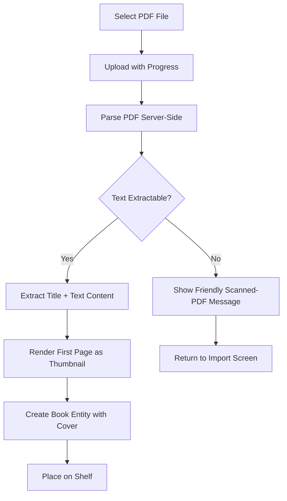

# STORY-046: PDF File Import

**Epic**: EPIC-005
**Persona**: Julia — The Young Author
**Priority**: Could Have (V1.1 per PM-HANDOFF)
**Story Points**: 5
**Dependencies**: STORY-045 (TXT Import — establishes pipeline), STORY-009 (Bookshelf Grid)

## User Story
As a young author, I want to import PDF files from school or downloads so I can keep all my reading materials on my beautiful shelf, not in a boring folder.

## Description
Extend the import pipeline (STORY-045) to support PDF files. Julia selects a PDF via the file picker, the system uploads it for server-side parsing, extracts text content and (if available) renders the first page as a thumbnail for the cover. If text extraction fails (scanned PDF), a friendly message explains the limitation. PDF books are read-only like all imports.

## Context
PDF is the most common "school document" format for Julia's persona. However, PDF parsing is notoriously variable — text-based PDFs work well, while scanned/image PDFs produce no extractable text. The MVP must handle both cases gracefully: extract text when possible, explain the limitation when not.

## Acceptance Criteria (Verifiable)
- [ ] GIVEN Julia selects a PDF file from the import file picker
      WHEN the file is text-based (not scanned)
      THEN the PDF's text content is extracted and the book appears on the shelf with extracted title (from metadata) or filename as fallback
- [ ] GIVEN Julia selects a text-based PDF
      WHEN the import completes
      THEN the first page is rendered as a thumbnail and used as the book cover (instead of default cover)
- [ ] GIVEN Julia selects a scanned/image PDF (no extractable text)
      WHEN parsing completes
      THEN she sees a friendly message: "This PDF has no text to read. It might be a scanned image. Try a text-based PDF!"
- [ ] GIVEN the import pipeline from STORY-045
      WHEN a PDF is imported
      THEN all validations apply: file size ≤25MB, progress indicator, friendly error for unsupported types
- [ ] GIVEN a PDF import fails mid-upload (network error)
      WHEN the upload is interrupted
      THEN Julia sees "Upload failed. Check your connection and try again!" and the partial upload is discarded

## NFRs
- NFR-SEC-04: PDF content sanitized; no embedded JavaScript or executable payloads executed
- NFR-SEC-05: PDF MIME type validated server-side
- NFR-PERF-07: Import completes within 60s for files up to 25MB
- NFR-ACC-07: Error messages in Portuguese (primary) and English

## Definition of Done (DoD)
- [ ] Code reviewed by CodeReviewer
- [ ] Tests with coverage >= 90%
- [ ] Integration tests passing
- [ ] QA approved by QAAnalyst
- [ ] Documentation updated
- [ ] PR created by MergeRequestCreator

## Technical Notes
- Server-side parsing: use `pdf.js` (Mozilla's PDF renderer) or `pdf-parse` on Node.js
- Text extraction: extract text layer; if empty or only whitespace → classify as scanned/image PDF
- Thumbnail: render first page to canvas at 200x280px; save as cover asset (coordinate with STORY-006 asset storage and STORY-027 image upload)
- Metadata extraction: attempt to read PDF metadata title and author; fall back to filename
- Security: disable JavaScript execution in PDF parser; validate no embedded scripts
- Share pipeline infrastructure with STORY-045: file picker, upload progress, size validation, error handling
- This story reuses the same pipeline as STORY-045; focus is on format-specific parsing and thumbnail generation

## User Flow

## Test Scenarios
- Scenario 1: Import text-based PDF → book appears with extracted text and first-page thumbnail cover
- Scenario 2: Import scanned/image PDF → friendly message shown, no book created
- Scenario 3: Import PDF with embedded metadata → title and author extracted correctly
- Scenario 4: Import PDF >25MB → size error
- Scenario 5: Network failure mid-upload → partial upload discarded, retry message shown
