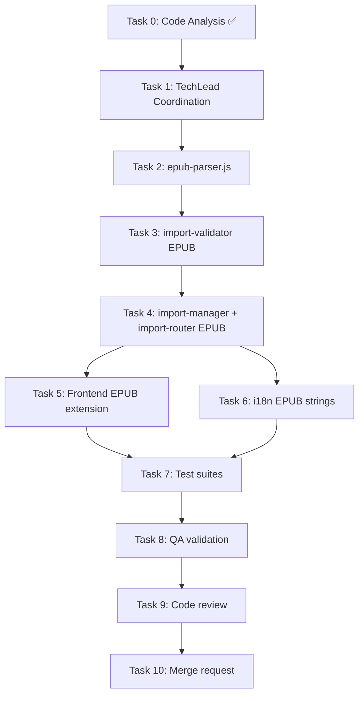

# STORY-047: EPUB File Import — Implementation Plan

**Epic**: EPIC-005 | **Persona**: Julia — The Young Author | **Priority**: Could Have | **Points**: 5
**Technical Analysis**: `/docs/stories/STORY-047-technical-analysis.md`
**PM Story**: `/docs/stories/STORY-047.md`

---

## Strategy Summary

Extend the shared import pipeline (STORY-045/046) with EPUB format support. EPUB is a ZIP of XHTML+CSS+images — parse with `adm-zip`, extract chapters via spine order, pull cover image from OPF metadata, detect DRM via `encryption.xml`. Reuse existing DOMPurify sanitization, `storage-manager` cover pipeline, and frontend import components.

---

## Implementation Tasks

### Task 2: `epub-parser.js` — Core EPUB Parsing (L)

**Agent**: BackendDeveloper | **Depends on**: Task 1 (TechLead coordination)

Create `backend/src/app/import/epub-parser.js`:

| Component | Detail |
|-----------|--------|
| DRM detection | Check `META-INF/encryption.xml` existence → throw `DRM_PROTECTED` |
| Container parsing | Read `META-INF/container.xml` → extract `.opf` path |
| OPF parsing | Extract `<dc:title>`, `<dc:creator>`, spine `itemref` order, `<meta name="cover">` |
| Chapter extraction | Iterate spine → resolve manifest hrefs → read XHTML from ZIP → DOMPurify sanitize → extract title from `<title>`/`<h1>`/`<h2>` |
| Cover extraction | Resolve cover manifest item → read image from ZIP → return buffer + mimeType |
| Error handling | `CORRUPT_EPUB` for malformed XML, `EMPTY_EPUB` for zero chapters |

Install: `adm-zip` (backend)

**Test fixtures needed**:
- Valid EPUB with cover + 5 chapters
- Valid EPUB without cover
- DRM-protected EPUB (with `encryption.xml`)
- Corrupted EPUB (broken ZIP)

---

### Task 3: `import-validator.js` — EPUB Validation Extension (S)

**Agent**: BackendDeveloper | **Depends on**: Task 2

Extend `import-validator.js` (from STORY-045/046):

| Check | Implementation |
|-------|----------------|
| MIME type | Accept `application/epub+zip` |
| Magic bytes | ZIP signature `PK\x03\x04` at offset 0 |
| EPUB-specific | Verify `mimetype` file in ZIP contains `application/epub+zip` |
| Size | ≤25MB (shared import limit) |

---

### Task 4: `import-manager` + `import-router` — EPUB Dispatch (M)

**Agent**: BackendDeveloper | **Depends on**: Task 3

| File | Change |
|------|--------|
| `import-manager.js` | Add `case 'epub'` → call `parseEpub()` → create Book + Chapters + upload cover or default |
| `import-router.js` | Add `POST /api/v1/import/epub` route with multer (25MB) |

**Book creation**: `source: 'imported'`, `format: 'epub'`, `isEditable: false`

**Cover handling**:
- With cover → `storage-manager.uploadCoverAsset()` → thumbnail + cover + dominant color
- Without cover → `book.coverAssetId = null`, `default_color` auto-assigned by schema pre-save hook

---

### Task 5: Frontend EPUB Extension (S)

**Agent**: FrontendDeveloperReact | **Depends on**: Task 4

| Change | Detail |
|--------|--------|
| `useImportBook.js` | Add `.epub` to accepted types, add EPUB MIME type |
| `ImportDialog.jsx` | Add `.epub` option in file picker `accept` attribute |
| `ImportProgressBar.jsx` | No changes — shared progress component |
| `ImportError.jsx` | Add EPUB-specific error code rendering |

---

### Task 6: i18n EPUB Strings (S)

**Agent**: FrontendDeveloperReact | **Depends on**: Task 5 (can parallel with Task 5)

| File | Keys to Add |
|------|-------------|
| `en/import.json` | `epubUnsupported`, `epubDrmProtected`, `epubCorrupted`, `epubEmpty` |
| `pt-BR/import.json` | Portuguese translations of above |

---

### Task 7: Test Suites (L)

**Agent**: TestEngineer | **Depends on**: Tasks 4, 5, 6

| Test Suite | Coverage |
|-----------|----------|
| `epub-parser.test.js` | Valid EPUB with cover/metadata, EPUB without cover, DRM detection, corrupted EPUB, chapter count/order, XSS in XHTML stripped |
| `import-validator.test.js` | EPUB MIME validation, ZIP magic bytes, renamed file rejection, size limit |
| `import-manager.test.js` | Full EPUB import flow, cover upload, default cover fallback |
| `import-router.test.js` | `POST /import/epub` integration: success, DRM, corrupted, size exceeded |
| Frontend tests | `useImportBook` with EPUB, `ImportDialog` EPUB file picker |

---

### Task 8: QA Validation (M)

**Agent**: QAAnalyst | **Depends on**: Task 7

**Acceptance Criteria Checklist**:
1. EPUB with chapters → text organized by EPUB chapter structure ✓
2. EPUB with cover → embedded cover used on shelf ✓
3. EPUB without cover → default cover generated ✓
4. EPUB with metadata → title from metadata; filename as fallback ✓
5. DRM/corrupted EPUB → friendly "Oops!" error ✓

**NFR Checklist**:
- NFR-SEC-04: XSS stripped, scripts not executed
- NFR-SEC-05: MIME + magic bytes validated server-side
- NFR-PERF-07: Import ≤60s for 25MB
- NFR-ACC-07: Error messages in pt-BR + en

---

### Task 9: Code Review (M)

**Agent**: CodeReviewer | **Depends on**: Task 8

---

### Task 10: Merge Request (S)

**Agent**: MergeRequestCreator | **Depends on**: Task 9

---

## Execution DAG

---

## Parallelization

| Phase | Tasks | Parallel? |
|-------|-------|-----------|
| Backend core | 2→3→4 | Sequential (parser → validator → manager) |
| Frontend + i18n | 5 + 6 | **Yes** (independent) |
| Backend + Frontend | 4 + 5 | **Yes** after backend parser done |
| Validation | 7→8→9→10 | Sequential |

**Max 2 agents concurrent** per operating constraints.

---

## Dependencies to Install

| Package | Location | Purpose |
|---------|----------|---------|
| `adm-zip` | backend | ZIP extraction for EPUB parsing |

No frontend dependencies needed.

---

## Key Files Created/Modified

### New Files
- `backend/src/app/import/epub-parser.js`
- `backend/src/app/import/__tests__/epub-parser.test.js`

### Modified Files
- `backend/src/app/import/import-manager.js` — EPUB dispatch
- `backend/src/app/import/import-validator.js` — EPUB MIME + ZIP magic
- `backend/src/app/import/import-router.js` — EPUB route
- `backend/src/app/import/__tests__/import-manager.test.js` — EPUB tests
- `backend/src/app/import/__tests__/import-validator.test.js` — EPUB tests
- `frontend/src/hooks/useImportBook.js` — .epub support
- `frontend/src/components/import/ImportDialog.jsx` — .epub file picker
- `frontend/src/i18n/locales/en/import.json` — EPUB error strings
- `frontend/src/i18n/locales/pt-BR/import.json` — EPUB error strings (Portuguese)

---

## Risks & Mitigations

| Risk | Mitigation |
|------|------------|
| Non-standard EPUBs (no proper spine) | Fallback: enumerate XHTML files alphabetically; mark as CORRUPT if total failure |
| `adm-zip` memory on 25MB EPUBs | 25MB fits in memory; `adm-zip` extracts in-memory; total processing <30s |
| DRM false positive | Only flag if `encryption.xml` has actual encryption content, not just existence |
| XSS via EPUB XHTML | DOMPurify strips all scripts/iframe/object/embed before storage |

---

## Referenced Documents

| Doc | Path |
|-----|------|
| PM Story | `/docs/stories/STORY-047.md` |
| Technical Analysis | `/docs/stories/STORY-047-technical-analysis.md` |
| STORY-045 | `/docs/stories/STORY-045.md` (TXT Import — pipeline base) |
| STORY-046 Analysis | `/docs/stories/STORY-046-technical-analysis.md` (PDF Import — shared infrastructure) |