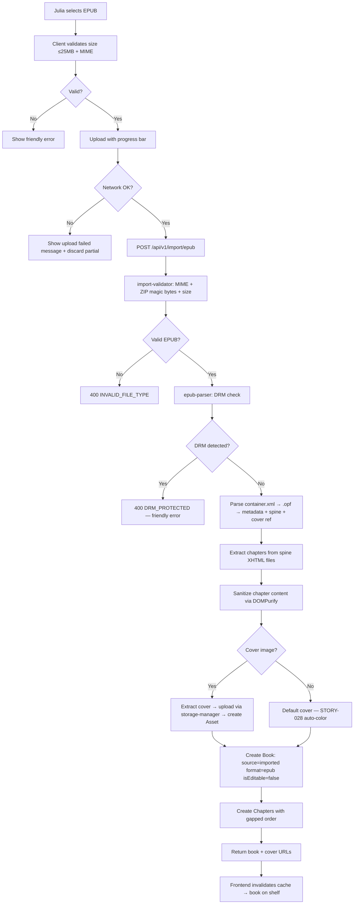
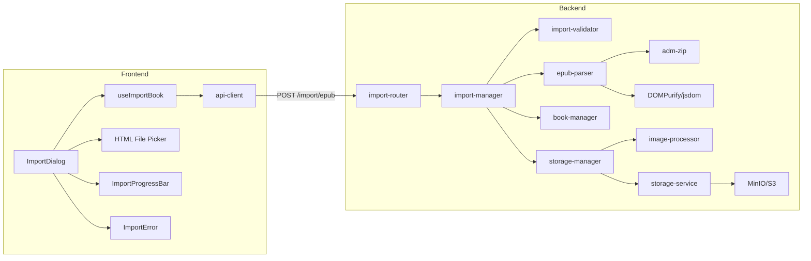
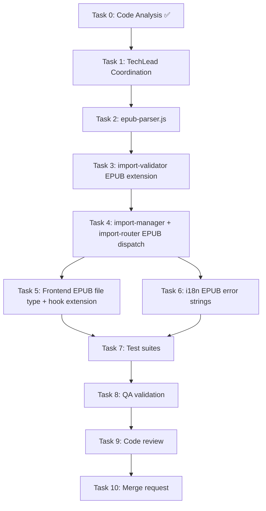

# STORY-047: EPUB File Import — Technical Analysis

**Epic**: EPIC-005 | **Persona**: Julia — The Young Author | **Priority**: Could Have | **Points**: 5
**Dependencies**: STORY-045 (TXT Import — establishes pipeline), STORY-046 (PDF Import), STORY-028 (Default Cover), STORY-006 (Asset Storage)

**Stack**: Node.js 22 + Express 4 + MongoDB 7 / Mongoose 8 + MinIO + React 18 + Vite 5 + Tailwind + Zustand + TanStack Query
**Source**: Build file detection (`backend/package.json`, `frontend/package.json`)

---

## 1. Code Analysis Summary

- **No import pipeline exists yet** — STORY-045/046 not implemented. STORY-047 layers EPUB parsing on the shared `import` domain that STORY-045/046 must establish.
- **Book model** (`book-model.js`): No `source`, `format`, or `isEditable` fields. STORY-045/046 analysis proposes adding them. STORY-047 inherits that migration; no additional schema changes needed beyond what STORY-046 defines (`source: "imported"`, `format: "epub"`, `isEditable: false`).
- **Asset model**: `type` enum = `['cover', 'cover_thumbnail', 'spine', 'edge', 'upload']`. EPUB cover image extraction can reuse `'cover'` + `'cover_thumbnail'` — same pipeline as STORY-046's PDF thumbnail.
- **File validator** (`file-validator.js`): Image-only. STORY-046 analysis proposes `import-validator.js` with format-aware MIME/magic-byte checking. STORY-047 extends with EPUB MIME (`application/epub+zip`) and ZIP magic bytes (`PK`).
- **Storage router**: multer at 5MB limit. STORY-046 proposes separate import multer at 25MB. STORY-047 reuses that.
- **DOMPurify + jsdom** (`sanitize-content.js`): Available for EPUB XHTML content sanitization. EPUB chapters are XHTML — extract text via HTML-to-text, then sanitize before storage.
- **Image processor** (`image-processor.js`): `sharp` for thumbnails. EPUB cover images (JPEG/PNG) pass through `sharp` same as STORY-006 cover upload pipeline.
- **Frontend**: No import components exist. STORY-045/046 propose `ImportDialog`, `ImportProgressBar`, `ImportError`. STORY-047 adds EPUB as a third format option in the same dialog.
- **i18n**: `import` namespace proposed by STORY-046. STORY-047 adds EPUB-specific error strings.

---

## 2. Impacted Components

| File | Change Type | Description |
|------|-------------|-------------|
| **New**: `backend/src/app/import/epub-parser.js` | **Create** | EPUB parsing: ZIP extraction, chapter enumeration, metadata extraction, cover image extraction, DRM detection |
| **New**: `backend/src/app/import/__tests__/epub-parser.test.js` | **Create** | EPUB parser unit tests (valid EPUB, cover, no-cover, DRM, corrupted) |
| `backend/src/app/import/import-manager.js` | **Modify** | Add EPUB format dispatch: `case 'epub'` → call `epub-parser` |
| `backend/src/app/import/import-validator.js` | **Modify** | Add EPUB MIME + ZIP magic bytes validation |
| `backend/src/app/import/import-router.js` | **Modify** | Add `POST /api/v1/import/epub` route (or extend single-endpoint with format detection) |
| `backend/src/app/import/__tests__/import-manager.test.js` | **Modify** | Add EPUB import test cases |
| `backend/src/app/import/__tests__/import-validator.test.js` | **Modify** | Add EPUB validation test cases |
| `frontend/src/hooks/useImportBook.js` | **Modify** | Add `.epub` to accepted file types |
| `frontend/src/components/import/ImportDialog.jsx` | **Modify** | Add EPUB file type option in file picker |
| `frontend/src/i18n/locales/en/import.json` | **Modify** | Add EPUB-specific error strings |
| `frontend/src/i18n/locales/pt-BR/import.json` | **Modify** | Add EPUB-specific error strings (Portuguese primary) |

---

## 3. Technical Approach

### 3.1 EPUB Format Overview

EPUB is a ZIP archive containing:
- `META-INF/container.xml` — points to `content.opf`
- `content.opf` (or similar `.opf`) — manifest + spine + metadata
- XHTML chapter files listed in spine order
- Optional cover image referenced via `<meta name="cover">` in `.opf`

### 3.2 Library Choice: `epub-parser` or Manual ZIP Extraction

**Decision: Manual ZIP extraction using Node.js built-in `node:zlib` + `yauzl` (or `adm-zip`)**

Rationale:
- `epub` npm package (most popular) is callback-based, unmaintained, and doesn't support streaming
- `epub-parser` has inconsistent chapter ordering and limited metadata extraction
- Manual approach gives full control over: DRM detection, chapter ordering (spine), cover extraction, and security sanitization

**Recommended: `adm-zip`** — synchronous, simple API, well-maintained, supports Buffer input. Alternative: `yauzl` for streaming (lower memory on huge files, but EPUBs rarely exceed 25MB).

### 3.3 EPUB Parser Architecture

```javascript
// backend/src/app/import/epub-parser.js

import AdmZip from 'adm-zip';
import { JSDOM } from 'jsdom';
import createDOMPurify from 'dompurify';

/**
 * Parse an EPUB buffer and extract metadata, chapters, and cover image.
 * @param {Buffer} buffer — EPUB file buffer
 * @returns {{ title, author, chapters: [{order, title, content}], coverImage: Buffer|null, coverMimeType: string|null }}
 */
export async function parseEpub(buffer) {
  // 1. DRM detection — check for encryption.xml or META-INF rights
  detectDrm(zip);

  // 2. Parse container.xml → find .opf path
  // 3. Parse .opf → extract metadata (title, author), spine order, cover reference
  // 4. Iterate spine items → extract XHTML chapter content → HTML-to-text conversion
  // 5. If cover referenced → extract cover image buffer + mime type
  // 6. Return structured result
}
```

### 3.4 DRM Detection (NFR-SEC-04)

EPUB DRM is identified by:
- `META-INF/encryption.xml` exists (Adobe DRM)
- `META-INF/rights.xml` exists
- Any file in `META-INF/` with `encryption` in the name

```javascript
function detectDrm(zip) {
  const entry = zip.getEntry('META-INF/encryption.xml');
  if (entry) {
    const err = new Error('Oops! This file couldn\'t be opened. It might be protected or damaged.');
    err.code = 'DRM_PROTECTED';
    err.status = 400;
    throw err;
  }
}
```

### 3.5 Chapter Extraction from Spine

EPUB spine defines reading order. Each spine `itemref` points to a manifest `item` with an `href` to an XHTML file.

```javascript
// Parse .opf → spine item IDs → manifest hrefs → read XHTML files
const chapters = [];
for (const [index, itemref] of spineItems.entries()) {
  const href = manifest[itemref.idref].href;
  const xhtmlBuffer = zip.getEntry(`${contentBasePath}/${href}`).getData();
  const xhtmlStr = xhtmlBuffer.toString('utf8');

  // Sanitize XHTML via DOMPurify — strip all tags except allowed text formatting
  const sanitized = DOMPurify.sanitize(xhtmlStr, { ALLOWED_TAGS: ['p', 'br', 'strong', 'em', 'h2'], ALLOWED_ATTR: [] });

  // Extract chapter title from <title> or first <h1>/<h2>
  const chapterTitle = extractChapterTitle(xhtmlStr, index);

  chapters.push({
    order: index * 100,  // Gapped ordering (consistent with chapter-manager.js pattern)
    title: chapterTitle,
    content: sanitized,
  });
}
```

### 3.6 Cover Image Extraction

```javascript
// .opf may have: <meta name="cover" content="cover-image-id" />
// manifest item with id="cover-image-id" → href → extract from ZIP
function extractCover(zip, opfDoc, contentBasePath) {
  const metaCover = opfDoc.querySelector('meta[name="cover"]');
  if (!metaCover) return null;

  const coverItemId = metaCover.getAttribute('content');
  const coverItem = manifest[coverItemId];
  if (!coverItem) return null;

  const coverEntry = zip.getEntry(`${contentBasePath}/${coverItem.href}`);
  if (!coverEntry) return null;

  const coverMimeType = coverItem.mediaType || 'image/jpeg';
  return {
    buffer: coverEntry.getData(),
    mimeType: coverMimeType,
  };
}
```

Cover image is uploaded through existing `storage-manager.uploadCoverAsset()` pipeline — generates thumbnail + cover size, extracts dominant color, creates Asset records, links `book.coverAssetId`.

### 3.7 Metadata Extraction (Title, Author)

```javascript
// .opf <dc:title> and <dc:creator>
// Fall back to filename (strip .epub extension) if metadata missing
const title = opfDoc.querySelector('metadata > title')?.textContent
  || filename.replace(/\.epub$/i, '');
const author = opfDoc.querySelector('metadata > creator')?.textContent
  || null;
```

Metadata sanitized via DOMPurify plain-text mode before storage.

### 3.8 Content Sanitization (NFR-SEC-04)

EPUB XHTML may contain:
- Embedded `<script>` tags → **DOMPurify strips them**
- `<link>` to external CSS → **DOMPurify strips them**
- `<iframe>`, `<object>`, `<embed>` → **DOMPurify strips them**
- External image references → **Not extracted (MVP: text content only)**

Existing `sanitizeChapterContent()` uses DOMPurify with `ALLOWED_TAGS: ['p', 'br', 'strong', 'em', 'h2', 'hr', 'span']`. EPUB chapter content goes through the same sanitizer.

### 3.9 MIME & Magic Bytes Validation (NFR-SEC-05)

```javascript
// EPUB MIME: application/epub+zip
// Magic bytes: ZIP signature (PK\x03\x04 at offset 0) + mimetype file at offset 30
const EPUB_MIME = 'application/epub+zip';
const ZIP_MAGIC = Buffer.from([0x50, 0x4b, 0x03, 0x04]); // PK..

// Additional EPUB verification: first file in ZIP must be "mimetype" with content "application/epub+zip"
```

### 3.10 Import Flow (End-to-End)

1. **Frontend**: Julia opens Import dialog → selects EPUB → file picker accepts `.epub`
2. **Frontend**: Client-side check: `file.size ≤ 25MB`, MIME type
3. **Frontend**: `XMLHttpRequest.upload.progress` → progress bar
4. **Backend**: `POST /api/v1/import/epub` with multer (25MB limit)
5. **Backend**: `import-validator.js` — validate MIME `application/epub+zip` + ZIP magic bytes
6. **Backend**: `epub-parser.js` — DRM detection → metadata extraction → chapter extraction → cover extraction
7. **Backend**: If DRM → return `400 DRM_PROTECTED` with friendly message
8. **Backend**: If corrupted → return `400 CORRUPT_EPUB` with friendly message
9. **Backend**: If valid → create Book (`source: 'imported'`, `format: 'epub'`, `isEditable: false`)
10. **Backend**: Create Chapters from spine items (gapped order: 0, 100, 200...)
11. **Backend**: If cover exists → upload via `storage-manager.uploadCoverAsset()` → link `book.coverAssetId`
12. **Backend**: If no cover → default cover (STORY-028 system, `default_color` auto-assigned)
13. **Backend**: Return book + cover URLs
14. **Frontend**: Invalidate TanStack Query cache → book on shelf

---

## 4. Execution Architecture





---

## 5. NFR Analysis

| NFR | Requirement | Strategy | Verification |
|-----|-------------|----------|--------------|
| NFR-SEC-04 | EPUB content sanitized; no embedded scripts executed | DOMPurify strips `<script>`, `<iframe>`, `<object>`, `<embed>`, `<link>` from XHTML; DRM detection rejects encrypted files; no external resource loading | Unit test: EPUB with embedded `<script>alert('xss')</script>` → script stripped from chapter content |
| NFR-SEC-05 | EPUB MIME type validated server-side | `import-validator`: check `application/epub+zip` MIME + ZIP magic bytes `PK\x03\x04` + verify `mimetype` file in ZIP | Unit test: renamed PNG with `.epub` extension → rejected |
| NFR-PERF-07 | Import ≤60s for files up to 25MB | `adm-zip` extraction <5s for 25MB; XHTML parsing <10s; S3 upload <10s; total <30s | Integration test: 25MB EPUB import timing |
| NFR-ACC-07 | Error messages in Portuguese (primary) and English | All error strings in `import.json` locale files (pt-BR + en); server returns error codes, frontend maps to i18n | Verify locale files exist with EPUB-specific keys |

---

## 6. Persona Impact

**Julia — The Young Author** (primary): EPUB is the most common e-book format for free books (Project Gutenberg, local libraries). Julia can now add downloaded e-books alongside her own stories. Chapter-by-chapter reading preserves the original book structure — critical for novels and textbooks. Extracted covers make the shelf look real and inviting, while the default cover fallback ensures every imported book is visually identifiable.

---

## 7. Task Breakdown & Agent Assignment

| Task | Description | Agent | Effort |
|------|-------------|-------|--------|
| 0 | Code analysis (completed above) | CodeAnalyzer | — |
| 1 | Coordination: delegate & sequence tasks | TechLead | S |
| 2 | Backend: `epub-parser.js` — ZIP extraction, DRM detection, container.xml/OPF parsing, metadata, spine chapter extraction, cover extraction | BackendDeveloper | L |
| 3 | Backend: Extend `import-validator.js` with EPUB MIME + ZIP magic bytes + mimetype verification | BackendDeveloper | S |
| 4 | Backend: Extend `import-manager.js` with EPUB dispatch + extend `import-router.js` with EPUB route | BackendDeveloper | M |
| 5 | Frontend: Extend `useImportBook` hook + `ImportDialog` with `.epub` file type + EPUB error messages | FrontendDeveloperReact | S |
| 6 | Frontend: i18n strings (en + pt-BR) for EPUB-specific errors | FrontendDeveloperReact | S |
| 7 | Test suites: backend (epub-parser, import-validator EPUB, import-manager EPUB, import-router EPUB) | TestEngineer | L |
| 8 | QA validation: all 5 acceptance criteria + NFRs | QAAnalyst | M |
| 9 | Code review | CodeReviewer | M |
| 10 | Merge request | MergeRequestCreator | S |

---

## 8. Execution Order



**Sequential**: Tasks 2→3→4 (parser before validator before manager)
**Parallel possible**: Tasks 5 + 6 (frontend hook + i18n are independent)
**Sequential**: Tasks 7→8→9→10 (tests → QA → review → merge)
**Max parallel**: 2 agents (per operating constraints)

---

## 9. Risk Assessment

| Risk | Likelihood | Impact | Mitigation |
|------|-----------|--------|------------|
| EPUB container.xml / .opf parsing fails on non-standard EPUBs | Medium | Medium | Fallback: if OPF parsing fails, try to enumerate all `.xhtml`/`.html` files alphabetically; mark as `CORRUPT_EPUB` if nothing works |
| `adm-zip` fails on EPUBs with non-UTF8 filenames | Low | Medium | Use `adm-zip` v0.5+ which supports UTF-8 flags; fallback: suggest user re-save the EPUB |
| DRM false positive (encryption.xml in non-DRM EPUB) | Low | Medium | Only flag if `encryption.xml` contains actual encryption descriptors, not empty/whitespace |
| Cover image not found despite `<meta name="cover">` | Medium | Low | Graceful fallback to default cover (STORY-028); log warning |
| Large EPUB (25MB with many images) — images not extracted | Low | Low | MVP: only text content + cover; non-cover images intentionally skipped per story notes |
| Malicious EPUB with XHTML containing `<script>` or external resources | Medium | Critical | DOMPurify strips all dangerous tags; no external resource fetching; sanitize all extracted text/metadata |

---

## 10. Implementation Recommendations

1. **`adm-zip` for ZIP extraction** — synchronous, simple, well-maintained. Buffer-based, no temp files. Already handles ZIP64 for large archives.
2. **DRM detection first** — check `META-INF/encryption.xml` before any parsing; fail fast with friendly message.
3. **Spine-based chapter ordering** — never enumerate manifest files directly; always follow spine `itemref` order for correct reading sequence.
4. **DOMPurify on all extracted content** — reuse existing `sanitizeChapterContent()` pattern; EPUB XHTML chapters sanitized the same way as editor content.
5. **Cover extraction pipeline** — reuse `storage-manager.uploadCoverAsset()` — generates thumbnail + cover-size + dominant color + Asset records. Same as PDF thumbnail in STORY-046.
6. **Default cover fallback** — if no cover in EPUB, `book.coverAssetId` stays `null`; `default_color` auto-assigned via pre-save hook in `book-model.js`. No custom logic needed.
7. **Error code pattern** — consistent with STORY-046: server returns structured error codes (`DRM_PROTECTED`, `CORRUPT_EPUB`), frontend maps via i18n.
8. **Chapter gapped ordering** — `order: 0, 100, 200, ...` consistent with `chapter-manager.js` pattern.
9. **Test with real EPUB fixtures** — include test fixtures: (a) valid EPUB with cover and metadata, (b) EPUB without cover, (c) DRM-protected EPUB, (d) corrupted EPUB. Use Project Gutenberg EPUBs as test data.

---

## 11. Integration Pattern

**Node.js fullstack** (React SPA + Express API):

| Aspect | Detail |
|--------|--------|
| API Contract | `POST /api/v1/import/epub` — multipart form, field `file`, returns `{ book, coverUrl }` |
| State | Zustand book-store + TanStack Query cache invalidation on import success |
| Data flow | File picker → XHR upload → backend parse → book+chapters+cover creation → response → cache invalidate → shelf refresh |
| Auth | `authMiddleware` on `/api/v1/import/*` — same as all V1 routes |
| Rate limiting | `rateLimitMiddleware` already mounted on `/api/v1` |
| Storage | MinIO for cover/thumbnail; MongoDB for book/chapter/asset records |
| i18n | Server returns error codes; frontend maps via `import.json` + `errors.json` locale files |
| Testing | Backend: Vitest + supertest + in-memory MongoDB; Frontend: Vitest + React Testing Library |
| Reader | Chapters read via existing `GET /api/v1/reader/:bookId/chapters` — no reader changes needed |

---

## 12. Dependencies to Install

**Backend** (`backend/package.json`):
- `adm-zip` — ZIP archive extraction for EPUB parsing (v0.5+)

**Frontend**: No new dependencies — `axios`, `react-i18next`, `flowbite-react`, `framer-motion` already available.

**Note**: `jsdom` and `dompurify` are already installed and used in `sanitize-content.js`. EPUB XHTML parsing reuses the same stack.

---

## 13. Error Handling

| Error | Code | Status | Message (EN) | Message (PT-BR) |
|-------|------|--------|--------------|-----------------|
| DRM-protected EPUB | `DRM_PROTECTED` | 400 | Oops! This file couldn't be opened. It might be protected or damaged. | Ops! Não foi possível abrir este arquivo. Ele pode estar protegido ou danificado. |
| Corrupted EPUB | `CORRUPT_EPUB` | 400 | Oops! This file couldn't be opened. It might be protected or damaged. | Ops! Não foi possível abrir este arquivo. Ele pode estar protegido ou danificado. |
| Non-EPUB file | `INVALID_FILE_TYPE` | 400 | Oops! This file type isn't supported yet. Try an EPUB file! | Ops! Esse tipo de arquivo não é suportado ainda. Tente um arquivo EPUB! |
| File >25MB | `PAYLOAD_TOO_LARGE` | 413 | This file is too big. Maximum size is 25MB. | Esse arquivo é grande demais. O tamanho máximo é 25MB. |
| No chapters found | `EMPTY_EPUB` | 422 | This EPUB has no readable content. Try a different file! | Este EPUB não tem conteúdo para ler. Tente outro arquivo! |

---

## 14. Documents Referenced

- PM Story: `/docs/stories/STORY-047.md`
- Dependent Stories: `/docs/stories/STORY-045.md` (TXT Import), `/docs/stories/STORY-046.md` (PDF Import)
- STORY-046 Technical Analysis: `/docs/stories/STORY-046-technical-analysis.md`
- This Analysis: `/docs/stories/STORY-047-technical-analysis.md`