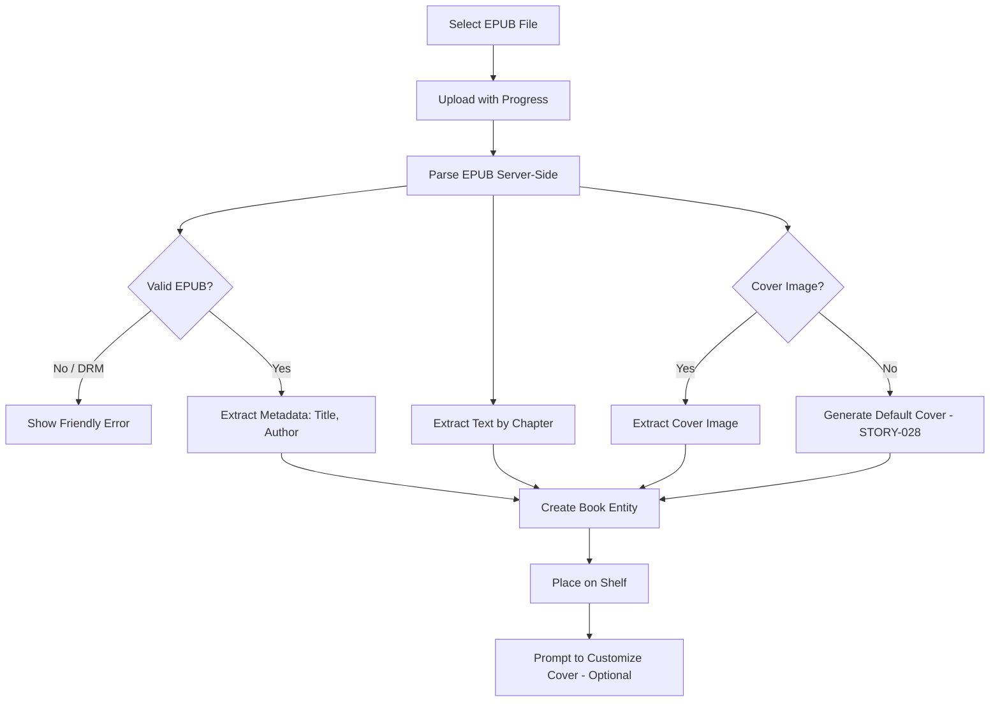

# STORY-047: EPUB File Import

**Epic**: EPIC-005
**Persona**: Julia — The Young Author
**Priority**: Could Have (V1.1 per PM-HANDOFF)
**Story Points**: 5
**Dependencies**: STORY-045 (TXT Import — establishes pipeline), STORY-046 (PDF Import)

## User Story
As a young author, I want to import EPUB e-books so I can add free e-books and downloaded stories to my shelf alongside the books I write.

## Description
Extend the import pipeline (STORY-045, STORY-046) to support EPUB files. Julia selects an EPUB via the file picker, the system uploads it for server-side parsing, extracts text content and embedded cover image (if available), and places the book on the shelf. EPUB content is rendered in the reader chapter-by-chapter. EPUB books are read-only.

## Context
EPUB is the most feature-rich import format and the most common e-book standard. It supports embedded covers, metadata, and chapter structure — all of which should be extracted for the best shelf experience. This is the last format-specific import story and completes EPIC-005's core scope.

## Acceptance Criteria (Verifiable)
- [ ] GIVEN Julia selects an EPUB file from the import file picker
      WHEN the file is parsed
      THEN the EPUB's text content is extracted and organized by the EPUB's internal chapter structure
- [ ] GIVEN an EPUB contains an embedded cover image
      WHEN the import completes
      THEN the embedded cover is extracted and used as the book's cover on the shelf
- [ ] GIVEN an EPUB does NOT contain a cover image
      WHEN the import completes
      THEN a default cover is generated using the book title (delegate to STORY-028)
- [ ] GIVEN an EPUB has metadata (title, author)
      WHEN the import completes
      THEN the book uses the EPUB metadata title; filename is used only as fallback
- [ ] GIVEN Julia selects a corrupted or DRM-protected EPUB
      WHEN parsing fails
      THEN she sees a friendly error: "Oops! This file couldn't be opened. It might be protected or damaged."

## NFRs
- NFR-SEC-04: EPUB content sanitized; no embedded scripts executed
- NFR-SEC-05: EPUB MIME type validated server-side
- NFR-PERF-07: Import completes within 60s for files up to 25MB
- NFR-ACC-07: Error messages in Portuguese (primary) and English

## Definition of Done (DoD)
- [ ] Code reviewed by CodeReviewer
- [ ] Tests with coverage >= 90%
- [ ] Integration tests passing
- [ ] QA approved by QAAnalyst
- [ ] Documentation updated
- [ ] PR created by MergeRequestCreator

## Technical Notes
- Server-side parsing: use `epub` npm package or `epub-parser` for Node.js
- EPUB is a ZIP containing XHTML + CSS + images; extract text from XHTML files using an HTML-to-text converter
- Chapter extraction: iterate over EPUB spine items; each spine item maps to a `Chapter` entity with `chapterNumber` matching spine order
- Cover extraction: look for `<meta name="cover" content="..."/>` in `content.opf`; extract referenced image
- DRM detection: if EPUB has `encryption.xml` (Adobe DRM) or META-INF rights file → reject with friendly message
- Share pipeline with STORY-045 and STORY-046
- EPUB images (if any besides cover) should NOT be extracted for MVP — text content only

## User Flow

## Test Scenarios
- Scenario 1: Import EPUB with cover and metadata → correct title, cover image, chapter structure
- Scenario 2: Import EPUB without cover → default cover generated from title
- Scenario 3: Import DRM-protected EPUB → friendly error message
- Scenario 4: Import EPUB >25MB → size error
- Scenario 5: Chapter structure extracted correctly (5 chapters → 5 Chapter entities)
