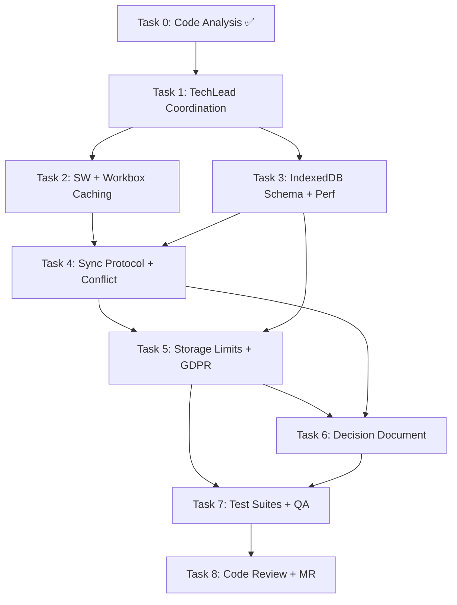
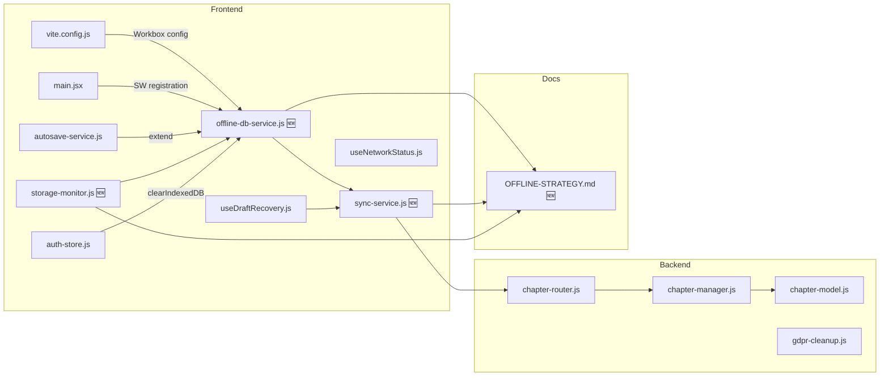

# STORY-048: Technical Analysis — Offline Strategy Spike (PWA)

**Parent Epic**: EPIC-008
**Persona**: Julia — The Young Author
**Priority**: Could Have (V1.1)
**Story Points**: 3

---

## Stack Reference

Source: `docs/architecture/TECH-STACK.md`

| Layer | Technology |
|-------|-----------|
| Runtime | Node.js 22 LTS |
| Frontend | React 18 + Vite 5.x |
| State | Zustand + TanStack Query |
| Build/PWA | Vite + vite-plugin-pwa 0.20.5 |
| Database | MongoDB 7 + Mongoose 8.x |
| Cache/Session | Redis 7 |

**Frontend-Backend Integration**: Node.js fullstack SPA — Vite dev proxy → Express API, JWT auth, shared repo.

---

## Code Analysis Summary

Source: `/docs/stories/STORY-048-code-analysis.md`

### Existing Infrastructure (Reusable)

| Component | Status | Detail |
|-----------|--------|--------|
| `autosave-service.js` | ✅ Production | IndexedDB drafts store, composite keys, cleanup, flush-on-reconnect |
| `useNetworkStatus.js` | ✅ Production | `navigator.onLine` + event listeners |
| `useAutoSave.js` | ✅ Production | Dual debounce (5s local / 30s server), exponential backoff retry |
| `useDraftRecovery.js` | ✅ Production | Timestamp-based conflict detection, 5-min divergence threshold |
| `vite-plugin-pwa` | ⚠️ Skeleton | Configured manifest + registerType, zero workbox caching |

### Critical Gaps

| Gap | Severity | Impact |
|-----|----------|-------|
| No Service Worker runtime caching | 🔴 | App shell won't load offline |
| No Workbox `runtimeCaching` config | 🔴 | No cache strategies for assets/API |
| No backend sync endpoint | 🔴 | Can't batch-resolve conflicts on reconnect |
| No `_version` / `updatedAt` field for chapters | 🟠 | Can't detect server-side changes since last local edit |
| No client-side GDPR cleanup for IndexedDB | 🟠 | NFR-PRV-03 violation — drafts persist after account deletion |
| No background sync queue | 🟡 | Write ops silently fail offline without queue |

---

## Task Decomposition

### Task 0: Code Analysis ✅ (Complete)
- **Agent**: CodeAnalyzer
- **Output**: `/docs/stories/STORY-048-code-analysis.md`

### Task 1: TechLead Coordination
- **Agent**: TechLead
- **Input**: PM story, technical analysis, code analysis
- **Action**: Coordinate Tasks 2–7

### Task 2: Spike — Service Worker + Workbox Caching Prototype
- **Agent**: FrontendDeveloper
- **Scope**:
  - Extend `vite.config.js` VitePWA config with `workbox.runtimeCaching`
  - Implement Cache-First for app shell (HTML, JS, CSS bundles)
  - Implement Stale-While-Revalidate for static assets (icons, fonts, images)
  - Implement Network-First for API calls (`/api/` routes)
  - Test: disable network → app shell loads from SW cache within 2s
- **Files**: `frontend/vite.config.js`, `frontend/src/main.jsx` (SW registration)
- **AC**: Acceptance Criterion 1 — app shell loads offline from SW cache

### Task 3: Spike — IndexedDB Schema + Performance Benchmarks
- **Agent**: FrontendDeveloper
- **Scope**:
  - Extend `autosave-service.js` schema or create `offline-db-service.js`
  - Add stores: `books` (metadata + content), `chapters` (content + versions), `syncQueue` (pending ops)
  - Benchmark: write/read 10 books × 10,000 words — verify < 100ms per op (NFR-PERF-06)
  - Test: save content offline → survive page refresh → survive browser restart
  - Evaluate `navigator.storage.persist()` — document Chrome, Firefox, Safari behavior
  - Evaluate `navigator.storage.estimate()` — quota monitoring threshold
- **Files**: `frontend/src/services/offline-db-service.js` (new), `frontend/src/services/autosave-service.js` (extend)
- **AC**: Acceptance Criterion 2 — content survives refresh + restart; performance < 100ms

### Task 4: Spike — Sync Protocol + Conflict Resolution
- **Agent**: BackendDeveloper + FrontendDeveloper
- **Scope**:
  - Backend: Add `updatedAt` / `version` to chapter model if absent
  - Backend: Create `POST /api/v1/sync` endpoint — accepts batch of chapter writes with client timestamps, returns server timestamps + conflict flags
  - Frontend: Extend `useDraftRecovery.js` → use `offline-db-service.syncQueue` for pending ops
  - Test: simulate conflict (local edit + server edit) → sync on reconnect → document resolution strategy
  - Document: last-write-wins with server-timestamp comparison (single-user app), edge cases (clock skew, long offline)
- **Files**: `backend/src/app/editor/chapter-router.js`, `backend/src/app/editor/chapter-manager.js`, `frontend/src/hooks/useDraftRecovery.js`, `frontend/src/services/sync-service.js` (new)
- **AC**: Acceptance Criterion 3 — conflict resolution tested and documented

### Task 5: Spike — Storage Limits + GDPR Cleanup
- **Agent**: FrontendDeveloper + BackendDeveloper
- **Scope**:
  - Frontend: Implement storage quota monitoring (warning at 80% threshold)
  - Frontend: Implement graceful degradation when storage cleared (re-sync from server)
  - Frontend: Add IndexedDB cleanup to `auth-store.js clearAll()` — NFR-PRV-03
  - Backend: Verify GDPR cleanup job covers all user data (already exists but check completeness)
  - Document: storage limits per browser, `navigator.storage.persist()` results
- **Files**: `frontend/src/services/storage-monitor.js` (new), `frontend/src/stores/auth-store.js`
- **AC**: Acceptance Criterion 4 + NFR-PRV-03

### Task 6: Decision Document
- **Agent**: DocWriter
- **Scope**:
  - Write `docs/decisions/OFFLINE-STRATEGY.md`
  - Sections: caching strategy, data storage schema, sync protocol, conflict resolution, storage limits, security, GDPR
  - Include benchmark results, browser compatibility matrix
  - Include architecture recommendations for STORY-050+ implementation
- **Files**: `docs/decisions/OFFLINE-STRATEGY.md` (new)
- **AC**: Acceptance Criterion 4 — recommendations documented

### Task 7: Test Suites + QA
- **Agent**: TestEngineer → QAAnalyst
- **Scope**:
  - Unit tests for `offline-db-service.js`, `sync-service.js`, `storage-monitor.js`
  - Integration test: offline flow (save → refresh → reconnect → sync)
  - Verify coverage ≥ 90% for new spike code
  - QA validates all 4 acceptance criteria

### Task 8: Code Review + Merge Request
- **Agent**: CodeReviewer → MergeRequestCreator
- **Scope**: Review spike code quality, verify no production regressions, create PR

---

## Execution Order & Dependencies

### Parallelization Plan

| Phase | Tasks | Parallel? | Notes |
|-------|-------|-----------|-------|
| 0–1 | T0, T1 | Sequential | Analysis → coordination |
| 2–3 | T2, T3 | **Parallel** | SW caching (independent of IndexedDB schema) |
| 4–5 | T4, T5 | **Sequential** after T4 | T5 depends on T4 (sync queue uses offline-db schema); but T5 storage monitoring can start after T3 |
| 6 | T6 | Sequential after T4+T5 | Decision doc needs all spike results |
| 7–8 | T7, T8 | Sequential | Tests → review → MR |

**Max concurrent agents**: 2 (T2 + T3 in phase 2)

---

## Impacted Components & Files

### File Change Summary

| File | Action | Task |
|------|--------|------|
| `frontend/vite.config.js` | Modify (add workbox.runtimeCaching) | T2 |
| `frontend/src/main.jsx` | Modify (add SW registration) | T2 |
| `frontend/src/services/offline-db-service.js` | **New** | T3 |
| `frontend/src/services/autosave-service.js` | Modify (extend schema) | T3 |
| `frontend/src/services/sync-service.js` | **New** | T4 |
| `frontend/src/hooks/useDraftRecovery.js` | Modify (use sync-service) | T4 |
| `backend/src/app/editor/chapter-router.js` | Modify (add /sync endpoint) | T4 |
| `backend/src/app/editor/chapter-manager.js` | Modify (add sync logic) | T4 |
| `frontend/src/services/storage-monitor.js` | **New** | T5 |
| `frontend/src/stores/auth-store.js` | Modify (add IndexedDB cleanup) | T5 |
| `docs/decisions/OFFLINE-STRATEGY.md` | **New** | T6 |

---

## NFR Analysis

| NFR | Requirement | Spike Validation | Risk |
|-----|-------------|-----------------|------|
| NFR-PERF-06 | Local save < 100ms | Benchmark 10 books × 10K words in Task 3 | Low — IndexedDB write is typically < 10ms for this size |
| NFR-PRV-03 | No data retention after account deletion | Task 5 adds IndexedDB cleanup to auth-store `clearAll()` | 🟠 Currently violated — must fix |

---

## Persona Impact

**Julia (Young Author)** — Primary beneficiary of offline mode:
- Can read and write books offline (school, commute, no WiFi)
- Needs seamless transition: writes offline → auto-syncs on reconnect
- Trusts the app not to lose her work — conflict resolution critical
- Storage quota warnings must be simple/child-friendly
- Data must be fully cleared if her parent deletes her account

---

## Risk Assessment

| Risk | Probability | Impact | Mitigation |
|------|------------|--------|------------|
| SW caching breaks existing app flow | Low | High | Spike is isolated; VitePWA autoUpdate handles SW updates |
| IndexedDB quota exceeded on large content | Medium | Medium | `navigator.storage.estimate()` monitoring + localStorage fallback (already exists) |
| Sync conflicts cause data loss | Medium | Critical | Last-write-wins with server timestamp; test clock skew edge cases; recommend CRDT only for multiplayer in V2 |
| `navigator.storage.persist()` denied by browser | Medium | Low | Document browser behavior; graceful degradation: warn user, rely on server re-sync |
| GDPR: local drafts survive account deletion | High | High | Task 5 explicitly adds IndexedDB cleanup to auth-store and documents the gap |

---

## Spike Deliverables

1. **Working prototype**: app shell loads offline, content persists offline, sync on reconnect
2. **Performance benchmarks**: IndexedDB read/write latency for 10 books × 10K words
3. **Conflict resolution test artifacts**: documented scenarios (last-write-wins, clock skew, long offline)
4. **Browser compatibility matrix**: `navigator.storage.persist()`, quota limits per browser
5. **Decision document**: `docs/decisions/OFFLINE-STRATEGY.md` with architecture recommendations for STORY-050+

---

## SubAgent Assignments

| Task | Agent | Description |
|------|-------|-------------|
| 0 | CodeAnalyzer ✅ | Code analysis complete |
| 1 | TechLead | Coordinate Tasks 2–8 |
| 2 | FrontendDeveloper | SW + Workbox caching spike |
| 3 | FrontendDeveloper | IndexedDB schema + perf benchmark |
| 4 | BackendDeveloper + FrontendDeveloper (sequential) | Sync protocol + conflict resolution |
| 5 | FrontendDeveloper + BackendDeveloper (sequential) | Storage limits + GDPR cleanup |
| 6 | DocWriter | Decision document |
| 7 | TestEngineer → QAAnalyst | Test suites + QA validation |
| 8 | CodeReviewer → MergeRequestCreator | Code review + merge request |

---

## Key Architectural Decisions (Pre-Spike Recommendations)

These are **preliminary** — the spike validates or revises them:

1. **Caching Strategy**: Cache-First (app shell), Stale-While-Revalidate (static assets), Network-First (API) → Workbox via vite-plugin-pwa
2. **IndexedDB Schema**: Extend existing `contopia-autosave` DB → add `books`, `chapters`, `syncQueue` stores
3. **Conflict Resolution**: Last-write-wins with server timestamp comparison (single-user app; CRDT overkill for V1)
4. **Sync Protocol**: `POST /api/v1/sync` batch endpoint — client sends pending ops with client timestamps, server responds with resolved state + conflicts
5. **Storage Limits**: Monitor via `navigator.storage.estimate()`, warn at 80%, request `navigator.storage.persist()` on first offline save
6. **GDPR**: Add IndexedDB + localStorage cleanup to auth logout/account-deletion flow