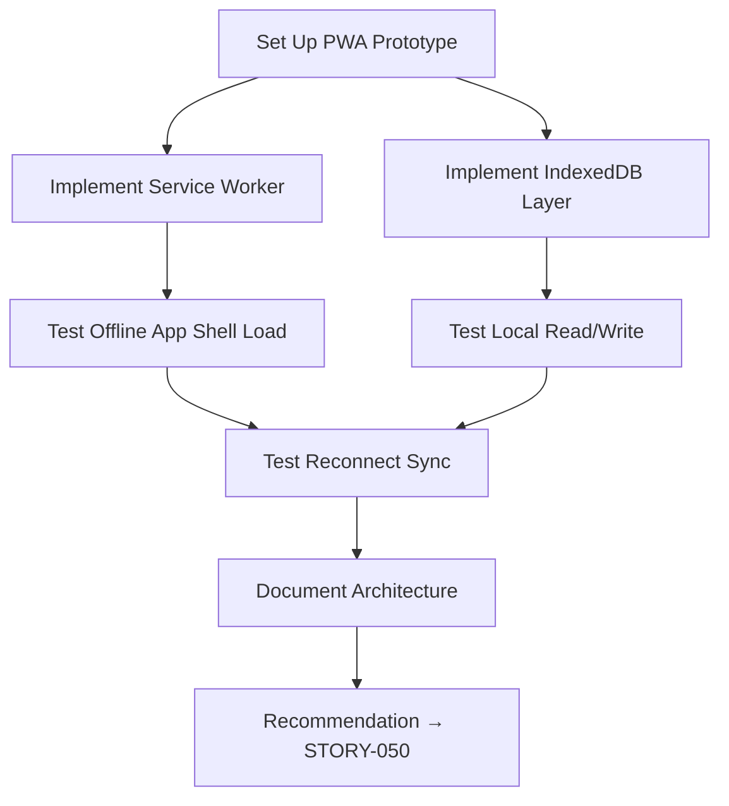

# STORY-048: Offline Strategy Spike (PWA)

**Epic**: EPIC-008
**Persona**: Julia — The Young Author
**Priority**: Could Have (V1.1 per PM-HANDOFF)
**Story Points**: 3
**Dependencies**: STORY-007 (CI/CD — needs deployed app to test), STORY-009 (Bookshelf Grid)

## User Story
As the development team, I want to evaluate PWA technologies (Service Worker, IndexedDB, Cache API) and produce a strategy for offline reading and writing, so we can implement reliable offline mode without risking data loss.

## Description
Conduct a time-boxed spike (max 1 sprint) to prototype and evaluate the offline architecture for Estante Digital. Test: (1) Service Worker registration for caching core app shell assets, (2) IndexedDB for storing book content and writing drafts locally, (3) conflict resolution strategy (last-write-wins vs. CRDT), (4) storage limits and persistent storage API. Produce a decision document with architecture recommendations.

## Context
Offline mode is the highest-risk EPIC-008 story due to data loss potential. This spike must answer the fundamental architectural questions before any implementation stories are written. The spike must be time-boxed: make a recommendation, don't build production offline mode.

## Acceptance Criteria (Verifiable)
- [ ] GIVEN a basic PWA prototype
      WHEN the app is loaded, then the network is disabled
      THEN the app shell (shelf UI, basic routing) loads from Service Worker cache within 2 seconds
- [ ] GIVEN the prototype
      WHEN book content is saved to IndexedDB while offline
      THEN the content survives a page refresh and browser restart
- [ ] GIVEN the prototype with simulated conflict (local edit vs. server edit)
      WHEN sync occurs on reconnect
      THEN the conflict resolution strategy (last-write-wins or timestamp comparison) is tested and documented
- [ ] GIVEN the spike is complete
      WHEN the time-box expires
      THEN recommendations are documented for: SW caching strategy, IndexedDB schema, sync protocol, storage limit handling

## NFRs
- NFR-PERF-06: Local save must complete within 100ms
- NFR-PRV-03: Local storage must not retain data after account deletion

## Definition of Done (DoD)
- [ ] Code reviewed by CodeReviewer
- [ ] Tests with coverage >= 90% (for evaluation scripts)
- [ ] Integration tests passing
- [ ] QA approved by QAAnalyst
- [ ] Documentation updated
- [ ] PR created by MergeRequestCreator

## Technical Notes
- **Deliverable**: `docs/decisions/OFFLINE-STRATEGY.md` with sections: caching strategy, data storage schema, sync protocol, conflict resolution, storage limits, security
- **Service Worker**: test Workbox (Google) vs. manual SW; compare caching strategies (Cache-First, Network-First, Stale-While-Revalidate)
- **IndexedDB**: test with 10 books of 10,000 words each; measure read/write performance
- **Persistent Storage**: test `navigator.storage.persist()` API; measure quota on Chrome, Firefox, Safari
- **Conflict resolution**: for single-user app, last-write-wins with server timestamp comparison is sufficient; document edge cases (clock skew, offline duration)
- **Time box**: 3 story points = ~half sprint

## User Flow

## Test Scenarios
- Scenario 1: App loads offline from SW cache — shelf UI visible
- Scenario 2: Write book content offline → survives refresh → syncs on reconnect
- Scenario 3: Storage quota approached → warning to user
- Scenario 4: Browser storage cleared → graceful degradation (re-sync from server)
