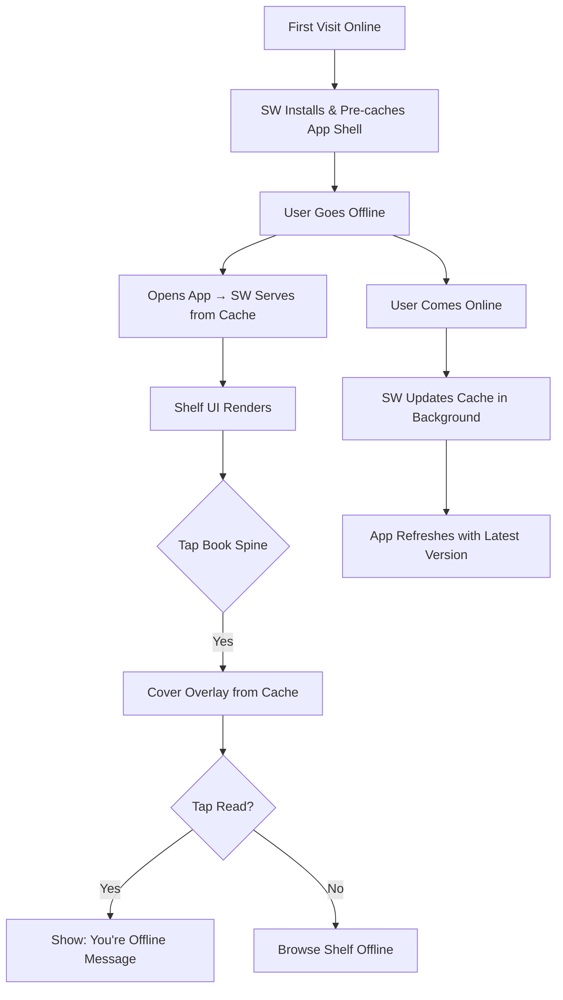

# STORY-049: Service Worker & Asset Pre-Caching

**Epic**: EPIC-008
**Persona**: Julia — The Young Author
**Priority**: Could Have (V1.1 per PM-HANDOFF)
**Story Points**: 5
**Dependencies**: STORY-048 (Offline Spike), STORY-007 (CI/CD)

## User Story
As a young author, I want the app to still open and show my shelf even when I don't have internet, so I can see my books anywhere — even in the car or at grandma's house.

## Description
Implement a Service Worker that pre-caches the core app shell (HTML, CSS, JS, and shelf UI assets) so that Estante Digital loads and renders the bookshelf even without internet connectivity. The SW must cache: the app shell, shelf rendering code, default book spine assets, and basic reader UI. It must NOT cache: user-generated book content (handled by STORY-050/051), large images, or API responses (handled by sync layer).

## Context
This is the foundation of offline mode. Without a Service Worker, the app is a blank screen when offline. This story ensures the "happy path" offline experience: Julia opens the app, sees her shelf, and knows her books are there — even if she can't read them yet (reading offline comes in STORY-051).

## Acceptance Criteria (Verifiable)
- [ ] GIVEN Julia has visited the app at least once online
      WHEN she opens the app without internet
      THEN the app shell loads from cache and the bookshelf UI renders within 2 seconds
- [ ] GIVEN the app is updated (new deploy)
      WHEN Julia comes online
      THEN the Service Worker updates its cache in the background and prompts a refresh (or auto-refreshes)
- [ ] GIVEN the Shelf renders offline
      WHEN Julia taps a book spine
      THEN the cover overlay shows cached assets; tapping "Read" shows a friendly "You're offline — come back online to read!" message
- [ ] GIVEN Julia is online
      WHEN she navigates the app
      THEN the Service Worker does not interfere — all requests go to the network normally, cache is only used as fallback
- [ ] GIVEN the Service Worker is installed
      WHEN Julia's browser storage is low
      THEN the app requests persistent storage (`navigator.storage.persist()`) to protect cached assets from eviction

## NFRs
- NFR-PERF-01: Shelf must render offline within 2 seconds
- NFR-PRV-03: No user-generated content stored in SW cache (only app shell assets)
- NFR-AVL-04: Graceful degradation — clear messaging when offline, no crashes

## Definition of Done (DoD)
- [ ] Code reviewed by CodeReviewer
- [ ] Tests with coverage >= 90%
- [ ] Integration tests passing
- [ ] QA approved by QAAnalyst
- [ ] Documentation updated
- [ ] PR created by MergeRequestCreator

## Technical Notes
- Use Workbox (Google) `precacheAndRoute()` for app shell assets: HTML, main JS bundle, CSS, shelf SVG assets, default cover gradient, empty state illustration
- SW lifecycle: `install` → cache app shell, `activate` → clean old caches, `fetch` → network-first for API calls, cache-first for static assets
- Update strategy: Workbox `skipWaiting()` + `clientsClaim()` for immediate activation; show a subtle "New version available" toast
- Persistent storage: call `navigator.storage.persist()` on first SW activation; check `navigator.storage.persisted()`
- Cache strategy: `CacheFirst` for static assets (immutable, versioned filenames), `NetworkFirst` for API (use cache as fallback), `StaleWhileRevalidate` for shelf data
- Coordinate with STORY-006 (CDN setup) — SW must handle CDN-hosted assets correctly (`crossorigin` attribute)

## User Flow

## Test Scenarios
- Scenario 1: Online first visit → go offline → shelf loads from cache in <2s
- Scenario 2: Offline shelf → tap spine → cover overlay shows; tap "Read" → offline message
- Scenario 3: New deploy published → SW updates cache after online visit
- Scenario 4: Browser storage low → persistent storage request succeeds
- Scenario 5: Online navigation → no SW interference; all requests go to network
