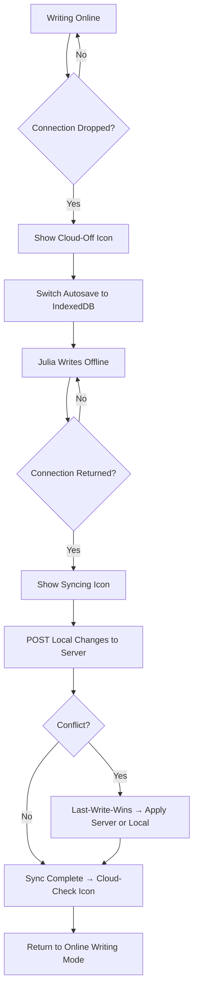

# STORY-050: Offline Writing with Local Autosave

**Epic**: EPIC-008
**Persona**: Julia — The Young Author
**Priority**: Could Have (V1.1 per PM-HANDOFF)
**Story Points**: 5
**Dependencies**: STORY-048 (Offline Spike), STORY-019 (Autosave — online), STORY-016 (Create Book), STORY-018 (Rich Text Editor)

## User Story
As a young author, I want to keep writing my story even without Wi-Fi and know my work is safely saved, so I never lose a good idea just because I'm offline.

## Description
Implement offline writing: when Julia is editing a book (STORY-018) and loses connectivity, the autosave system (STORY-019) switches to local storage (IndexedDB). Julia can continue writing, creating new chapters, and editing — all saved locally. When connectivity returns, local changes sync to the server automatically. The offline state is indicated by a subtle, non-blocking icon in the editor.

## Context
This is the highest-value EPIC-008 story for Julia's JTBD #4: "When I'm bored on a car ride, I want to keep writing even without Wi-Fi." Data loss is unacceptable. The sync must be seamless — Julia should not need to think about whether she's online or offline.

## Acceptance Criteria (Verifiable)
- [ ] GIVEN Julia is writing a book and the internet disconnects
      WHEN the connection drops
      THEN a subtle cloud-offline icon appears in the editor toolbar and writing continues without interruption
- [ ] GIVEN Julia is writing offline
      WHEN she types new text or edits chapters
      THEN content is saved to IndexedDB within 100ms (same autosave frequency as online)
- [ ] GIVEN Julia wrote 3 chapters offline
      WHEN internet connectivity returns
      THEN the local changes sync to the server automatically and the cloud-offline icon becomes a cloud-checkmark icon (sync success)
- [ ] GIVEN Julia closes the browser tab while offline
      WHEN she reopens the app (still offline)
      THEN all locally-saved content is still intact and readable
- [ ] GIVEN Julia is editing offline and the server also has a newer version (conflict)
      WHEN sync occurs
      THEN the last-write-wins rule applies (most recent `updatedAt` wins) and a subtle "Synced" indicator appears

## NFRs
- NFR-PERF-06: Local save must complete within 100ms
- NFR-AVL-04: Graceful degradation — clear offline indicator, no blocking errors
- NFR-PRV-03: Local storage cleared on account deletion (STORY-054)

## Definition of Done (DoD)
- [ ] Code reviewed by CodeReviewer
- [ ] Tests with coverage >= 90%
- [ ] Integration tests passing
- [ ] QA approved by QAAnalyst
- [ ] Documentation updated
- [ ] PR created by MergeRequestCreator

## Technical Notes
- Detection: use `navigator.onLine` + `online`/`offline` events; also use fetch heartbeat (every 30s) to detect captive portals
- Storage: IndexedDB schema matches server Book/Chapter schema; use same data model as STORY-004
- Sync protocol: on connectivity return, POST changed entities to API; conflict resolution by `updatedAt` timestamp comparison (last-write-wins)
- Sync queue: store pending sync operations in a separate IndexedDB table; process sequentially on reconnect
- Offline indicator: small cloud icon in editor toolbar; grey-cloud = offline, green-check = synced, orange-sync = syncing
- Reuse STORY-019 autosave trigger logic; add `offline: boolean` flag to save function
- DO NOT allow cover design or image upload offline (per EPIC-008 scope exclusion)

## User Flow

## Test Scenarios
- Scenario 1: Disconnect mid-writing → offline indicator appears, autosave continues locally
- Scenario 2: Write 3 chapters offline → reconnect → all content synced to server
- Scenario 3: Close browser offline → reopen → content intact from IndexedDB
- Scenario 4: Conflict: local edit + server edit → last-write-wins, synced indicator shown
- Scenario 5: Captive portal Wi-Fi → heartbeat detects no real internet → stays in offline mode
