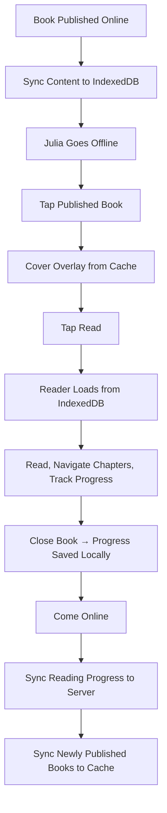

# STORY-051: Offline Reading for Published Books

**Epic**: EPIC-008
**Persona**: Julia — The Young Author
**Priority**: Could Have (V1.1 per PM-HANDOFF)
**Story Points**: 5
**Dependencies**: STORY-049 (Service Worker), STORY-029 (Reader UI), STORY-020 (Publish Book)

## User Story
As a young author, I want to read my published books even when I'm offline, so I can enjoy my stories in the car, on a plane, or anywhere without Wi-Fi.

## Description
Enable offline reading of all published books: when Julia publishes a book (STORY-020) while online, the full content (all chapters, text, and reading progress) is cached in IndexedDB. When offline, Julia can open and read any published book from the local cache. The reader UI (STORY-029) functions fully offline with paginated mode (STORY-030) and continuous scroll (STORY-031). Reading progress is saved locally and synced on reconnect.

## Context
Offline reading is Julia's JTBD #4: reading in the car. Combined with offline writing (STORY-050), this makes Estante Digital a fully offline-capable creative tool. Published books are the right scope — drafts may not be fully ready for offline reading and add complexity.

## Acceptance Criteria (Verifiable)
- [ ] GIVEN Julia has published a book while online
      WHEN the app syncs content to local cache
      THEN the book's full text (all chapters) is stored in IndexedDB
- [ ] GIVEN Julia is offline
      WHEN she taps a published book's spine (cover overlay opens) and taps "Read"
      THEN the reader opens and displays the full book content from local cache
- [ ] GIVEN Julia is reading offline
      WHEN she navigates between chapters (STORY-034) and turns pages (STORY-030)
      THEN all content loads instantly from local cache; no network requests
- [ ] GIVEN Julia is reading offline and reaches page 15
      WHEN she closes and reopens the book (still offline)
      THEN her reading progress is restored from local cache
- [ ] GIVEN a new book is published online
      WHEN Julia comes online
      THEN the new book is synced to local cache automatically for future offline reading
- [ ] GIVEN Julia has 50 published books
      WHEN IndexedDB storage approaches the browser limit (80%+)
      THEN a subtle warning appears: "Your device is almost full. Some books may not be available offline."

## NFRs
- NFR-PERF-02: First page loads within 1s from local cache
- NFR-PERF-06: Reading progress save within 100ms locally
- NFR-SCL-02: Support up to 50 books locally; warn at storage limit
- NFR-PRV-03: Local cache cleared on account deletion

## Definition of Done (DoD)
- [ ] Code reviewed by CodeReviewer
- [ ] Tests with coverage >= 90%
- [ ] Integration tests passing
- [ ] QA approved by QAAnalyst
- [ ] Documentation updated
- [ ] PR created by MergeRequestCreator

## Technical Notes
- Caching trigger: on book publish (STORY-020) and on app startup (sync any newly published books)
- IndexedDB schema: `books` table with `id`, `title`, `content` (full text), `chapters` (JSON array), `updatedAt`, `readingProgress`
- Storage limit detection: `navigator.storage.estimate()` → warn at 80% of quota; use LRU eviction (oldest accessed books removed) if limit hit
- Reader integration: modify STORY-029 to check `navigator.onLine` first; if offline, fetch from IndexedDB; if online, fetch from API (with IndexedDB cache as fallback)
- Reading progress: save to same IndexedDB table; sync to server via STORY-033 sync queue on reconnect
- DO NOT cache draft books (only published); draft data is handled by offline writing (STORY-050)

## User Flow

## Test Scenarios
- Scenario 1: Publish book online → go offline → read full book from cache
- Scenario 2: Read offline, close, reopen offline → progress restored
- Scenario 3: 50 books cached → storage warning at 80% quota
- Scenario 4: New book published after reconnect → synced to cache for future offline
- Scenario 5: Draft book NOT available offline (only published)
