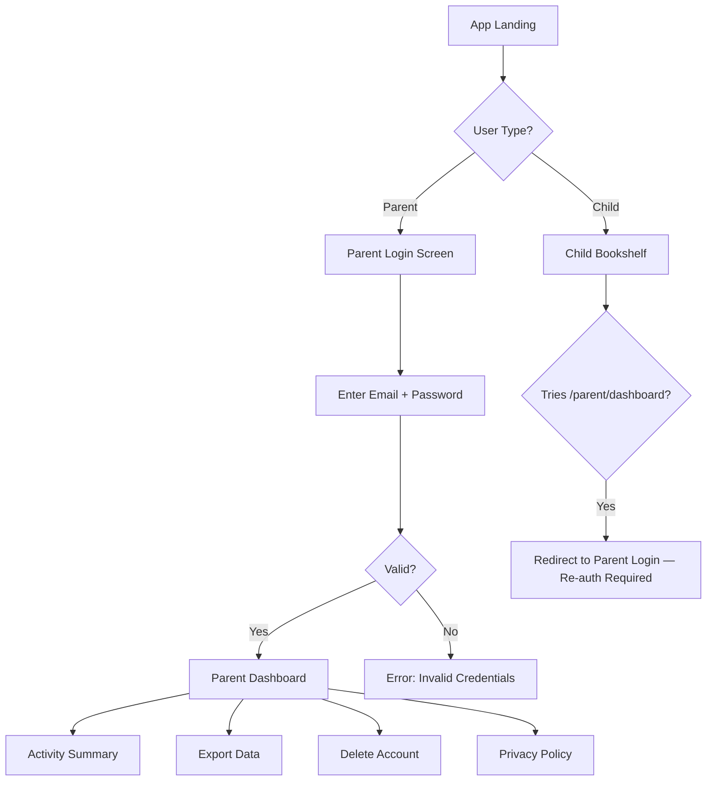

# STORY-052: Parent Authentication & Dashboard Access

**Epic**: EPIC-009
**Persona**: Mãe da Julia — The Caring Parent
**Priority**: Could Have (V1.1 per PM-HANDOFF)
**Story Points**: 5
**Dependencies**: STORY-001 (Onboarding — captures parent email), STORY-002 (Auth), STORY-004 (Data Model)

## User Story
As a caring parent, I want a separate, password-protected area where I can see what my child is doing in the app, so I feel confident she's safe and productive.

## Description
Create a parent login flow and dashboard shell accessible from the app. Parents authenticate with their email (captured during STORY-001 onboarding) and a password — separate from the child's session. The dashboard is a distinct view with aggregated activity: number of books created, time spent reading, and privacy management options. The dashboard must never be accessible from the child's session without re-authentication.

## Context
Parent trust is the gatekeeper for adoption. The dashboard must feel transparent and reassuring — not surveillance. It shows high-level aggregates, not granular tracking. This story establishes the authentication and layout; subsequent stories add dashboard features (activity, export, deletion).

## Acceptance Criteria (Verifiable)
- [ ] GIVEN a parent with email registered during STORY-001 onboarding
      WHEN they navigate to the parent login screen
      THEN they can authenticate with their email and a password they set
- [ ] GIVEN a child is logged into their session
      WHEN the child navigates to the parent dashboard URL
      THEN the dashboard is inaccessible — the app requires parent re-authentication
- [ ] GIVEN a parent is authenticated
      WHEN the dashboard loads
      THEN they see a dashboard shell with navigation: Activity Summary, Export Data, Delete Account, Privacy Policy
- [ ] GIVEN a parent session is idle for 30 minutes (per NFR-SEC-03)
      WHEN they attempt any action
      THEN the session has expired and re-authentication is required
- [ ] GIVEN a parent is authenticated
      WHEN they view the dashboard
      THEN it is clearly distinct from the child's app UI — different color scheme, no bookshelf, adult-appropriate typography

## NFRs
- NFR-SEC-03: Sessions expire after 30 minutes of inactivity
- NFR-SEC-04: Parent login uses strong password validation (min 8 chars, 1 uppercase, 1 number)
- NFR-PRV-01: Parent auth is separate from child auth; no shared credentials
- NFR-PRV-05: No marketing or promotional content on parent dashboard
- NFR-OBS-04: Parent logins logged with hashed user ID for audit

## Definition of Done (DoD)
- [ ] Code reviewed by CodeReviewer
- [ ] Tests with coverage >= 90%
- [ ] Integration tests passing
- [ ] QA approved by QAAnalyst
- [ ] Documentation updated
- [ ] PR created by MergeRequestCreator

## Technical Notes
- Auth flow: separate `/parent/login` and `/parent/dashboard` routes with parent-specific JWT claims (`role: "parent"`)
- Password setup: if parent email exists but no password, show "Set up your parent account" flow with email verification link
- Dashboard UI: distinct from child UI — neutral color palette (blues/whites), no child illustrations, clear data presentation
- Session management: parent JWTs stored in httpOnly cookie (not localStorage); separate from child JWT cookie
- Link parent to child: `ParentAccount` model with `parentEmail`, `childAccountId` FK; one parent can link to one child (MVP)
- Parent session idle timeout: 30 minutes, enforced server-side via JWT exp claim + middleware check

## User Flow

## Test Scenarios
- Scenario 1: Registered parent email logs in → dashboard loads
- Scenario 2: Child session tries to access dashboard → re-auth required
- Scenario 3: Parent session idle 30 min → session expired, re-auth needed
- Scenario 4: Invalid login attempt → friendly error, no lockout (max 5 attempts)
- Scenario 5: Dashboard UI is visually distinct from child UI
