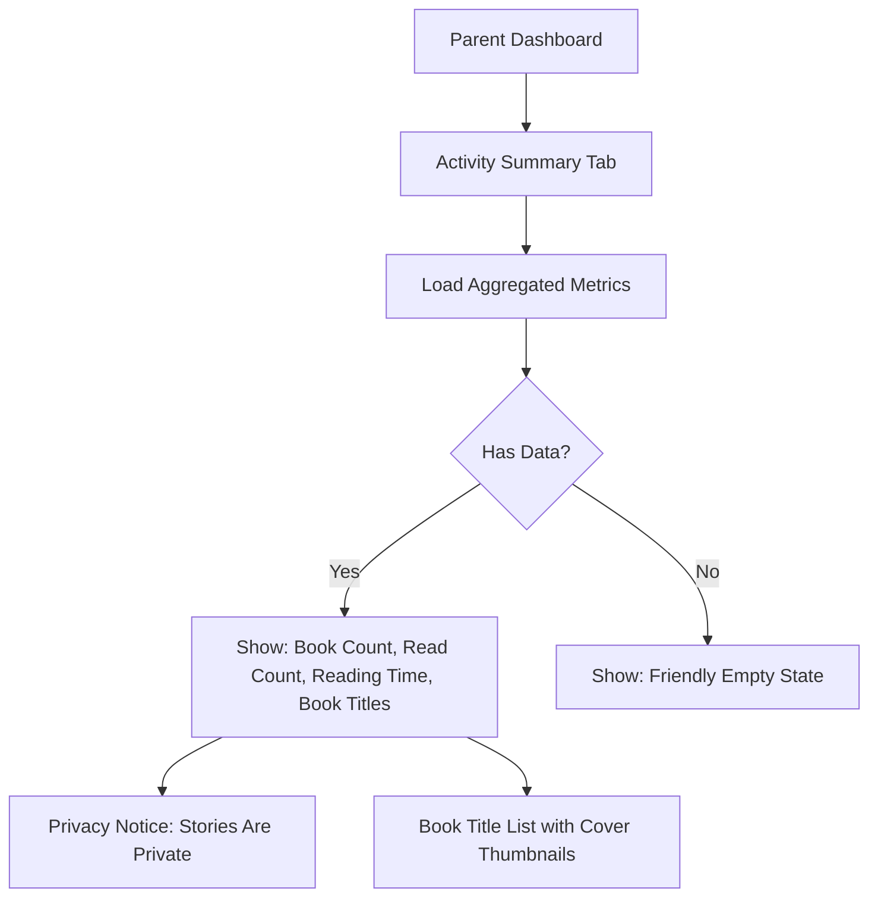

# STORY-053: Parent Activity Summary View

**Epic**: EPIC-009
**Persona**: Mãe da Julia — The Caring Parent
**Priority**: Could Have (V1.1 per PM-HANDOFF)
**Story Points**: 3
**Dependencies**: STORY-052 (Parent Dashboard Auth), STORY-033 (Reading Progress Tracking)

## User Story
As a caring parent, I want to see a simple summary of my child's reading and writing activity, so I can encourage her creativity without hovering over her shoulder.

## Description
Add an Activity Summary view to the parent dashboard (STORY-052). It displays aggregated, high-level metrics: number of books created, number of books read, total reading time this week, and a list of book titles (not full content). The summary is intentionally NOT granular — no per-page tracking, no keystroke logs, no reading speed metrics. This respects child autonomy while giving parents meaningful visibility.

## Context
The Activity Summary is the most-visited page in the parent dashboard. It must strike the right balance: enough information for parents to feel informed, not so much that it feels like surveillance. Per EPIC-009 business rules: "aggregated, not minute-by-minute tracking."

## Acceptance Criteria (Verifiable)
- [ ] GIVEN a parent is logged into the dashboard (STORY-052)
      WHEN the Activity Summary loads
      THEN they see: "Julia has written **5 books** and read **3 books** this week."
- [ ] GIVEN the Activity Summary
      WHEN a parent views the book list
      THEN they see book titles and cover thumbnails — NOT the full book content
- [ ] GIVEN Julia read a book for 15 minutes today
      WHEN the Activity Summary loads
      THEN it shows: "Total reading time this week: 45 minutes" (aggregated across all sessions)
- [ ] GIVEN a parent views the Activity Summary
      WHEN the data loads
      THEN it clearly states: "Julia's stories are private. Only titles and reading time are shown here."
- [ ] GIVEN no activity data exists (new account)
      WHEN the Activity Summary loads
      THEN it shows a friendly empty state: "Julia is just getting started! Check back soon."

## NFRs
- NFR-PRV-03: Only aggregated metrics stored; no granular session logs retained beyond 12 months
- NFR-PRV-04: No analytics cookies or tracking on parent dashboard
- NFR-ACC-07: All text in Portuguese (primary) and English

## Definition of Done (DoD)
- [ ] Code reviewed by CodeReviewer
- [ ] Tests with coverage >= 90%
- [ ] Integration tests passing
- [ ] QA approved by QAAnalyst
- [ ] Documentation updated
- [ ] PR created by MergeRequestCreator

## Technical Notes
- Data aggregation: query book count (published books), books read count (any read session with >1 minute), total reading time (sum of reading session durations from STORY-033)
- Time period: "This week" = last 7 days from current date
- Privacy note: render as a subtle info banner or tooltip — "Julia's stories are private. Only titles and reading time are shown here." — per EPIC-009 business rule about trust-based positioning
- Book list: render as a simple card grid with title + cover thumbnail; no "Read" button, no access to content
- Empty state: illustrated placeholder with encouraging message in the child-friendly style
- Performance: aggregate queries must respond within 1s for up to 100 books

## User Flow

## Test Scenarios
- Scenario 1: Active child (5 books, 3 read, 45 min) → all metrics displayed correctly
- Scenario 2: New account with no activity → friendly empty state shown
- Scenario 3: Parent cannot access book content (only titles and covers)
- Scenario 4: Privacy notice is visible on the summary page
- Scenario 5: Metrics recalculate correctly for "this week" window
