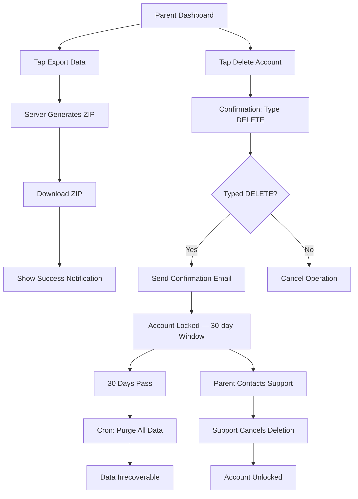

# STORY-054: Data Export & Account Deletion

**Epic**: EPIC-009
**Persona**: Mãe da Julia — The Caring Parent
**Priority**: Could Have (V1.1 per PM-HANDOFF)
**Story Points**: 5
**Dependencies**: STORY-052 (Parent Dashboard Auth), STORY-004 (Data Model)

## User Story
As a caring parent, I want to download all of Julia's books and data at any time, and permanently delete her account if needed, so I have full control over her privacy and creative work.

## Description
Add two critical parent dashboard features: (1) **Data Export** — generate and download a ZIP archive containing all child's books (content as TXT/JSON + metadata) and cover images, and (2) **Account Deletion** — initiate a GDPR/LGPD/COPPA-compliant permanent deletion of the child account with confirmation email and 30-day purge window. Both require explicit parent confirmation to prevent accidents.

## Context
Data portability and right-to-erasure are legal requirements under GDPR/LGPD and COPPA. These features build parent trust by making data control visible and easy. The export should feel like a "backup" for parents; the deletion should feel safe and deliberate, not scary.

## Acceptance Criteria (Verifiable)
- [ ] GIVEN a parent is logged into the dashboard
      WHEN they tap "Download All Data"
      THEN a ZIP file is generated containing all child books (each as .txt file with metadata.json) and cover images, and downloaded to the parent's device within 30 seconds for up to 10 books
- [ ] GIVEN a data export is generated
      WHEN the ZIP downloads
      THEN a success notification appears: "Download complete! All of Julia's stories are saved."
- [ ] GIVEN a parent taps "Delete Account"
      WHEN the confirmation dialog appears
      THEN it requires the parent to type "DELETE" to confirm (prevents accidental taps)
- [ ] GIVEN a parent confirms account deletion
      WHEN the request is submitted
      THEN a confirmation email is sent and the account is queued for permanent deletion within 30 days
- [ ] GIVEN an account deletion request is submitted
      WHEN the parent (or anyone) attempts to log in within the 30-day window
      THEN the account is locked with a message: "This account is scheduled for deletion. Contact support to cancel."
- [ ] GIVEN the 30-day deletion window expires
      WHEN the deletion job runs
      THEN all child data (books, covers, metadata, reading history, auth info) is permanently purged and irrecoverable

## NFRs
- NFR-PRV-02 (GDPR Article 15): Data must be exportable in open format
- NFR-PRV-02 (GDPR Article 17): Right to erasure; data purged within 30 days
- NFR-PRV-02 (LGPD): Same rights as GDPR; compliant for Brazilian users
- NFR-PRV-01 (COPPA): Parent must be able to delete child's data
- NFR-SEC-03: Account deletion requires re-authentication (destructive action)
- NFR-OBS-04: All deletion operations fully logged for audit

## Definition of Done (DoD)
- [ ] Code reviewed by CodeReviewer
- [ ] Tests with coverage >= 90%
- [ ] Integration tests passing
- [ ] QA approved by QAAnalyst
- [ ] Documentation updated
- [ ] PR created by MergeRequestCreator

## Technical Notes
- **Export format**: ZIP containing:
  - `books/` folder: each book as `{title}.txt` (plain text with chapters separated by `\n\n---\n\n`)
  - `metadata.json`: `{ "exportDate": "ISO8601", "bookCount": N, "books": [{ "title": "...", "createdAt": "...", "chapterCount": N }] }`
  - `covers/` folder: cover images as `{bookId}.png` (or original format)
- **Export generation**: server-side ZIP creation using `archiver` npm package; stream to response with `Content-Disposition: attachment`
- **Deletion flow**: create `DeletionRequest` record with `status: "pending"` and `expiresAt: now + 30 days`; send confirmation email; run daily cron job for expired requests → hard-delete all related records (cascade)
- **Deletion rollback**: within 30 days, parent can contact support to cancel; support admin can flip `DeletionRequest.status` to `"cancelled"`
- **Data model cleanup**: cascade delete for: `Book`, `Chapter`, `Cover`, `ReadingProgress`, `ReadingSession`, `ChildAccount`, `ParentAccount`, `DeletionRequest`
- **Email**: use transactional email service (e.g., SendGrid, SES) for confirmation; include support contact

## User Flow

## Test Scenarios
- Scenario 1: Export 5 books → ZIP contains all .txt files + metadata.json + cover images
- Scenario 2: Delete account with confirmation → email sent, account locked
- Scenario 3: Attempt login during 30-day window → locked message shown
- Scenario 4: 30-day window expires → cron purges all data permanently
- Scenario 5: Support cancels deletion → account unlocked, data intact
