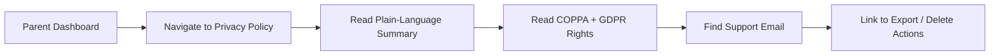

# STORY-055: Privacy Policy & Transparency Page

**Epic**: EPIC-009
**Persona**: Mãe da Julia — The Caring Parent
**Priority**: Could Have (V1.1 per PM-HANDOFF)
**Story Points**: 2
**Dependencies**: STORY-052 (Parent Dashboard Auth)

## User Story
As a caring parent, I want to read a clear, plain-language privacy policy that explains what data is collected and why, so I can trust the app without needing a law degree.

## Description
Add a Privacy Policy page to the parent dashboard (STORY-052) that explains, in simple language: what data is collected (child name, books, reading progress, device type), why it's collected (to provide the service), how long it's kept (12 months for activity data), and how parents can export or delete it (STORY-054). The page must also include: a contact/support email for privacy questions, a link to the full legal privacy policy (if one exists), and COPPA/GDPR/LGPD compliance badges or statements.

## Context
Parents cite "confusing privacy policies" as a top pain point. This story flips that by making the privacy policy a trust-building feature, not a legal checkbox. The language must be at a reading level accessible to non-technical, non-legal parents.

## Acceptance Criteria (Verifiable)
- [ ] GIVEN a parent is logged into the dashboard
      WHEN they navigate to "Privacy Policy"
      THEN they see a plain-language explanation of: what data is collected, why, for how long, and how to delete it
- [ ] GIVEN the Privacy Policy page
      WHEN a parent reads it
      THEN it clearly states: "We never show Julia's stories to anyone. We never sell data. We never show ads. Ever."
- [ ] GIVEN the Privacy Policy page
      WHEN a parent needs help
      THEN a support email link is visible: "Questions? Email privacy@estantedigital.app"
- [ ] GIVEN the Privacy Policy page
      WHEN rendered
      THEN COPPA compliance and GDPR/LGPD rights are explained in simple terms (not legal citations)
- [ ] GIVEN the parent navigates away from the privacy page
      WHEN they return
      THEN the page is still accessible (it's a static/rendered page, not a one-time modal)

## NFRs
- NFR-PRV-01 (COPPA): Privacy policy must be accessible to parents
- NFR-PRV-02 (GDPR/LGPD): Transparent data processing information required
- NFR-ACC-07: Available in Portuguese (primary) and English
- NFR-ACC-04: Text contrast 4.5:1 minimum

## Definition of Done (DoD)
- [ ] Code reviewed by CodeReviewer
- [ ] Tests with coverage >= 90%
- [ ] Integration tests passing
- [ ] QA approved by QAAnalyst
- [ ] Documentation updated
- [ ] PR created by MergeRequestCreator

## Technical Notes
- Content: static page rendered on dashboard; content managed via a markdown/text file for easy updates (e.g., `docs/product/PRIVACY-POLICY.md`)
- Key statements (must include):
  - "What we collect: Julia's name, books she writes, books she reads, and how long she reads. That's it."
  - "What we NEVER do: sell data, show ads, share stories, track location."
  - "How long we keep data: Activity data is kept for 12 months, then automatically deleted. Books are kept until you delete the account."
  - "Your rights: You can download all data (Export), delete the account (Delete), or ask us questions any time."
- COPPA note: "This app complies with COPPA. You control your child's data."
- GDPR/LGPD note: "You have the right to access, download, and delete your child's data at any time."
- Support email: configurable via environment variable `SUPPORT_EMAIL`
- Reading level target: Flesch-Kincaid Grade 6-8 (accessible to most parents)

## User Flow

## Test Scenarios
- Scenario 1: Privacy policy page renders with all required sections
- Scenario 2: Plain language — no legal jargon beyond "COPPA" and "GDPR" (explained inline)
- Scenario 3: Support email link is clickable and prefilled
- Scenario 4: Portuguese version renders correctly; English version available
