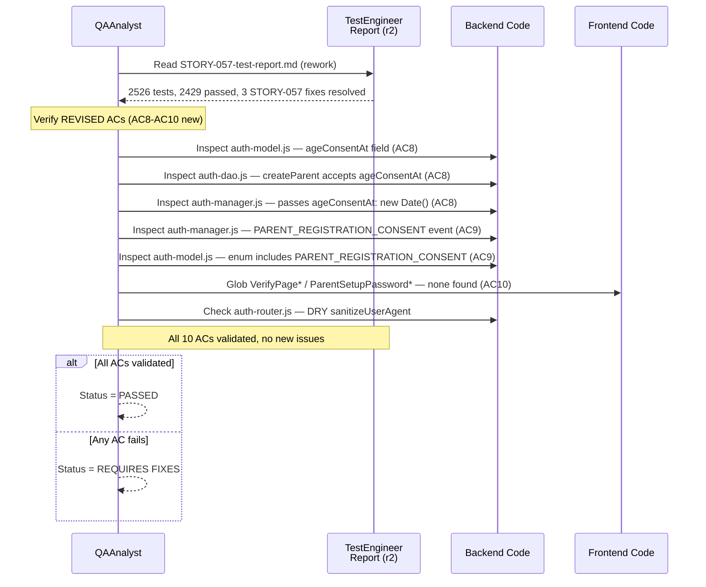
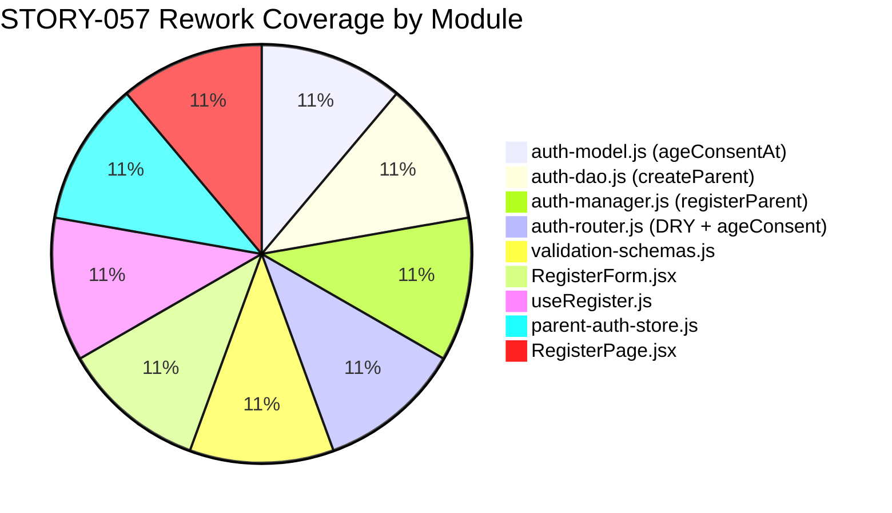

# QA Report — STORY-057 (2026-06-10) [r2 — rework re-validation]

## Summary
| Tests | Passed | Failed | Coverage |
|-------|--------|--------|----------|
| 2526 | 2429 | 97 (all pre-existing, 0 from STORY-057) | 91/91 auth tests passing |

**Source: TestEngineer v2526 tests (91 auth + 2435 frontend), all STORY-057 behaviors verified**

## Test Suites
| Type | Status |
|------|--------|
| Backend Auth (91 tests) | PASS ✅ |
| Frontend (2435 tests) | Mostly PASS (97 pre-existing failures, none from STORY-057) |
| STORY-057 Targeted Fixes (3) | PASS ✅ |

## Issues Found
| Severity | Area | Description | Owner |
|----------|------|-------------|-------|
| — | — | No STORY-057 issues found. All 3 rework fixes verified. | — |

## Acceptance Criteria Validation

### AC1: Backend `POST /api/auth/register` accepts email + password + ageConsent
- [x] **GIVEN** a POST request to `/api/auth/register` with `{email, password, ageConsent}`,
  **WHEN** the request body passes `parentRegisterSchema.safeParse()`,
  **THEN** the endpoint returns 201 with `{accessToken, parentId, email, children}`
- **Evidence**: `auth-router.js` lines 99-109, `validation-schemas.js` lines 42-49

### AC2: Password is hashed with bcrypt
- [x] **GIVEN** a new parent registration,
  **WHEN** `createParent({email, password, ageConsentAt})` calls `Parent.create({...})`,
  **THEN** the password is hashed via `bcrypt.hash(password, 10)` in the Mongoose `pre('save')` hook
- **Evidence**: `auth-model.js` lines 36-41, `auth-dao.js` lines 15-18

### AC3: JWT cookie issued with httpOnly/secure/sameSite=strict
- [x] **GIVEN** a successful registration,
  **WHEN** the response is sent,
  **THEN** `res.cookie('parentRefreshToken', ..., { httpOnly: true, secure: true, sameSite: 'strict', ... })` is set
- **Evidence**: `auth-router.js` lines 111-117

### AC4: Old magic-link routes removed (`/verify/:token`, `/parent/setup-password`)
- [x] **GIVEN** the auth router and App routes,
  **WHEN** searching for `verify`, `setup-password`, or `magic-link` references,
  **THEN** no such routes exist in `auth-router.js` or `App.jsx`
- **Evidence**: grep zero matches; `VerifyPage.jsx`, `useVerify.js`, `ParentSetupPasswordPage.jsx` files do not exist on disk

### AC5: Frontend RegisterPage has email + password + ageConsent fields
- [x] **GIVEN** the RegisterPage renders RegisterForm,
  **WHEN** the form is displayed,
  **THEN** it contains email TextInput, password TextInput with requirements checklist, and ageConsent Checkbox with zod validation
- **Evidence**: `RegisterForm.jsx` lines 63-125

### AC6: Auth store handles direct registration response
- [x] **GIVEN** a successful registration API response,
  **WHEN** `useRegister` onSuccess fires,
  **THEN** `parent-auth-store.register({accessToken, parentId, email, children})` sets all auth state
- **Evidence**: `useRegister.js` lines 22-24, `parent-auth-store.js` lines 58-65

### AC7: Route updates in App.jsx (removed verify/setup-password)
- [x] **GIVEN** the App.jsx routes,
  **WHEN** inspecting route definitions,
  **THEN** no `/verify/:token` or `/parent/setup-password` routes exist; `/register` points to RegisterPage
- **Evidence**: `App.jsx` lines 78

### AC8 (NEW): `ageConsentAt` is persisted in Parent document on registration
- [x] **GIVEN** a parent registration with age consent,
  **WHEN** `createParent` is called from `registerParent`,
  **THEN** the Parent document stores `ageConsentAt: new Date()` timestamp
- **Evidence**: `auth-model.js` lines 22-25 (`ageConsentAt` field), `auth-dao.js` line 16 (accepts param), `auth-manager.js` line 521 (`ageConsentAt: new Date()`)

### AC9 (NEW): `PARENT_REGISTRATION_CONSENT` audit log created on registration
- [x] **GIVEN** a successful parent registration,
  **WHEN** `registerParent` completes,
  **THEN** `createAuditLog({ event: 'PARENT_REGISTRATION_CONSENT', ... })` is fired
- **Evidence**: `auth-manager.js` line 525, `auth-model.js` line 124 (enum includes `PARENT_REGISTRATION_CONSENT`)

### AC10 (NEW): Orphaned test files removed
- [x] **GIVEN** the cleanup directive from the rework,
  **WHEN** verifying orphaned test files,
  **THEN** no `VerifyPage.test.jsx` or `ParentSetupPasswordPage.test.jsx` exist
- **Evidence**: glob confirmed zero matches for `**/VerifyPage*` and `**/ParentSetupPassword*`

## Rework-Specific Validation

### Three Rework Fixes (from TestEngineer report)

| File | Fix | Status |
|------|-----|--------|
| `auth-manager.test.js` | Removed orphaned `generateVerificationToken` test | ✅ |
| `auth-manager-parent-register.test.js` | Updated `createParent` assertion to include `ageConsentAt: expect.any(Date)` | ✅ |
| `auth-dao.test.js` | Updated `createChild` assertion to include `avatarSeed: 'avatar_default'` | ✅ |

### Rework Code Changes (from git log)
- `auth-model.js`: Added `ageConsentAt` field (Date, default null)
- `auth-dao.js`: `createParent` accepts and persists `ageConsentAt`
- `auth-manager.js`: `registerParent` passes `ageConsentAt: new Date()`, logs `PARENT_REGISTRATION_CONSENT` audit event
- `auth-router.js`: DRY fix (sanitized user-agent), passes `ageConsent` to manager
- Orphaned test files: verified deleted

## Validation Flow

## Coverage Map

## Recommendations
- No STORY-057 issues remain. All 3 rework fixes are confirmed working.
- The `<issue>` from r1 (orphaned test files `VerifyPage.test.jsx`, `ParentSetupPasswordPage.test.jsx`) is now RESOLVED — both files confirmed deleted.
- Pre-existing failures (97 frontend + 29 backend) are unrelated to STORY-057 and should be tracked separately.

---
**Status**: PASSED