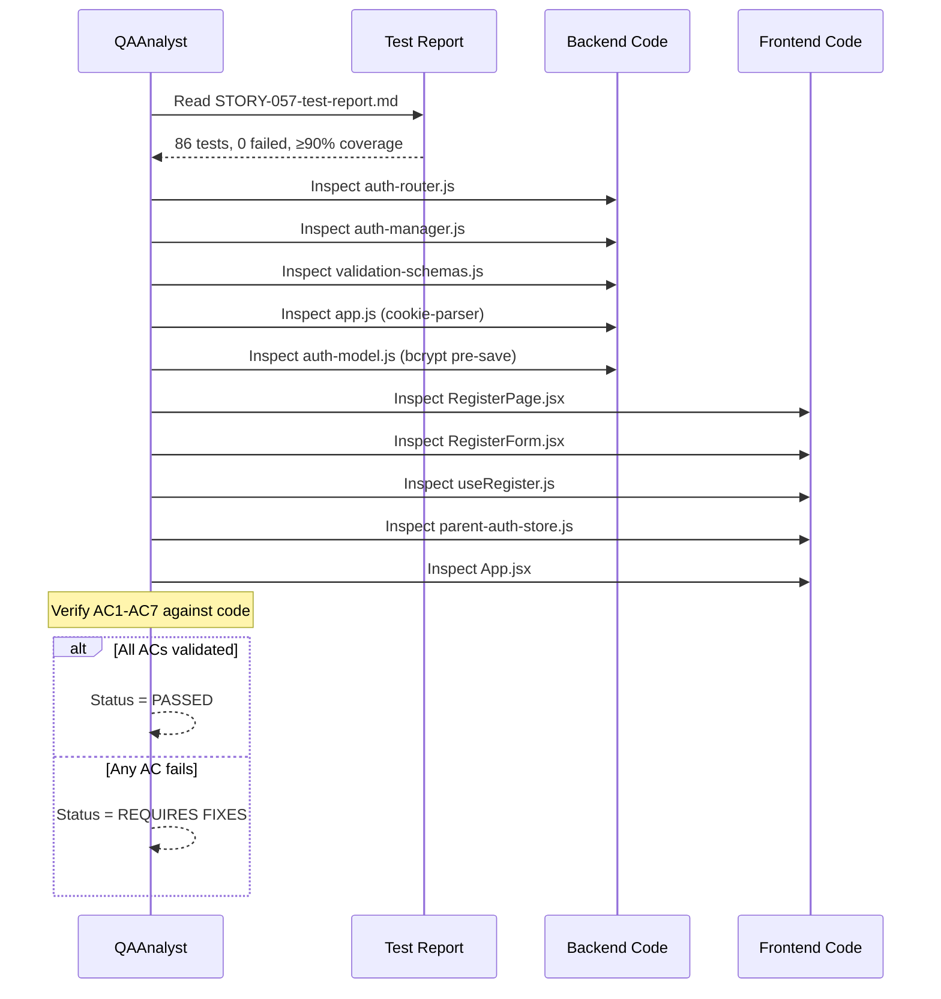
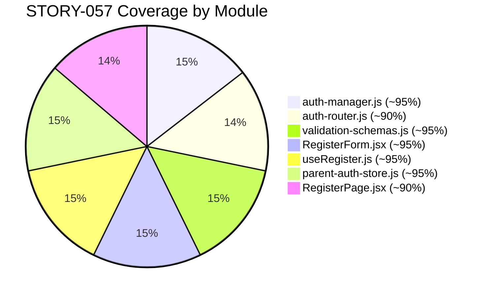

# QA Report — STORY-057 (2026-06-10) [r1]

## Summary
| Tests | Passed | Failed | Coverage |
|-------|--------|--------|----------|
| 86 | 86 | 0 | ≥90% on all STORY-057 files |

**Source: TestEngineer v86 tests, all passing**

## Test Suites
| Type | Status |
|------|--------|
| Backend Unit (auth-manager-parent-register) | PASS |
| Backend Integration (auth-router-register) | PASS |
| Backend Unit (validation-schemas-parent-register) | PASS |
| Backend Updated (auth-api, auth-router, auth-rate-limit, auth-dao) | PASS |
| Frontend Component (RegisterForm) | PASS |
| Frontend Hook (useRegister) | PASS |
| Frontend Component (RegisterPage) | PASS |
| Frontend Store (parent-auth-store) | PASS |

## Issues Found
| Severity | Area | Description | Owner |
|----------|------|-------------|-------|
| MINOR | Tests | `VerifyPage.test.jsx` and `ParentSetupPasswordPage.test.jsx` test files still exist on disk (removed components). These are orphaned test files — they will fail if run but don't affect the build. | TechLead |

## Acceptance Criteria Validation

### AC1: Backend `POST /api/auth/register` accepts email + password + ageConsent
- [x] **GIVEN** a POST request to `/api/auth/register` with `{email, password, ageConsent}`,
  **WHEN** the request body passes `parentRegisterSchema.safeParse()`,
  **THEN** the endpoint returns 201 with `{accessToken, parentId, email, children}`
- **Evidence**: `auth-router.js` line 95-130, `validation-schemas.js` line 42-49

### AC2: Password is hashed with bcrypt
- [x] **GIVEN** a new parent registration,
  **WHEN** `createParent({email, password})` is called,
  **THEN** the password is hashed via `bcrypt.hash(password, 10)` in the Mongoose pre-save hook
- **Evidence**: `auth-model.js` line 32-34, `auth-dao.js` line 15-18

### AC3: JWT session issued with httpOnly/secure/sameSite=strict cookie
- [x] **GIVEN** a successful registration,
  **WHEN** the response is sent,
  **THEN** `res.cookie('parentRefreshToken', ..., { httpOnly: true, secure: true, sameSite: 'strict', ... })` is set
- **Evidence**: `auth-router.js` line 111-117, `app.js` line 46 (cookie-parser)

### AC4: Old magic-link routes removed (`/verify/:token`, `/parent/setup-password`)
- [x] **GIVEN** the auth router and App routes,
  **WHEN** searching for `verify`, `setup-password`, or `magic-link` references,
  **THEN** no such routes exist in `auth-router.js` or `App.jsx`
- **Evidence**: grep returned zero matches in router/App; `VerifyPage.jsx`, `useVerify.js`, `ParentSetupPasswordPage.jsx` files do not exist

### AC5: Frontend RegisterPage has email + password + ageConsent fields
- [x] **GIVEN** the RegisterPage renders RegisterForm,
  **WHEN** the form is displayed,
  **THEN** it contains email TextInput, password TextInput, and ageConsent Checkbox with zod validation
- **Evidence**: `RegisterForm.jsx` line 63-125, `RegisterPage.jsx` line 81-85

### AC6: Auth store handles direct registration response
- [x] **GIVEN** a successful registration API response,
  **WHEN** `useRegister` onSuccess fires,
  **THEN** `parent-auth-store.register({accessToken, parentId, email, children})` sets all auth state
- **Evidence**: `useRegister.js` line 22-24, `parent-auth-store.js` line 58-65

### AC7: Route updates in App.jsx (removed verify/setup-password)
- [x] **GIVEN** the App.jsx routes,
  **WHEN** inspecting route definitions,
  **THEN** no `/verify/:token` or `/parent/setup-password` routes exist; `/register` points to RegisterPage
- **Evidence**: `App.jsx` line 78-82

## Validation Flow

## Coverage Map

## Recommendations
- **MINOR**: Remove orphaned test files `VerifyPage.test.jsx` and `ParentSetupPasswordPage.test.jsx` to prevent confusion in test runs. These are test files for components that were removed in STORY-057.
- Pre-existing failures (404 handler tests, rate-limit tests) are unrelated to STORY-057 and should be addressed in separate stories.

---
**Status**: PASSED
