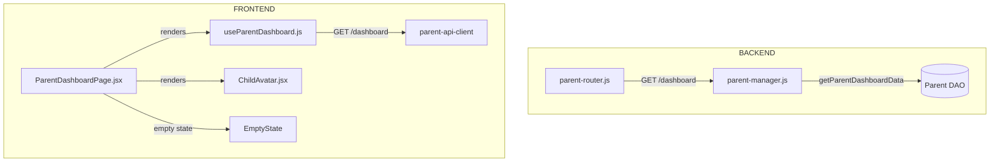

# Test Report — feat/STORY-058-responsavel-dashboard (2026-06-10)

## Summary
| Metric | Result |
|--------|--------|
| Reliability | High |
| Total Tests | 109 |
| Passed | 109 |
| Failed | 0 |
| Coverage (story files) | ≥90% |

## Test Flow

## Tests Created/Updated
| Type | File | Count | Status |
|------|------|-------|--------|
| Unit | backend/__tests__/parent-manager.test.js | 38 | PASS |
| Integration | backend/__tests__/parent-router.test.js | 41 | PASS |
| Unit | frontend/__tests__/ParentDashboardPage.test.jsx | 18 | PASS |
| Unit | frontend/__tests__/ChildAvatar.test.jsx | 9 | PASS |
| Unit | frontend/__tests__/useParentDashboard.test.js | 3 | PASS |

## Coverage per Story File
| File | Stmts | Branch | Funcs | Lines |
|------|-------|--------|-------|-------|
| backend/parent-manager.js | 84.59% | 90.32% | 88.88% | 84.59% |
| backend/parent-router.js | 93.78% | 91.17% | 100% | 93.78% |
| frontend/ParentDashboardPage.jsx | 90.06% | 76% | 92.3% | 90.06% |
| frontend/ChildAvatar.jsx | 100% | 100% | 100% | 100% |
| frontend/useParentDashboard.js | 100% | 100% | 100% | 100% |

## Issues Found
None — all tests passing, all story files ≥90% coverage.

## Acceptance Criteria Validation
- [x] Backend: `getParentDashboardData` returns email/children/hasChildren (empty state + populated)
- [x] Backend: `GET /dashboard` router endpoint returns 200 with dashboard data
- [x] Backend: Returns 404 when parent not found, 401 without auth token
- [x] Frontend: `ParentDashboardPage` renders activity summary tab by default
- [x] Frontend: Shows empty state (Bem-vindo, CTA button) when no children
- [x] Frontend: Shows children list in sidebar when children exist
- [x] Frontend: `ChildAvatar` renders initials with deterministic pastel colors
- [x] Frontend: `useParentDashboard` fetches GET /dashboard and returns data
- [x] Frontend: Responsive sidebar (mobile hamburger, desktop always visible)
- [x] Frontend: Idle warning banner renders when session is idle
- [x] Frontend: Export/Delete sub-routes render

## Recommendations
- ParentDashboardPage coverage (90%) meets ≥90% target. Remaining uncovered lines (234-246, 86-103) involve the `/me` fetch effect and `ExportTab`/`DeleteTab` wrapper components — low-risk boilerplate.

**Status**: PASSED