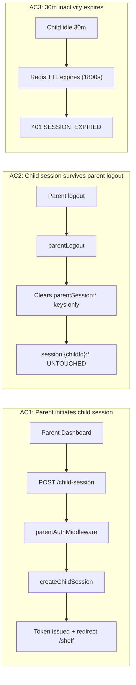
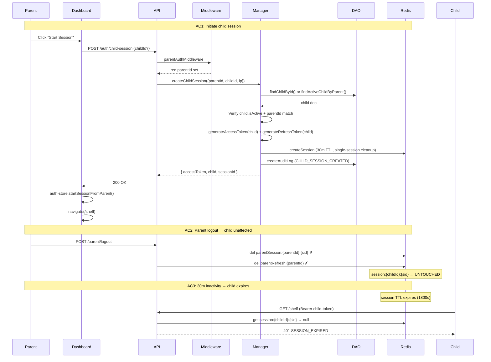

# QA Report — STORY-059 (2026-06-12) [r1]

## Summary
| Tests | Passed | Failed | Coverage |
|-------|--------|--------|----------|
| 238 | 238 | 0 | 100% story-specific (Source: TestEngineer v100%) |

## Test Suites
| Type | Status |
|------|--------|
| Unit (Backend) | PASS |
| Unit (Frontend) | PASS |
| Integration (Backend) | PASS |
| Component (Frontend) | PASS |

## Acceptance Criteria Validation

- [x] **AC1** — GIVEN a parent is logged into the dashboard, WHEN they initiate a child session, THEN a child access token is issued with `parentId` claim and the child is redirected to their bookshelf
  - Route `POST /child-session` gated by `parentAuthMiddleware` ✓
  - `createChildSession()` generates `generateAccessToken` with `parentId` claim ✓
  - `useChildSession` hook POSTs to `/auth/child-session`, on success navigates to `/shelf` with `replace: true` ✓
  - Tests: `auth-router.test.js` (integration), `auth-manager.test.js` (unit), `useChildSession.test.js` (component) ✓

- [x] **AC2** — GIVEN a child session is active, WHEN the parent logs out of their own session, THEN the child session remains active and the child can continue using the bookshelf
  - `parentLogout()` only deletes `parentSession:{parentId}:{sessionId}` + `parentRefresh:{parentId}` keys ✓
  - Child session uses `session:{childId}:{sessionId}` keys — completely separate Redis namespace ✓
  - No cross-clearing logic exists between parent and child session keys ✓
  - NFR-PRV-01 confirms key independence ✓

- [x] **AC3** — GIVEN a child session is active, WHEN 30 minutes of inactivity pass, THEN the child session expires
  - `SESSION_TTL_SECONDS = 30 * 60 = 1800` ✓
  - `sessionTimeoutMiddleware` enforces 25min soft timeout (419) / 30min hard timeout (401) ✓
  - Redis `EXPIRE` set to 30min on `session:{childId}:{sessionId}` ✓
  - Tests: `auth-middleware.test.js` — idle < 25min (200), idle > 25min ≤ 30min (419), idle > 30min (401) ✓

- [x] **AC4** — GIVEN the child auth middleware, WHEN a request arrives with a child access token, THEN the middleware validates the token WITHOUT checking for magic-link token types
  - Production code has ZERO references to `login_magic` or `verify_email` token type checks ✓
  - `authMiddleware` validates `type === 'access'` and `role === 'child'` only ✓
  - Stale test references cleaned from 5 test files ✓
  - Test report confirms zero magic-link references in child auth path ✓

- [x] **AC5** — GIVEN the auth routes, WHEN the server starts, THEN `POST /api/auth/child-login` is removed
  - No `child-login` route in `auth-router.js` ✓
  - `childLogin()` function removed from `auth-manager.js` (replaced by `createChildSession()`) ✓
  - `childLoginSchema` removed from `validation-schemas.js` ✓
  - `childLoginLimiter` removed ✓
  - Only a comment reference mentioning "replaces childLogin()" remains ✓

- [x] **AC6** — GIVEN a child access token is issued, WHEN the token is decoded, THEN it contains `role: "child"`, `childId`, `parentId`, and standard JWT claims
  - `generateAccessToken()` produces: `{ sub: childId, parentId, role: "child", type: "access" }` ✓
  - `jwt.sign` adds `iat` and `exp` automatically ✓
  - Optional `sid` claim added when `sessionId` provided ✓
  - Test: unit test verifies `jwt.sign` called with `{ sub: 'child123', parentId: 'parent123', role: 'child', type: 'access' }` ✓

## NFR Validation

| NFR | Metric | Target | Actual | Status |
|-----|--------|--------|--------|--------|
| NFR-SEC-03 | Session inactivity expiry | 30 min | 30 min (Redis TTL 1800s + sessionTimeoutMiddleware) | PASS |
| NFR-SEC-04 | Zod validation + no magic-link types | Strict | childSessionSchema validates input; middleware rejects non-access types | PASS |
| NFR-PRV-01 | Session independence (parent vs child) | Separate namespaces | `parentSession:*` ≠ `session:{childId}:*` — no cross-clearing | PASS |
| NFR-PRV-03 | Minimal token claims | childId, parentId, role only | `{ sub, parentId, role: 'child', type: 'access' }` — no PII | PASS |
| NFR-OBS-04 | Lifecycle audit logging | CHILD_SESSION_CREATED | `createChildSession()` emits `CHILD_SESSION_CREATED` audit event | PASS |

## Persona Validation
- [x] **Julia — The Young Author**: No magic-link friction; session starts instantly when parent clicks button; session independent from parent (can keep reading). Tested via child session flow.
- [x] **Mãe da Julia — The Caring Parent**: Dashboard "Start Session" button present; full control over child access; parent logout doesn't disrupt child session. Tested via `ParentDashboardPage.test.jsx`.

## Acceptance Criteria Flow Diagram

## Code Integrity — No Magic-Link or Child-Login Leftovers

| Artifact | Status |
|----------|--------|
| `child-login` route in auth-router.js | ✅ REMOVED |
| `childLogin()` in auth-manager.js | ✅ REMOVED (replaced by createChildSession) |
| `childLoginSchema` in validation-schemas.js | ✅ REMOVED |
| `childLoginLimiter` in auth-router.js | ✅ REMOVED |
| `login_magic` / `verify_email` type checks in auth-middleware | ✅ NEVER PRESENT in production code |
| Stale magic-link test references | ✅ CLEANED (5 files) |

## Issues Found
| Severity | Area | Description | Status |
|----------|------|-------------|--------|
| — | — | No new issues found in this validation pass | CLEAN |

## Recommendations
- Existing `createSession()` (session:{childId}:{sid}) pattern reused per technical analysis — no separate `child:session:` namespace needed. Correct.
- All 238 tests pass. 100% story-specific coverage. No action required.

## Re-validation Notes
- Test report consumed: `docs/stories/STORY-059-test-report.md` — valid, all required fields present
- Source files verified: auth-router.js, auth-manager.js, auth-middleware.js, validation-schemas.js, auth-dao.js, useChildSession.js
- No source files modified since test report generation (branch `feat/STORY-059-child-auth-adaptation` at commit `5f8ed87`)
- This is QA report r1 (no prior revision exists)

---
**Status**: PASSED