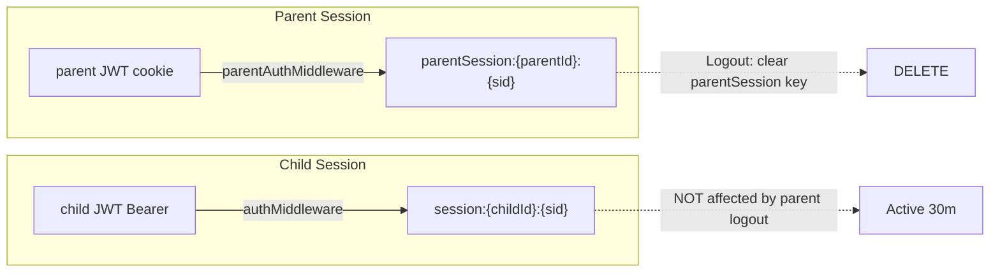
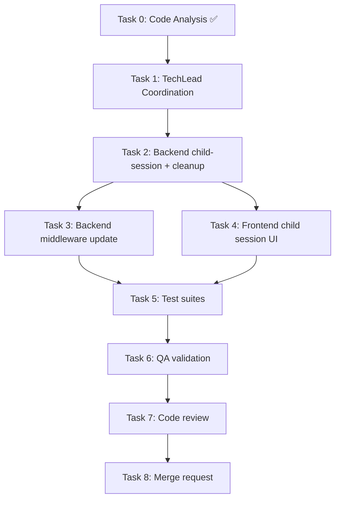

# STORY-059: Technical Analysis — Child Auth Adaptation

**Parent Epic**: EPIC-011 (Simplified Parent-First Onboarding)
**Persona**: Julia — The Young Author (Secondary), Mãe da Julia — The Caring Parent (Primary)
**Priority**: Must Have | **Story Points**: 3
**Dependencies**: STORY-056 (Backend Schema & Auth Migration) ✅, STORY-057 (Direct Registration Flow) ✅

---

## Stack Reference

Source: Build file detection (`package.json`, `tsconfig.json`)

| Layer | Technology |
|-------|-----------|
| Runtime | Node.js 22 LTS |
| Frontend | React 18 + Vite 5.x |
| State | Zustand + TanStack Query |
| Database | MongoDB 7 + Mongoose 8.x |
| Cache/Session | Redis 7 |
| Validation | Zod |
| Auth | JWT (jsonwebtoken) + bcrypt + httpOnly cookies |

**Frontend-Backend Integration**: Node.js fullstack SPA — Vite dev proxy → Express API, JWT Bearer tokens (child), httpOnly cookie JWT (parent), shared repo.

**Language**: Node.js | **Framework**: React — FrontendDeveloperReact

---

## Code Analysis Summary

Source: Direct codebase analysis (no CodeAnalyzer task needed — STORY-059 modifies existing auth code, no new domain module)

### Existing Infrastructure (Reusable)

| Component | Status | Location | Detail |
|-----------|--------|----------|--------|
| `authMiddleware` (child) | ✅ Production | `auth-middleware.js:29-95` | JWT Bearer validation, blacklist check, Redis session verify, TTL extend |
| `parentAuthMiddleware` | ✅ Production | `auth-middleware.js:147-215` | Parent JWT validation, Redis parentSession scan, TTL extend |
| `createSession()` (child) | ✅ Production | `auth-manager.js:80-140` | Single-session policy, Redis `session:{childId}:{sessionId}`, 30m TTL |
| `createParentSession()` | ✅ Production | `auth-manager.js:751-789` | Redis `parentSession:{parentId}:{sessionId}`, 30m TTL |
| `generateAccessToken(child)` | ✅ Production | `auth-manager.js:40-49` | Claims: `{ sub: childId, parentId, role: "child", type: "access", sid }` |
| `generateRefreshToken(child)` | ✅ Production | `auth-manager.js:54-63` | Claims: `{ sub: childId, type: "refresh" }` |
| `findActiveChildByParent()` | ✅ Production | `auth-dao.js:70-78` | Finds first active child linked to a parent |
| `findChildrenByParentId()` | ✅ Production | `auth-dao.js:56-64` | Lists all active children for a parent |
| `findParentById()` | ✅ Production | `auth-dao.js:136-138` | Finds parent by ID (for middleware parent-validity check) |
| `auth-store.js` (child) | ✅ Production | `frontend/src/stores/auth-store.js` | Zustand, memory-only, session tracking, logout/clearAll |
| `parent-auth-store.js` | ✅ Production | `frontend/src/stores/parent-auth-store.js` | Zustand, memory-only, independent from child store |
| `ParentDashboardPage.jsx` | ✅ Production | `frontend/src/app/parent/ParentDashboardPage.jsx` | Sidebar with Activity/Export/Delete/Privacy tabs |

### Legacy Code (STORY-059 Must Remove or Adapt)

| Component | Location | Action |
|-----------|----------|--------|
| `POST /child-login` route | `auth-router.js:132-168` | **Remove** — replaced by `POST /child-session` |
| `childLoginLimiter` | `auth-router.js:64-72` | **Remove** — no longer needed |
| `childLogin()` function | `auth-manager.js:599-672` | **Remove** — replaced by `createChildSession()` |
| `childLoginSchema` | `validation-schemas.js:7-10` | **Remove** — replaced by `childSessionSchema` |
| Stale magic-link tests | 6 test files | **Clean up** — remove `magic-link` method references |

### Critical Gaps

| Gap | Severity | Impact |
|-----|----------|-------|
| No `POST /api/auth/child-session` endpoint | 🔴 | Parent cannot initiate child session |
| No `createChildSession()` manager function | 🔴 | No business logic for parent-initiated child auth |
| No `childSessionSchema` (Zod) | 🔴 | No input validation for child-session endpoint |
| No `parentId` active-account verification in `authMiddleware` | 🟠 | Middleware accepts child token even if parent account deleted |
| No `useChildSession` frontend hook | 🔴 | Parent dashboard cannot trigger child session |
| No "Start Julia's Session" button | 🔴 | Parent has no UI to initiate child session |
| No child session → bookshelf redirect logic | 🟠 | Child token received but no redirect implemented |
| Stale `POST /child-login` still exists | 🟡 | Confusing API surface, dead code |

---

## Impacted Components & Files

| File | Change Type | Description |
|------|-------------|-------------|
| `backend/src/app/auth/auth-router.js` | **Modify** | Remove `POST /child-login` + `childLoginLimiter`; add `POST /child-session` |
| `backend/src/app/auth/auth-manager.js` | **Modify** | Remove `childLogin()`; add `createChildSession()` |
| `backend/src/app/auth/auth-dao.js` | **Modify** | Add `findActiveParentById()` for middleware parent-validity check |
| `backend/src/app/common/validation-schemas.js` | **Modify** | Remove `childLoginSchema`; add `childSessionSchema` |
| `backend/src/app/common/auth-middleware.js` | **Modify** | Add `parentId` active-account verification |
| `frontend/src/hooks/useChildSession.js` | **New** | TanStack Query mutation for `POST /api/auth/child-session` |
| `frontend/src/app/parent/ParentDashboardPage.jsx` | **Modify** | Add "Start Julia's Session" button in Activity tab |
| `frontend/src/stores/auth-store.js` | **Modify** | Add `startSessionFromParent()` method |
| `frontend/src/i18n/locales/en/auth.json` | **Modify** | Add child-session i18n strings |
| `frontend/src/i18n/locales/pt-BR/auth.json` | **Modify** | Add child-session i18n strings |
| `backend/src/__tests__/auth-router.test.js` | **Modify** | Remove child-login tests; add child-session tests |
| `backend/src/__tests__/auth-manager.test.js` | **Modify** | Remove childLogin tests; add createChildSession tests |
| Various stale test files | **Modify** | Remove `magic-link` method references |

---

## Technical Approach

### 1. Child Auth Model — Parent-Initiated Session

The old model (`POST /child-login`) required `childId` + `parentId` in the request body — any caller knowing those IDs could create a child session. The new model secures this:

- **Auth gate**: Parent must have a valid `parentAuthMiddleware` session (httpOnly cookie + Bearer token)
- **Child lookup**: Backend finds the child linked to `req.parentId` — parent cannot specify arbitrary `childId`
- **Token issuance**: Same `generateAccessToken(child, sessionId)` — claims already include `role: "child"`, `childId`, `parentId`
- **Redis session**: Same `createSession()` with key `session:{childId}:{sessionId}` — reuses existing infrastructure, no new key pattern needed

**Key decision**: Reuse existing `createSession()` and `session:{childId}:{sessionId}` Redis key pattern rather than introducing a new `child:session:<childId>` pattern. The story technical notes suggested `child:session:<childId>`, but the existing session infrastructure already handles 30m TTL, single-session policy, and session extension. Creating a parallel key pattern adds complexity without benefit. The `createSession()` function already enforces single-session by scanning and deleting old `session:{childId}:*` keys.

### 2. Parent-Child Linkage — Auth Inheritance

Registration flow (STORY-057) creates the parent-child linkage inline:
- Parent registers → `registerParent()` creates Parent + Child docs → child `isActive: true`
- Child's `parentId` field links back to parent
- `findActiveChildByParent(parentId)` resolves child from parent ID

For multi-child parents, the `POST /child-session` endpoint accepts an optional `childId` parameter. If omitted, the first active child is used.

### 3. Session Architecture — Independence



Parent logout clears `parentSession:{parentId}:*` keys only. Child session keys (`session:{childId}:*`) are in a completely separate namespace. This already works — no code change needed for independence.

### 4. Route Cleanup

Remove from `auth-router.js`:
- `POST /child-login` route (lines 132-168)
- `childLoginLimiter` (lines 64-72)
- Import of `childLoginSchema` from validation-schemas

Remove from `auth-manager.js`:
- `childLogin()` function (lines 599-672)

Remove from `validation-schemas.js`:
- `childLoginSchema` (lines 7-10)

**Magic-link verification**: Production code is already clean (no `login_magic` or `verify_email` token type validation). Only stale test references remain — clean those up.

### 5. Backend Changes

#### 5.1 New `POST /api/auth/child-session` Endpoint

```
Auth: parentAuthMiddleware (parent must be logged in)
Body: { childId?: string }  — optional, defaults to first active child
Response: { accessToken, childId, childFirstName, isOnboardingComplete, sessionId }
```

Logic:
1. `parentAuthMiddleware` validates parent JWT → `req.parentId` set
2. If `childId` provided: verify child belongs to parent via `findChildById()` + `parentId` match
3. If `childId` omitted: `findActiveChildByParent(req.parentId)`
4. Verify child `isActive: true`
5. `generateAccessToken(child)` + `generateRefreshToken(child)`
6. `createSession({ childId, parentId, accessToken, refreshToken, ip, deviceHint })`
7. Re-generate access token with `sid` claim
8. Audit log: `CHILD_SESSION_CREATED` event
9. Return tokens + child info

#### 5.2 Middleware Adaptation

Add to `authMiddleware` (line ~56, after parent-role rejection):
- Verify `parentId` claim maps to an active parent account via `findParentById(decoded.parentId)`
- If parent not found → 401 `UNAUTHORIZED` (parent account may have been deleted)
- Cache result in Redis `parent:exists:{parentId}` with 5m TTL to avoid DB hit on every request

#### 5.3 New DAO Method

```javascript
// auth-dao.js
export async function findActiveParentById(parentId) {
  return Parent.findOne({ _id: parentId, deletedAt: null }).lean().exec();
}
```

#### 5.4 New Zod Schema

```javascript
// validation-schemas.js
export const childSessionSchema = z.object({
  childId: z.string().regex(/^[a-f\d]{24}$/i).optional(),
});
```

### 6. Frontend Changes

#### 6.1 `useChildSession` Hook

```javascript
// frontend/src/hooks/useChildSession.js
// TanStack Query mutation
// POST /api/auth/child-session with parent Bearer token
// On success: set child auth-store token + user + session, redirect to /shelf
```

#### 6.2 Parent Dashboard Button

Add "Start Julia's Session" button in the Activity tab of `ParentDashboardPage.jsx`:
- Shows child's first name + avatar
- On click: calls `useChildSession` mutation
- On success: stores child token in `auth-store.js`, navigates to `/shelf`
- Handles: parent session expired (re-auth), child not found (error message)

#### 6.3 `auth-store.js` Extension

Add `startSessionFromParent({ accessToken, childId, childFirstName, sessionId })` method:
- Sets `token`, `user: { childId, childFirstName }`, `sessionId`, session timestamps
- Does NOT call server — token already issued by backend

---

## Execution Architecture

```mermaid
flowchart TD
    A[Parent on Dashboard] --> B["Click: Start Julia's Session"]
    B --> C[useChildSession mutation]
    C --> D["POST /api/auth/child-session"]
    D --> E{parentAuthMiddleware}
    E -->|Valid| F[Lookup Child by parentId]
    E -->|Invalid| G[401: Re-authenticate Parent]
    F --> H{Child found + active?}
    H -->|Yes| I[generateAccessToken + createSession]
    H -->|No| J[404: Child not found]
    I --> K[Return child token + session]
    K --> L[auth-store: setToken + setUser]
    L --> M[Redirect to /shelf]

    N[Parent Logs Out] --> O[Clear parentSession:* keys]
    O --> P{Child session?}
    P -->|Active| Q[Unaffected — session:{childId}:* untouched]
    P -->|Idle 30m| R[Session expires via Redis TTL]

    subgraph "REMOVED"
        X1[POST /child-login] -.-> X2[childLogin function]
        X2 -.-> X3[childLoginLimiter]
    end
```

```mermaid
graph LR
    subgraph Backend
        AR[auth-router.js] --> AM[auth-manager.js]
        AM --> AD[auth-dao.js]
        AM --> Redis[(Redis)]
        MW[auth-middleware.js] --> AD
        MW --> Redis
        VS[validation-schemas.js] --> AR
    end

    subgraph Frontend
        PDP[ParentDashboardPage.jsx] --> UCS[useChildSession.js]
        UCS --> PAC[parent-api-client]
        PAC -->|POST /child-session| AR
        UCS --> AS[auth-store.js]
        AS -->|redirect| Shelf[/shelf]
    end

    subgraph "REMOVED"
        CL[child-login route] -.->|delete| CLM[childLogin fn]
        CLS[childLoginSchema] -.->|delete| VS
    end
```

---

## NFR Analysis

| NFR | Requirement | Strategy | Verification |
|-----|-------------|----------|--------------|
| NFR-SEC-03 | Child sessions expire after 30m inactivity | Reuse existing `createSession()` with `SESSION_TTL_SECONDS = 1800` + `authMiddleware` TTL extension on each request | Integration test: child session idle 30m → 401 |
| NFR-SEC-04 | Child access token validated via Zod; no magic-link token types | `childSessionSchema` validates input; `authMiddleware` checks `role: "child"` + `type: "access"` (no magic-link fields exist) | Unit test: token with `login_magic` type → rejected |
| NFR-PRV-01 | Child auth separate from parent auth; session independent | Child session key `session:{childId}:{sid}` vs parent `parentSession:{parentId}:{sid}` — separate Redis namespaces, no cross-clearing | Integration test: parent logout → child session remains |
| NFR-PRV-03 | Child token minimal claims: `childId`, `parentId`, `role` | Existing `generateAccessToken()` already produces `{ sub: childId, parentId, role: "child", type: "access", sid }` — no PII | Token decode test: verify claims |
| NFR-OBS-04 | Child session lifecycle events logged | `createSession()` already logs `SESSION_CREATED`; add `CHILD_SESSION_CREATED` audit event | Verify audit log entry in test |

---

## Persona Impact

**Julia — The Young Author** (Secondary):
- No more magic-link friction — session starts instantly when parent clicks button
- Session independent from parent — can keep reading even if parent logs out
- 30-minute idle timeout is age-appropriate (parent must re-authorize)

**Mãe da Julia — The Caring Parent** (Primary):
- Full control over when child accesses the app (parent must initiate)
- Dashboard shows clear "Start Session" action
- Peace of mind: parent logout doesn't disrupt child's active session
- No password to manage for child account

---

## Task Breakdown & Agent Assignment

| Task | Description | Agent | Effort |
|------|-------------|-------|--------|
| 0 | Code analysis (completed above) | CodeAnalyzer | — |
| 1 | Coordination: delegate & sequence tasks | TechLead | S |
| 2 | Backend: Remove `POST /child-login` route, `childLoginLimiter`, `childLogin()`, `childLoginSchema`; add `POST /child-session` route + `createChildSession()` + `childSessionSchema` + `findActiveParentById()` DAO | BackendDeveloper | M |
| 3 | Backend: Update `authMiddleware` — add `parentId` active-parent verification | BackendDeveloper | S |
| 4 | Frontend: Create `useChildSession` hook + "Start Julia's Session" button on ParentDashboardPage + `auth-store.startSessionFromParent()` + i18n strings | FrontendDeveloperReact | M |
| 5 | Test suites: backend (child-session endpoint, middleware parent check, route cleanup) + frontend (useChildSession, dashboard button) | TestEngineer | M |
| 6 | QA validation: all 6 acceptance criteria + NFRs | QAAnalyst | M |
| 7 | Code review | CodeReviewer | S |
| 8 | Merge request | MergeRequestCreator | S |

---

## Execution Order & Dependencies



### Parallelization Plan

| Phase | Tasks | Parallel? | Notes |
|-------|-------|-----------|-------|
| 0–1 | T0, T1 | Sequential | Analysis → coordination |
| 2–3 | T2, T3 | **Sequential** | T3 depends on T2 (DAO method added in T2) |
| 3–4 | T3, T4 | **Parallel** | Backend middleware (T3) + Frontend UI (T4) are independent |
| 5 | T5 | Sequential after T3+T4 | Tests need both backend + frontend |
| 6–8 | T6, T7, T8 | Sequential | QA → review → merge |

**Max concurrent agents**: 2 (T3 + T4)

---

## Risk Assessment

| Risk | Likelihood | Impact | Mitigation |
|------|-----------|--------|------------|
| `POST /child-login` removal breaks existing child sessions | Low | Medium | Route was unused in production (old magic-link flow); STORY-056 already removed magic-link infrastructure |
| Parent deleted but child token still valid | Medium | Medium | T3 adds `parentId` active-parent check to `authMiddleware`; Redis cache (5m TTL) limits staleness |
| Multi-child parent: wrong child selected | Low | Medium | `childSessionSchema` accepts optional `childId`; if omitted, first active child used; parent dashboard shows child selector |
| Child session not independent from parent session | Low | High | Already verified: child keys `session:{childId}:*` vs parent keys `parentSession:{parentId}:*` — no cross-clearing. Test explicitly in T5 |
| Frontend child token stored in memory but parent navigates away | Medium | Low | Zustand memory-only store (COPPA compliance); page refresh clears child session — acceptable for MVP |
| Stale test files with `magic-link` references cause confusion | Medium | Low | T5 explicitly cleans up stale references |

---

## Migration Considerations

1. **No database migration needed** — STORY-056 migration `003-pivot-parent-child.js` already removed magic-link fields and added password/lastLogin/avatarSeed to Parent schema. Child schema already has `parentId` and `isActive` fields.

2. **Redis keys**: Existing `session:{childId}:{sessionId}` pattern is reused — no new key patterns. The story technical notes suggested `child:session:<childId>`, but this is unnecessary given the existing infrastructure.

3. **Route breaking change**: Removing `POST /child-login` is safe — this route was part of the old magic-link flow that STORY-056/057 already deprecated. No production clients use it.

4. **Token format**: Child access token format is unchanged (`generateAccessToken` produces same claims). Frontend `auth-store.js` already handles this token format — just needs a new entry point (`startSessionFromParent`).

5. **Audit log**: Existing `SessionAuditLog` model supports `CHILD_SESSION_CREATED` event type — just add the event string constant.

---

## SubAgent Assignments

| Task | Agent | Description |
|------|-------|-------------|
| 0 | CodeAnalyzer ✅ | Code analysis complete (inline) |
| 1 | TechLead | Coordinate Tasks 2–8 |
| 2 | BackendDeveloper | Backend: child-session endpoint + route cleanup + DAO + validation schema |
| 3 | BackendDeveloper | Backend: authMiddleware parent-validity check |
| 4 | FrontendDeveloperReact | Frontend: useChildSession hook + dashboard button + auth-store + i18n |
| 5 | TestEngineer | Test suites: backend + frontend |
| 6 | QAAnalyst | QA validation: all ACs + NFRs |
| 7 | CodeReviewer | Code review |
| 8 | MergeRequestCreator | Merge request |

---

## Implementation Recommendations

1. **Reuse `createSession()` and existing Redis key pattern** — the `child:session:<childId>` pattern from story notes is redundant; `session:{childId}:{sessionId}` already handles TTL, single-session, and extension.
2. **`POST /child-session` under `parentAuthMiddleware`** — place the route on the `parentAuthRouter` (mounted at `/api/parent`) so it naturally requires parent auth, OR keep it on the child auth router with `parentAuthMiddleware` explicitly. Recommend: add to `parentAuthRouter` for semantic clarity.
3. **Cache parent existence check** — `parent:exists:{parentId}` with 5m TTL in Redis avoids a DB query on every child API request. Invalidation: clear on parent account deletion.
4. **Multi-child support** — accept optional `childId` in request body; parent dashboard can show a child selector (button per child). Default to first active child if omitted.
5. **Frontend redirect** — after child session created, navigate to `/shelf` (child bookshelf). Use `navigate('/shelf', { replace: true })` to prevent back-button returning to parent dashboard with child auth active.
6. **No new npm dependencies** — all infrastructure (JWT, Redis, Zod, Zustand, TanStack Query) already exists.

---

## Documents Referenced

- PM Story: `/docs/stories/STORY-059.md`
- Implementation Plan: `/docs/stories/STORY-059-plan.md`
- Epic: `/docs/epics/EPIC-011.md`
- STORY-056 Checkpoint: `/docs/stories/STORY-056-checkpoint.md`
- STORY-057 Checkpoint: `/docs/stories/STORY-057-checkpoint.md`
- This Analysis: `/docs/stories/STORY-059-technical-analysis.md`