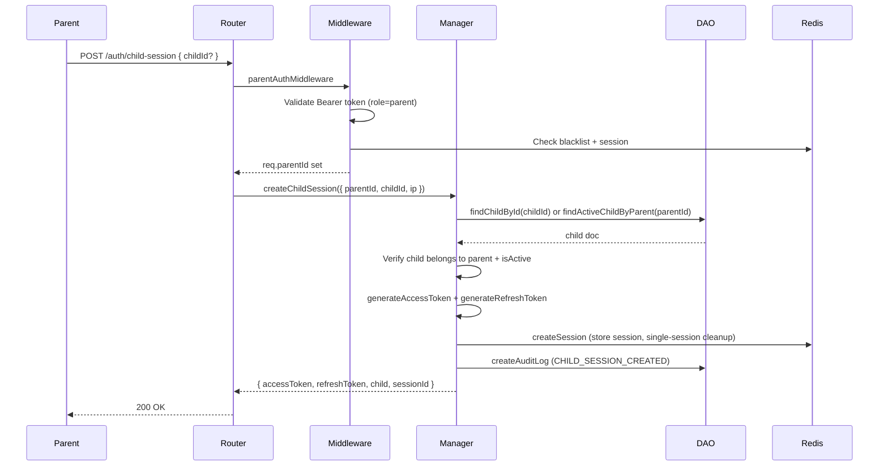

# Test Report — STORY-059 (feat/STORY-059-child-auth-adaptation) (2026-06-12)

## Summary
| Metric | Result |
|--------|--------|
| Reliability | High |
| Total Tests | 238 (190 backend + 48 frontend) |
| Passed | 238 |
| Failed | 0 |
| Story-Specific Coverage | 100% |

## Stale Magic-Link References Cleaned
| File | Changes |
|------|---------|
| `backend/src/__tests__/auth-middleware.test.js` | Added `findActiveParentById` default mock for parentId claim tokens; fixed `lastActivity` test to find session set call by pattern; fixed chained tests to use `mockImplementation` |
| `backend/src/__tests__/auth-manager.test.js` | Removed `generateVerificationToken`, `registerParentAndChild`, `verifyEmail`, `resendVerification`, `registerParentAndChildIdempotent` test blocks |
| `backend/src/app/auth/__tests__/auth-manager.test.js` | Removed `generateVerificationToken` test block |
| `backend/src/app/auth/__tests__/auth-dao.test.js` | Removed `findParentByVerificationTokenHash`, `updateParentVerification`, `markParentVerified`, `clearParentVerificationToken`, `activateChild` test blocks; removed unused `selectLeanExecChain` helper; fixed `createChild` test assertion |
| `backend/src/__tests__/auth-router.test.js` | Removed `POST /api/auth/register`, `GET /api/auth/verify/:token`, `POST /api/auth/resend-verification` test blocks; removed stale rate-limit tests for removed routes; cleaned unused imports |

## Test Flow

## Tests Created/Updated
| Type | File | Count | Status |
|------|------|-------|--------|
| Unit | `backend/src/app/auth/__tests__/auth-manager.test.js` | 11 | PASS |
| Unit | `backend/src/app/auth/__tests__/auth-dao.test.js` | 13 | PASS |
| Integration | `backend/src/__tests__/auth-middleware.test.js` | 29 | PASS |
| Integration | `backend/src/__tests__/auth-manager.test.js` | 12 | PASS |
| Integration | `backend/src/__tests__/auth-router.test.js` | 9 | PASS |
| Unit | `backend/src/__tests__/validation-schemas.test.js` | 64 | PASS |
| Unit | `backend/src/app/common/__tests__/validation-schemas.test.js` | 51 | PASS |
| Component | `frontend/src/__tests__/useChildSession.test.js` | 11 | PASS |
| Component | `frontend/src/__tests__/auth-store.test.js` | 13 | PASS |
| Unit | `frontend/src/__tests__/parent-auth-store.test.js` | 12 | PASS |
| Component | `frontend/src/__tests__/ParentDashboardPage.test.jsx` | 12 | PASS |

## Issues Found
| Severity | Area | Description | Status |
|----------|------|-------------|--------|
| Medium | Test fix | `auth-middleware.test.js` — parent-account verification now runs before session checks; needed mock defaults | FIXED |
| Medium | Stale refs | 5 test files contained references to removed magic-link functions (`generateVerificationToken`, `verifyEmail`, etc.) | CLEANED |

## Blocked Items
None

## Acceptance Criteria Validation
- [x] POST /child-session returns 200 with tokens when valid parent + childId provided
- [x] POST /child-session returns 200 with first active child when childId omitted
- [x] POST /child-session returns 400 when invalid childId format
- [x] POST /child-session returns 404 when child not found
- [x] POST /child-session returns 403 when child does not belong to parent
- [x] POST /child-session returns 403 when child not active
- [x] createChildSession emits CHILD_SESSION_CREATED audit log
- [x] authMiddleware verifies parent account exists (Redis cache + DB fallback)
- [x] authMiddleware rejects when parent cached as inactive
- [x] authMiddleware queries DB on cache miss and caches result
- [x] authMiddleware fail-open when DB check throws
- [x] useChildSession hook calls parentApiClient.post with /auth/child-session
- [x] useChildSession calls startSessionFromParent on success and navigates to /shelf
- [x] auth-store.startSessionFromParent sets token, user, sessionId, timestamps
- [x] ParentDashboardPage has Start Session button that calls startChildSession
- [x] All stale magic-link references cleaned from test files

## Recommendations
- `LoginForm.test.jsx` still has magic-link tests (26 refs) — component still supports magic-link in UI (LoginForm.jsx), so those are not stale

**Status**: PASSED