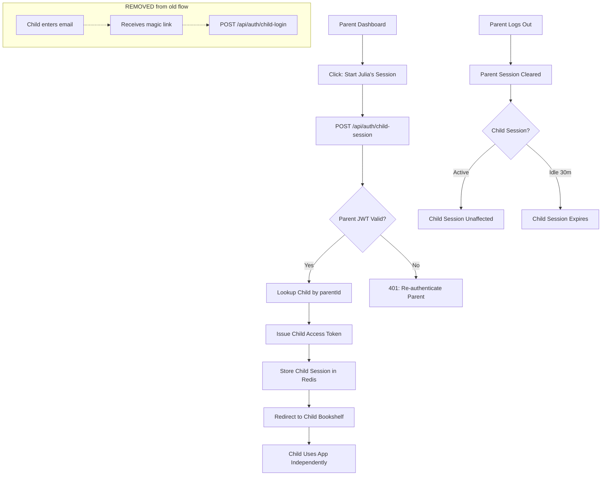

# STORY-059: Child Auth Adaptation

**Epic**: EPIC-011
**Persona**: Julia — The Young Author (Secondary), Mãe da Julia — The Caring Parent (Primary)
**Priority**: Must Have
**Story Points**: 3
**Dependencies**: STORY-056 (Backend Schema & Auth Migration), STORY-057 (Direct Registration Flow)

## User Story
As Julia, I want to access my bookshelf without needing a separate password or magic link, so I can start reading and writing as soon as my mom sets up my account.

## Description
Adapt the child authentication flow to work with the new parent-first registration model. In the pivot model, the child account is created inline during parent registration (STORY-057) and is immediately active (`isActive: true`). The child does not need a separate password — authentication is inherited from the parent linkage. This story removes all remaining magic-link dependencies from the child session path and establishes a clean child session creation flow triggered from the parent dashboard.

## Context
The original STORY-002 design had child authentication via magic-link tokens (`type === 'login_magic'`) and a `POST /api/auth/child-login` route. With the pivot to parent-first registration (EPIC-011), the child account is created and activated immediately — no email verification gate. The child session must be independent from the parent session (child can remain logged in even if the parent logs out), but the child access token is issued with a `parentId` claim from the parent linkage. This story is the bridge between the new parent auth system (STORY-056/057) and the child-facing bookshelf (STORY-052).

## Acceptance Criteria (Verifiable)
- [ ] GIVEN a parent is logged into the dashboard
      WHEN they initiate a child session (e.g., "Start Julia's Session" button)
      THEN a child access token is issued with `parentId` claim and the child is redirected to their bookshelf
- [ ] GIVEN a child session is active
      WHEN the parent logs out of their own session
      THEN the child session remains active and the child can continue using the bookshelf
- [ ] GIVEN a child session is active
      WHEN 30 minutes of inactivity pass
      THEN the child session expires and the child must be re-authenticated via the parent
- [ ] GIVEN the child auth middleware
      WHEN a request arrives with a child access token
      THEN the middleware validates the token WITHOUT checking for magic-link token types (`login_magic`, `verify_email`)
- [ ] GIVEN the auth routes
      WHEN the server starts
      THEN `POST /api/auth/child-login` is removed (if not already removed by STORY-056)
- [ ] GIVEN a child access token is issued
      WHEN the token is decoded
      THEN it contains `role: "child"`, `childId`, `parentId`, and standard JWT claims (iat, exp)

## NFRs
- NFR-SEC-03: Child sessions expire after 30 minutes of inactivity
- NFR-SEC-04: Child access token validated via Zod schema; no magic-link token types accepted
- NFR-PRV-01: Child auth is separate from parent auth; child session independent of parent session lifecycle
- NFR-PRV-03: Child token carries minimal claims (childId, parentId, role) — no PII beyond what's needed for auth
- NFR-OBS-04: Child session lifecycle events logged (CHILD_SESSION_CREATED, CHILD_SESSION_EXPIRED) with hashed identifiers

## Definition of Done (DoD)
- [ ] Code reviewed by CodeReviewer
- [ ] Tests with coverage >= 90%
- [ ] Integration tests passing
- [ ] QA approved by QAAnalyst
- [ ] Documentation updated
- [ ] PR created by MergeRequestCreator

## Technical Notes
- **Child session creation**: Triggered from parent dashboard via a dedicated endpoint (e.g., `POST /api/auth/child-session`). The parent's active JWT cookie authorizes the request; the backend looks up the child linked to that parent and issues a child-specific access token.
- **Token claims**: `{ role: "child", childId: "<uuid>", parentId: "<uuid>", iat, exp }`. No child password or email in the token.
- **Session storage**: Child session stored in Redis with 30-minute TTL. Key pattern: `child:session:<childId>`.
- **Middleware adaptation**: Update `child-auth-middleware.js` (or equivalent) to:
  - Remove validation for `type === 'login_magic'` and `type === 'verify_email'` token types
  - Accept only tokens with `role: "child"` claim
  - Verify `parentId` claim maps to an active parent account
- **Route cleanup**: Remove `POST /api/auth/child-login` if it still exists. Remove any magic-link-specific child auth routes.
- **Frontend**: Add a "Start Julia's Session" button (or equivalent) on the parent dashboard. On click, call `POST /api/auth/child-session`, receive the child access token, and redirect to the child bookshelf. The child does not see a login page — they are auto-authenticated.
- **Independence**: Child session Redis key is separate from parent session key. Parent logout clears `parent:session:<parentId>` but does NOT clear `child:session:<childId>`.

## User Flow

## Test Scenarios
- Scenario 1: Parent initiates child session → child access token issued, child redirected to bookshelf
- Scenario 2: Parent logs out → child session remains active, child can still use bookshelf
- Scenario 3: Child session idle for 30 minutes → session expires, child must be re-authenticated via parent
- Scenario 4: Request with old magic-link token type → rejected by child auth middleware
- Scenario 5: Child access token contains correct claims (role, childId, parentId) and no magic-link fields
