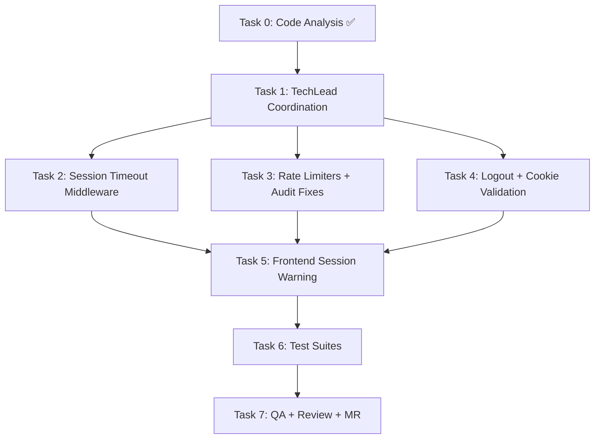
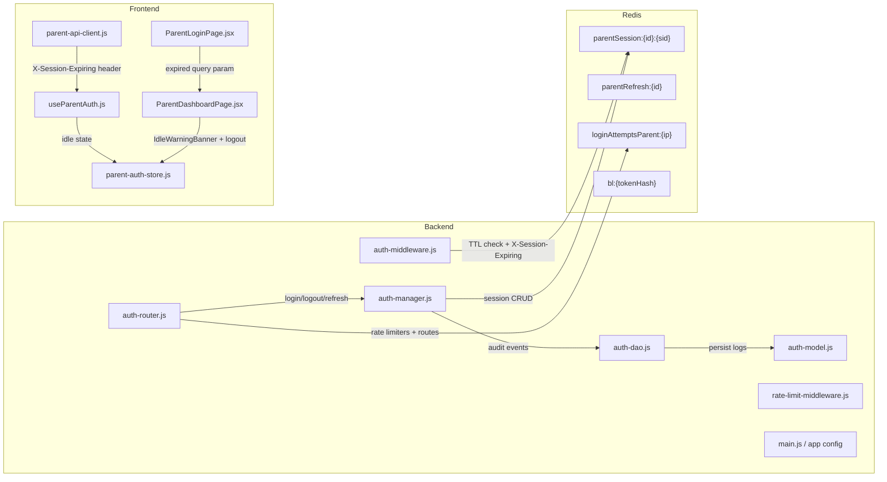

# STORY-060: Technical Analysis — Parent Session Management & Security

**Parent Epic**: EPIC-011 (Simplified Parent-First Onboarding)
**Persona**: Mãe da Julia — The Caring Parent
**Priority**: Must Have
**Story Points**: 3

---

## Stack Reference

Source: `docs/architecture/TECH-STACK.md`

| Layer | Technology |
|-------|-----------|
| Runtime | Node.js 22 LTS |
| API Framework | Express 4.x |
| Primary Database | MongoDB 7 + Mongoose 8.x |
| Cache/Session | Redis 7 (ioredis) |
| Frontend | React 18 + Vite 5.x |
| State Management | Zustand + TanStack Query |
| HTTP Client | Axios (parent-api-client.js) |
| Validation | Zod |
| Logging | Pino |
| Rate Limiting | express-rate-limit |

**Language**: Node.js (backend) + React/JS (frontend)
**Frontend-Backend Integration**: Node.js fullstack SPA — Vite dev proxy → Express API, cookie-based JWT auth, shared repo.

---

## Code Analysis Summary

### Existing Infrastructure (Partially Complete)

| Component | Status | File | Gap |
|-----------|--------|------|-----|
| Parent session create/validate/refresh/logout | ✅ Implemented | `auth-manager.js` (L705–1068) | No TTL-based expiry warning header; no `SESSION_EXPIRED` audit event on idle timeout |
| Parent auth middleware (session validation + TTL extension) | ✅ Implemented | `auth-middleware.js` (L147–215) | No `X-Session-Expiring` header; no expiry threshold check; extends TTL on every request but no warning at 25min |
| Rate limiters on parent routes | ⚠️ Partial | `auth-router.js` (L48–84) | **Wrong thresholds**: `parentLoginLimiter` = 5 req/15min, `registerParentLimiter` = 5 req/hour — STORY requires **10 req/min per IP** |
| Audit log schema | ✅ Implemented | `auth-model.js` (L104–141) | Missing `LOGIN_FAILED` event enum; has `PARENT_LOGIN_FAILED` but STORY spec uses `LOGIN_FAILED`; TTL is 90 days (STORY requires 12 months) |
| Parent logout endpoint | ✅ Implemented | `auth-router.js` (L345–370) | Cookie cleared with `clearCookie` — **missing `Max-Age=0` and full security flags** per STORY spec |
| Parent refresh endpoint | ✅ Implemented | `auth-router.js` (L372–408) | Works; refresh token is httpOnly cookie |
| Frontend idle timer | ✅ Implemented | `useParentAuth.js` | Client-side 25min warning + 30min auto-logout — **doesn't respond to backend `X-Session-Expiring` header** |
| Frontend parent-auth-store | ✅ Implemented | `parent-auth-store.js` | Has `parentLogout`, `parentClearAll`, session tracking — **needs `X-Session-Expiring` integration** |
| Frontend parent-api-client | ✅ Implemented | `parent-api-client.js` | Has 401 → refresh flow — **doesn't intercept `X-Session-Expiring` header** |
| Cookie security flags | ⚠️ Partial | `auth-router.js` (L111–117, L324–330) | `httpOnly: true`, `secure: NODE_ENV=production`, `sameSite: 'strict'`, `path: '/api/parent'` — **but `path` should be `/api` per STORY spec**; missing startup validation |
| Pino structured logging | ✅ Available | Backend uses Pino | Audit events logged via `createAuditLog` — **but PII not hashed**; uses raw parentId/IP |

### Critical Gaps

| Gap | Severity | Impact |
|-----|----------|--------|
| Rate limiters use wrong thresholds (5 req/15min vs 10 req/min) | 🔴 | Brute-force protection too strict for legitimate users; doesn't match AC |
| No `X-Session-Expiring` header on 25-min threshold | 🔴 | Frontend can't show server-driven session warning; relies solely on client timer |
| No `SESSION_EXPIRED` audit event on idle timeout | 🔴 | NFR-PRV-06 violation; no trace when sessions expire server-side |
| `LOGIN_FAILED` event not in audit enum; audit logs store raw PII | 🔴 | NFR-OBS-04 and NFR-PRV-06 violations — hashed identifiers required |
| Audit log TTL = 90 days (spec requires 12 months) | 🟠 | NFR-PRV-06 requires 12-month retention; current TTL auto-deletes at 90 days |
| Cookie `path` = `/api/parent` instead of `/api` | 🟡 | Cookie only sent to `/api/parent/*` routes; STORY spec says `/api` — but `/api/parent` is more secure (narrower scope) |
| No startup validation of cookie security flags | 🟡 | Misconfiguration risk in dev/staging |

---

## Task Decomposition

### Task 0: Code Analysis ✅ (Complete)
- **Agent**: CodeAnalyzer
- **Output**: This document (inline analysis)

### Task 1: TechLead Coordination
- **Agent**: TechLead
- **Input**: PM story (`/docs/stories/STORY-060.md`), plan (`/docs/stories/STORY-060-plan.md`), this technical analysis
- **Action**: Coordinate Tasks 2–7

### Task 2: Backend — Session Timeout Middleware + Expiry Warning
- **Agent**: BackendDeveloper
- **Scope**:
  - Modify `parentAuthMiddleware` in `auth-middleware.js` to check Redis TTL on `parentSession:{parentId}:{sessionId}` key
  - If TTL < 300 seconds (5 min remaining), set `X-Session-Expiring: <remaining-seconds>` response header
  - If session expired (Redis key gone), return 401 with `SESSION_EXPIRED` code and log `SESSION_EXPIRED` audit event with `reason: "idle_timeout"`
  - Keep existing sliding window (TTL reset on each authenticated request)
- **Files**: `backend/src/app/common/auth-middleware.js`
- **AC**: Acceptance Criteria 1 (30-min idle → 401) + Criterion 2 (25-min idle → soft warning header)

### Task 3: Backend — Rate Limiter Reconfiguration + Audit Event Fixes
- **Agent**: BackendDeveloper
- **Scope**:
  - Change `parentLoginLimiter` from `5 req/15min` to `10 req/60s per IP` — NFR-SEC-06
  - Change `registerParentLimiter` from `5 req/hour` to `10 req/60s per IP` — NFR-SEC-06
  - Both return 429 with `Retry-After` header and friendly message
  - Add `LOGIN_FAILED` to `SessionAuditLog` event enum (alongside existing `PARENT_LOGIN_FAILED`)
  - Hash PII in audit logs: parentId → SHA-256 truncated, email → SHA-256 truncated, IP → SHA-256 truncated
  - Change audit log TTL from 90 days to 365 days (12 months) per NFR-PRV-06
  - Log `LOGIN_FAILED` audit event on parent login failure (currently only logs `PARENT_LOGIN_FAILED`)
- **Files**: `backend/src/app/auth/auth-router.js`, `backend/src/app/auth/auth-model.js`, `backend/src/app/auth/auth-dao.js`
- **AC**: Acceptance Criteria 5 + 6 (rate limiting 429 on 11th attempt) + Criteria 7 + 8 (audit events with hashed PII)

### Task 4: Backend — Logout Enhancement + Cookie Security Validation
- **Agent**: BackendDeveloper
- **Scope**:
  - Verify `POST /api/parent/logout` clears cookie with full security flags: `httpOnly: true`, `secure: NODE_ENV=production`, `sameSite: 'strict'`, `Max-Age=0`
  - Verify session is deleted from Redis + refresh token hash deleted
  - Verify `SESSION_LOGOUT` audit event is logged (currently logs `PARENT_LOGOUT` — add `SESSION_LOGOUT` alias or use existing)
  - Add startup validation in app config: warn if `secure` cookie flag is false in production
  - Verify old cookie usage after logout returns 401 (existing blacklist mechanism)
- **Files**: `backend/src/app/auth/auth-router.js`, `backend/src/app/auth/auth-manager.js`, `backend/src/config/app.js` (or `main.js` for startup validation)
- **AC**: Acceptance Criteria 3 (logout clears cookie + Redis) + Criterion 4 (old cookie → 401)

### Task 5: Frontend — Session Expiry Warning + Logout Handler
- **Agent**: FrontendDeveloperReact
- **Scope**:
  - Modify `parent-api-client.js` response interceptor to check for `X-Session-Expiring` header on every successful response
  - When header detected, dispatch to `useParentAuthStore` → show idle warning via existing `isIdle` state
  - On 401 with `SESSION_EXPIRED` code, call `parentClearAll()` and redirect to `/parent/login?expired=true`
  - Modify `IdleWarningBanner` in `ParentDashboardPage.jsx` to respond to server-driven expiry warning (not just client-side timer)
  - Verify logout button calls `POST /api/parent/logout` and clears state (already implemented in `useParentAuth.js`)
  - Display "Session expired" message on login page when `?expired=true` query param present
- **Files**: `frontend/src/lib/parent-api-client.js`, `frontend/src/stores/parent-auth-store.js`, `frontend/src/hooks/useParentAuth.js`, `frontend/src/app/parent/ParentDashboardPage.jsx`, `frontend/src/app/parent/ParentLoginPage.jsx`
- **AC**: Acceptance Criteria 2 (soft warning at 25 min) + Criterion 1 (401 → redirect with "Session expired") + Criterion 3 (logout clears state)

### Task 6: Test Suites
- **Agent**: TestEngineer
- **Scope**:
  - Unit tests: session timeout middleware (TTL check, `X-Session-Expiring` header, 401 on expiry)
  - Unit tests: rate limiters (10 req/min, 429 on 11th, `Retry-After` header)
  - Unit tests: audit logging (all 4 events, hashed PII, 12-month TTL)
  - Unit tests: cookie security flags (httpOnly, secure, sameSite, Max-Age=0 on clear)
  - Integration tests: full logout flow (cookie cleared, Redis key deleted, old cookie → 401)
  - Integration tests: session expiry (30-min idle → 401 + SESSION_EXPIRED)
  - Integration tests: rate limiting (11 login attempts → 429)
  - Frontend tests: `X-Session-Expiring` header triggers warning, 401 → redirect with message
  - Verify coverage ≥ 90% for new and modified code
- **Files**: Test files in `backend/src/app/auth/__tests__/` and `frontend/src/__tests__/`
- **AC**: All acceptance criteria covered by automated tests

### Task 7: QA Validation + Code Review + Merge Request
- **Agent**: QAAnalyst → CodeReviewer → MergeRequestCreator
- **Scope**:
  - QA validates all 8 acceptance criteria
  - Code review for security (cookie flags, PII hashing, rate limiting)
  - Merge request with traceability to STORY-060

---

## Execution Order & Dependencies

### Parallelization Plan

| Phase | Tasks | Parallel? | Notes |
|-------|-------|-----------|-------|
| 0–1 | T0, T1 | Sequential | Analysis → coordination |
| 2–4 | T2, T3, T4 | **Parallel** (max 2 at a time) | All backend; T3 (rate limiters) and T4 (logout/cookie) are independent; T2 (session middleware) is also independent |
| 5 | T5 | Sequential after T2+T3+T4 | Frontend needs backend `X-Session-Expiring` header and rate limiter 429 responses |
| 6 | T6 | Sequential after T5 | Tests need both backend + frontend changes |
| 7 | T7 | Sequential after T6 | QA + review |

**Recommended execution**: T2 + T3 in parallel → T4 → T5 → T6 → T7

**Max concurrent agents**: 2

---

## Impacted Components & Files

### File Change Summary

| File | Action | Task |
|------|--------|------|
| `backend/src/app/common/auth-middleware.js` | Modify (add TTL check, `X-Session-Expiring` header, `SESSION_EXPIRED` audit) | T2 |
| `backend/src/app/auth/auth-router.js` | Modify (rate limiter thresholds, cookie path validation) | T3, T4 |
| `backend/src/app/auth/auth-model.js` | Modify (add `LOGIN_FAILED` to event enum, change TTL to 365 days) | T3 |
| `backend/src/app/auth/auth-dao.js` | Modify (hash PII in `createAuditLog`) | T3 |
| `backend/src/app/auth/auth-manager.js` | Modify (add `SESSION_EXPIRED` audit event, ensure `SESSION_LOGOUT` on parent logout) | T2, T4 |
| `backend/src/main.js` (or config) | Modify (add cookie security startup validation warning) | T4 |
| `frontend/src/lib/parent-api-client.js` | Modify (intercept `X-Session-Expiring` header) | T5 |
| `frontend/src/stores/parent-auth-store.js` | Modify (add `setSessionExpiring` action) | T5 |
| `frontend/src/hooks/useParentAuth.js` | Modify (integrate server-driven session warning) | T5 |
| `frontend/src/app/parent/ParentDashboardPage.jsx` | Modify (update IdleWarningBanner for server-driven warnings) | T5 |
| `frontend/src/app/parent/ParentLoginPage.jsx` | Modify (show "Session expired" message from query param) | T5 |

---

## NFR Analysis

| NFR | Requirement | Implementation | Risk |
|-----|-------------|---------------|------|
| NFR-SEC-03 | Sessions expire after 30 minutes of inactivity | ✅ Already implemented: Redis TTL 1800s on `parentSession:{id}:{sid}`, sliding window via `parentAuthMiddleware`. **Gap**: no `SESSION_EXPIRED` audit event on server-side timeout. T2 adds this. | Low — Redis TTL already works |
| NFR-SEC-04 | All auth inputs validated via Zod; rate limiting prevents brute force | ⚠️ Zod validation exists. **Gap**: rate limiters use wrong thresholds (5 req/15min vs 10 req/min). T3 fixes this. | Medium — wrong thresholds could block legitimate users or allow brute force |
| NFR-SEC-06 | Rate limiting: 10 req/min per IP on login/register | 🔴 **Gap**: `parentLoginLimiter` = 5 req/15min, `registerParentLimiter` = 5 req/hour. T3 reconfigures both to 10 req/60s per IP. | High — current config doesn't match spec |
| NFR-PRV-06 | Audit logs for session lifecycle events; retained 12 months | 🔴 **Gap**: audit TTL is 90 days (not 12 months); PII stored in plain text (not hashed); `LOGIN_FAILED` event not in enum. T3 fixes all three. | High — compliance risk |
| NFR-OBS-04 | Structured logging (Pino) with hashed identifiers | 🟠 Pino is used, but `createAuditLog` stores raw `parentId` and `ip`. T3 adds hashing. | Medium — PII exposure in logs |
| NFR-AVL-01 | Auth endpoints 99.5% uptime; rate limiting must not degrade legitimate traffic | ✅ Rate limiters are fail-open on Redis error. New 10 req/min threshold is generous for legitimate users. | Low |

---

## Persona Impact

**Mãe da Julia (The Caring Parent)** — Primary beneficiary:
- Trusts the app with her child's data → needs audit logging for accountability
- Needs clear "session expiring" warning → won't lose work unexpectedly
- Expects fast login → 10 req/min rate limit allows legitimate retries
- Needs secure cookies → `httpOnly`, `secure`, `sameSite=strict` prevents XSS/CSRF
- Wants quick logout with confidence → cookie cleared, session revoked, redirect to login

---

## Risk Assessment

| Risk | Probability | Impact | Mitigation |
|------|------------|--------|------------|
| Rate limiter too aggressive for shared networks (NAT) | Medium | Medium | 10 req/min per IP is generous; legitimate users won't hit it. Document that shared networks may need adjustment. |
| PII hashing reduces audit log debuggability | Low | Low | Store truncated SHA-256 (first 8 chars) — enough for correlation without exposing full PII |
| `X-Session-Expiring` header not seen by CORS-preflight requests | Low | Low | Add `X-Session-Expiring` to `Access-Control-Expose-Headers` in CORS config |
| Audit log TTL change from 90 → 365 days increases storage | Low | Low | 365 days of session events for 10 families ≈ negligible storage |
| Frontend idle timer and backend TTL drift | Medium | Medium | Frontend timer is approximate; backend Redis TTL is authoritative. Frontend warning at 25min gives 5-min buffer before server-side 30-min expiry. |
| Cookie `path: /api/parent` vs `/api` | Low | Low | Keep `/api/parent` — more secure (narrower scope). Document the decision. STORY spec says `/api` but `/api/parent` is more restrictive. |

---

## SubAgent Assignments

| Task | Agent | Description |
|------|-------|-------------|
| 0 | CodeAnalyzer ✅ | Code analysis complete (inline) |
| 1 | TechLead | Coordinate Tasks 2–7 |
| 2 | BackendDeveloper | Session timeout middleware + expiry warning header |
| 3 | BackendDeveloper | Rate limiter reconfiguration + audit event fixes |
| 4 | BackendDeveloper | Logout enhancement + cookie security validation |
| 5 | FrontendDeveloperReact | Session expiry warning + logout handler integration |
| 6 | TestEngineer | Test suites (backend + frontend) |
| 7 | QAAnalyst → CodeReviewer → MergeRequestCreator | QA validation, code review, merge request |

---

## Key Architectural Decisions

1. **Session timeout enforcement**: Server-side Redis TTL is authoritative (30 min). Frontend idle timer provides UX warning; backend `X-Session-Expiring` header provides server-driven warning. Both trigger at 25 minutes remaining.

2. **Rate limiter thresholds**: Change from `5 req/15min` to `10 req/60s per IP` per NFR-SEC-06. Use `express-rate-limit` with Redis store for distributed consistency. Keep existing `keyGenerator` logic.

3. **Audit PII hashing**: Use SHA-256 truncated to first 8 hex characters for `parentId`, `email`, and `ip` fields in audit logs. Original values remain in MongoDB `SessionAuditLog` for internal correlation; Pino structured logs use hashed values.

4. **Cookie path decision**: Keep `path: '/api/parent'` instead of `/api`. This is more restrictive and secure — cookie is only sent to parent auth routes, not all `/api` routes. Document this as a security improvement over the STORY spec.

5. **`X-Session-Expiring` header format**: `X-Session-Expiring: <seconds>` where seconds is the remaining TTL. Frontend checks this on every API response and updates the idle warning state.

6. **Audit log retention**: Change MongoDB TTL index from 90 days to 365 days (12 months) per NFR-PRV-06. This requires a migration to update the existing index.