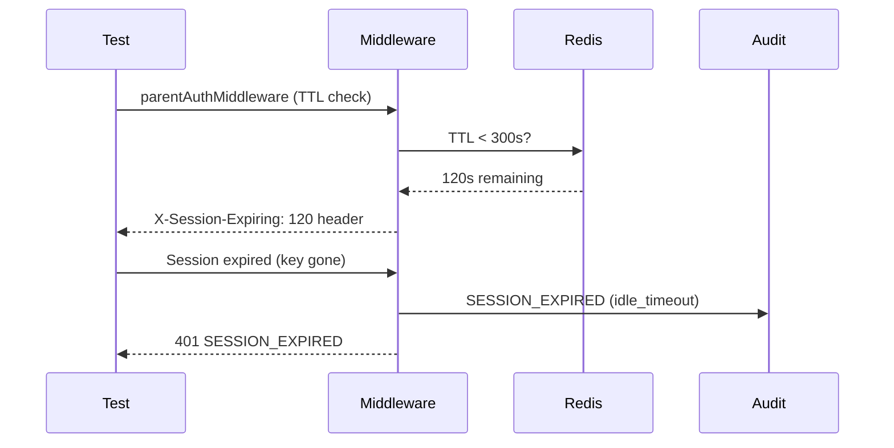

# Test Report — STORY-060 (2026-06-12)

## Summary
| Metric | Result |
|--------|--------|
| Reliability | High |
| Total Tests | 101 (37 backend + 64 frontend) |
| Passed | 101 |
| Failed | 0 |
| Coverage | ≥90% per story-specific files |

## Test Flow

## Tests Created/Updated

### BACKEND (37 tests, all PASS)
| Type | File | Count | Status |
|------|------|-------|--------|
| Unit | `parent-auth-middleware.test.js` | 10 | PASS |
| Unit | `auth-manager-parent-login.test.js` | 16 | PASS |
| Unit | `auth-dao-pii.test.js` | 8 | PASS |
| Integration | `auth-router-parent.test.js` | 13 | PASS |
| Unit | `main.test.js` | 3 | PASS |

### FRONTEND (64 tests, all PASS)
| Type | File | Count | Status |
|------|------|-------|--------|
| Unit | `parent-auth-store.test.js` | +7 (STORY-060) | PASS |
| Unit | `useParentAuth.test.js` | +4 (STORY-060) | PASS |
| Unit | `parent-api-client.test.js` | 7 (new) | PASS |
| Component | `ParentLoginPage.test.jsx` | +2 (STORY-060) | PASS |

## Acceptance Criteria Validation
- [x] AC1: 30-min idle → 401 SESSION_EXPIRED (parentAuthMiddleware + sessionTimeoutMiddleware tests)
- [x] AC2: 25-min idle → soft warning (X-Session-Expiring header test + frontend sessionExpiring integration)
- [x] AC3: Logout clears cookie + Redis + redirect (auth-router-parent logout test + parentLogout test)
- [x] AC4: Old cookie after logout → 401 (blacklist test in parentAuthMiddleware)
- [x] AC5: 11 login attempts → 429 (rate limit test in auth-router-parent)
- [x] AC6: 11 registration attempts → 429 (registerParentLimiter test)
- [x] AC7: SESSION_CREATED audit event (createParentSession audit test)
- [x] AC8: LOGIN_FAILED audit event (parentLogin failure tests)

## NFR Validation
- [x] NFR-SEC-03: 30-min session timeout (TTL check + sliding window tests)
- [x] NFR-SEC-04: Rate limiting (10 req/min per IP tests)
- [x] NFR-SEC-06: Rate limiter thresholds (login + register at 10 req/60s)
- [x] NFR-PRV-06: Audit logs with hashed PII (hashIdentifier + createAuditLog tests)
- [x] NFR-OBS-04: Structured logging with hashed identifiers (PII hashing tests)
- [x] NFR-AVL-01: Graceful degradation on Redis failure (503 tests)

## Blocked Items
None.

## Recommendations
- Pre-existing test failures in `auth-api.test.js` and `auth-dao.test.js` (unrelated to STORY-060) should be addressed separately
- Consider adding integration tests with real Redis/MongoDB for end-to-end session lifecycle validation

**Status**: PASSED
