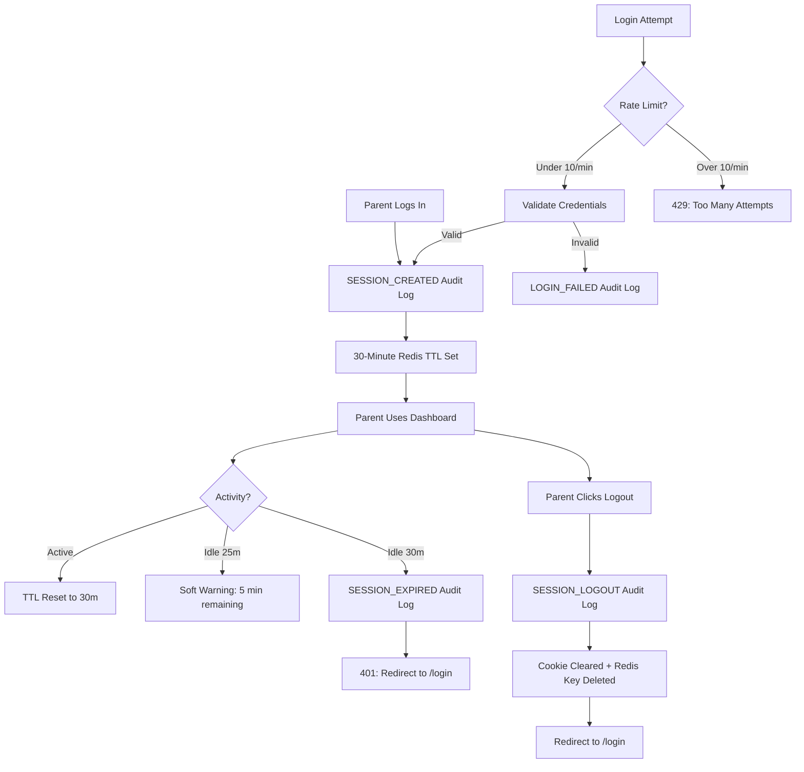

# STORY-060: Parent Session Management & Security

**Epic**: EPIC-011
**Persona**: Mãe da Julia — The Caring Parent
**Priority**: Must Have
**Story Points**: 3
**Dependencies**: STORY-056 (Backend Schema & Auth Migration), STORY-057 (Direct Registration Flow)

## User Story
As a caring parent, I want my account to be secure — with automatic logout when I'm away, protection against repeated login attempts, and a clear record of when my account is accessed — so I can trust the app with my child's data.

## Description
Harden the parent authentication system with full session lifecycle management, rate limiting, audit logging, and secure cookie configuration. This story adds: session timeout enforcement (30-minute idle expiry with soft warning at 25 minutes), proper logout (cookie cleared + session revoked in Redis), session refresh (JWT rotation), rate limiting on login and registration endpoints (10 req/min per IP), structured audit logging for all session lifecycle events, and validation of secure cookie flags (httpOnly, secure, sameSite=strict).

## Context
STORY-056 and STORY-057 established the foundation: cookie-based JWT sessions for parent auth. However, the session lifecycle is incomplete — there is no idle timeout enforcement, no rate limiting on auth endpoints, no structured audit logging, and cookie security flags need explicit validation. This story closes those gaps, bringing the parent auth system to production-grade security for the closed beta launch. Per EPIC-011 NFRs: "Session timeout: 30 minutes of inactivity. Rate limiting: 10 req/min per IP on login/register. Audit logging: SESSION_CREATED, SESSION_LOGOUT, SESSION_EXPIRED, LOGIN_FAILED events."

## Acceptance Criteria (Verifiable)
- [ ] GIVEN a parent is logged in
      WHEN 30 minutes pass with no activity
      THEN the next request returns 401 and the parent is redirected to `/login` with a "Session expired" message
- [ ] GIVEN a parent session has been idle for 25 minutes
      WHEN the parent performs an action
      THEN a soft warning is displayed: "Your session will expire in 5 minutes. Save your work."
- [ ] GIVEN a parent clicks "Logout" on the dashboard
      WHEN the logout request completes
      THEN the httpOnly cookie is cleared, the session is revoked in Redis, and the parent is redirected to `/login`
- [ ] GIVEN a parent logs out
      WHEN they attempt to use their old session cookie
      THEN the request is rejected with 401
- [ ] GIVEN a user attempts to log in
      WHEN they exceed 10 failed attempts in 1 minute from the same IP
      THEN the 11th attempt returns 429: "Too many attempts. Please try again later."
- [ ] GIVEN a user attempts to register
      WHEN they exceed 10 requests in 1 minute from the same IP
      THEN the 11th attempt returns 429: "Too many attempts. Please try again later."
- [ ] GIVEN a parent login succeeds
      WHEN the session is created
      THEN a SESSION_CREATED audit event is logged with hashed parent ID and timestamp
- [ ] GIVEN a parent session expires due to inactivity
      WHEN the timeout triggers
      THEN a SESSION_EXPIRED audit event is logged

## NFRs
- NFR-SEC-03: Sessions expire after 30 minutes of inactivity; re-authentication required
- NFR-SEC-04: All auth inputs validated via Zod; rate limiting prevents brute force
- NFR-SEC-06: Rate limiting on `/api/auth/login` and `/api/auth/register` — 10 req/min per IP
- NFR-PRV-06: Audit logs for all session lifecycle events (CREATED, LOGOUT, EXPIRED, LOGIN_FAILED); retained 12 months
- NFR-OBS-04: Structured logging (Pino) with hashed identifiers; session lifecycle events logged
- NFR-AVL-01: Auth endpoints maintain 99.5% uptime; rate limiting must not degrade legitimate traffic

## Definition of Done (DoD)
- [ ] Code reviewed by CodeReviewer
- [ ] Tests with coverage >= 90%
- [ ] Integration tests passing
- [ ] QA approved by QAAnalyst
- [ ] Documentation updated
- [ ] PR created by MergeRequestCreator

## Technical Notes
- **Session timeout**: Redis TTL of 30 minutes on `parent:session:<parentId>` key. Middleware checks TTL on each authenticated request. If TTL < 5 minutes remaining, return a `X-Session-Expiring: 300` header for frontend soft warning. On expiry, delete the Redis key and return 401.
- **Logout**: `POST /api/auth/logout` — clear the httpOnly cookie (set `Set-Cookie` with `Max-Age=0`), delete `parent:session:<parentId>` from Redis, log SESSION_LOGOUT audit event.
- **Session refresh**: `POST /api/auth/refresh` — validate the current session cookie, issue a new JWT with fresh `exp`, rotate the Redis key TTL back to 30 minutes. No refresh token rotation needed (cookie-based, not Bearer).
- **Rate limiting**: Use `express-rate-limit` or equivalent. Two separate limiters:
  - `loginLimiter`: 10 requests per 60 seconds per IP on `POST /api/auth/login`
  - `registerLimiter`: 10 requests per 60 seconds per IP on `POST /api/auth/register`
  - Return 429 with `Retry-After` header and friendly message.
- **Audit logging**: Structured Pino log entries for:
  - `SESSION_CREATED`: `{ event: "SESSION_CREATED", parentId: "<hashed>", timestamp, ip: "<hashed>" }`
  - `SESSION_LOGOUT`: `{ event: "SESSION_LOGOUT", parentId: "<hashed>", timestamp }`
  - `SESSION_EXPIRED`: `{ event: "SESSION_EXPIRED", parentId: "<hashed>", timestamp, reason: "idle_timeout" }`
  - `LOGIN_FAILED`: `{ event: "LOGIN_FAILED", email: "<hashed>", timestamp, ip: "<hashed>", reason: "invalid_password" | "account_not_found" }`
- **Cookie security config**: Validate in middleware/app config:
  - `httpOnly: true` (not accessible via JavaScript)
  - `secure: true` (HTTPS only; conditionally false in dev with `NODE_ENV=development`)
  - `sameSite: "strict"` (prevents CSRF)
  - `path: "/api"` (cookie only sent to API routes)
- **Frontend**: Add session expiry warning toast/notification when `X-Session-Expiring` header is received. Add logout button handler that calls `POST /api/auth/logout` and clears local auth state.

## User Flow

## Test Scenarios
- Scenario 1: Parent idle for 30 minutes → 401 response, session expired message, SESSION_EXPIRED logged
- Scenario 2: Parent idle for 25 minutes → soft warning displayed, session still valid
- Scenario 3: Parent logs out → cookie cleared, Redis key deleted, SESSION_LOGOUT logged
- Scenario 4: Old cookie used after logout → 401 rejected
- Scenario 5: 11 login attempts in 1 minute → 429 on 11th attempt
- Scenario 6: 11 registration attempts in 1 minute → 429 on 11th attempt
- Scenario 7: Successful login → SESSION_CREATED audit event logged with hashed identifiers
- Scenario 8: Failed login → LOGIN_FAILED audit event logged with hashed email and IP
