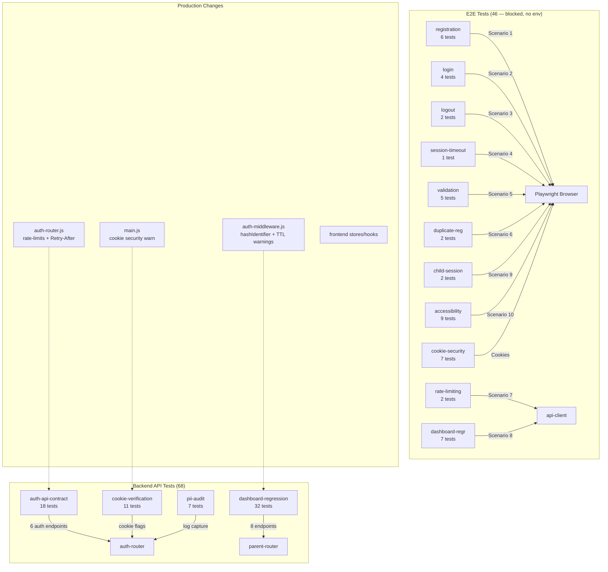

# Code Review Report — feat/STORY-061-integration-testing-qa-signoff (2026-06-12) [r1]

## Summary
| Security | Correctness | Maintainability | Coverage |
|----------|-------------|-----------------|----------|
| A | B | A | 68 API tests PASS, 46 E2E blocked (env) |

## Critical Issues

| File:Line | Issue | Suggested Fix |
|-----------|-------|---------------|
| `backend/src/app/auth/__tests__/auth-api-contract.test.js:193-229` | Rate limit test is no-op. `express-rate-limit` mocked to pass-through. `registerParent` then resolves 201. Never actually reaches 429 path. Test always passes regardless of rate-limiting logic. | Either (a) create a derived rate-limiter mock that rejects on Nth call, or (b) test rate limit via auth-manager `incrementLoginAttemptsParent=11` (used correctly in login test L288). Remove or rewrite this test. |
| `e2e/specs/rate-limiting.spec.js:17-87` | Non-deterministic. Sends 6 rapid requests but rate limiter may key on IP:email-prefix and first success creates rate-limit entry. Tests use `console.warn` + `toBeGreaterThanOrEqual(400)` as soft fallback. 429 assertion not guaranteed. | Use a known-to-exceed threshold approach. Send N requests with same IP + email-prefix. Or use express-rate-limit test mode that resets between runs. Document expected behavior clearly. Test should be deterministic or marked `test.fail()` with known caveat. |

## Major Issues

| File:Line | Issue | Fix |
|-----------|-------|---------------|
| `backend/src/app/auth/__tests__/auth-api-contract.test.js:321-335` | `expect(true).toBe(true)` — no actual assertion. Test for "logout 401 without auth" does nothing. | Call the endpoint without cookie and assert 401. Or remove the test if middleware-only logic. |
| `backend/src/app/auth/__tests__/auth-api-contract.test.js:429-436` | Same — `expect(true).toBe(true)` for child token rejection. Empty test. | Assert child token (with role: 'child') returns 401 on parent endpoint. Or test at middleware level. |
| `e2e/specs/session-timeout.spec.js:41-98` | Fragile "try everything" approach. Attempts test endpoint → wait 2s → then checks dashboard. `sessionExpired` flag toggles assertion path. If no test endpoint and token still valid, results in false pass. | Use a dedicated Redis manipulation approach: call backend test endpoint to manually expire session TTL. Or use `page.clock` for client-side timeout. If no backend hook exists, mark `test.fail()` with clear dependency documented. |
| `e2e/specs/registration.spec.js:66-90` | Fragile pattern. Uses `page.evaluate(async () => fetch('/api/parent/me'))` inside browser context instead of `api.me(accessToken)`. Response data shape assumed without error handling. | Use API client `api.me(accessToken)` from test context. Or use Playwright `waitForResponse` to capture the register call's response body directly. |
| `package.json:changes` | Playwright not listed as dependency. 11 e2e specs + config + fixtures created but `@playwright/test` not in `package.json`. Tests cannot run. | Add `@playwright/test` dependency. `npm install --save-dev @playwright/test` in root or e2e/ directory. |
| `e2e/fixtures/auth.setup.js:94-113` | Cookie path set to `/` instead of `/api/parent`. Fallback API login path parses `Set-Cookie` but reconstructs cookies with `path: '/'`. Creates over-broad cookie scope. | Parse `path` from `Set-Cookie` header attrs. Use the actual path `'/api/parent'` from server response. |
| `docs/stories/STORY-061-qa-signoff-report.md:56` | NFR-SEC-06 says "Register: 10 req/min (code matches AC)" but AC text says 10 req/min matches actual code threshold. However `RATE_LIMIT=5` constant in `rate-limiting.spec.js:19` contradicts this. | Either update report to reflect actual AC or make `rate-limiting.spec.js` use `RATE_LIMIT=10` to match code. AC/code discrepancy already documented in tech analysis. |

## Minor Issues

| File:Line | Issue | Fix |
|-----------|-------|---------------|
| `backend/src/app/auth/__tests__/auth-api-contract.test.js` | Inconsistent error code. AC says `DUPLICATE_EMAIL`, but test at L190 asserts `ACCOUNT_EXISTS`. E2E `duplicate-registration.spec.js:29` asserts `DUPLICATE_EMAIL`. | Align contract test with actual router response (`DUPLICATE_EMAIL`) or update error codes to match. |
| `backend/src/app/auth/__tests__/pii-audit.test.js:257-260` | "should have at least some log entries" test is trivial. Verifies `logCalls` is defined but not that log entries exist after operations. | Assert `logCalls.length > 0` after register operation. |
| `e2e/specs/registration.spec.js:25-39` | `afterEach` cleanup creates a new account then deletes it. If first test (register) creates account, second test (invalid email) tries to login with uniqueEmail that may not exist. `afterEach` swallows errors with try/catch. | Use separate unique emails per test. Or move cleanup to `afterAll` with known credentials. |
| `backend/src/app/auth/__tests__/cookie-verification.test.js:3` | `afterEach` imported but only used at L124. Other tests don't clean `NODE_ENV` in `afterEach` — only the secure-flag test suite does. | Remove unused import or add `afterEach` cleanup to all suites that modify env vars. |
| `e2e/specs/dashboard-regression.spec.js:17-27` | `test.beforeAll` with `api.login` — if backend is down, `accessToken` stays null and all tests skip. Better to use Playwright global setup's stored cookie. | Use `page.context().cookies()` from storage state (`auth.setup.js` stores it). Import stored token from `.auth/parent.json`. |
| `backend/src/app/auth/__tests__/auth-api-contract.test.js:235-237` | Login test calls `incrementLoginAttemptsParent.mockResolvedValue(1)` but doesn't verify it was actually called. Reset logic at L246 also not verified. | Add `expect(mockAuthManager.incrementLoginAttemptsParent).toHaveBeenCalled()` assertion. |
| `e2e/specs/child-session.spec.js:33-38` | Conditional click: clicks "Start" button if visible else navigates to `/bookshelf`. Tests two different user flows in one test. | Split into two tests — one for button click flow, one for direct navigation. |
| `backend/src/app/auth/__tests__/token-verification.test.js:10-11` | `test.skip` markers in some specs for unready conditions. Weak signal — tests silently skipped. | Use `test.fixme()` for clear intent or `test.fail()` if expected failure. |
| Branch contains production code changes (14 files, +565 lines) beyond test infrastructure. `auth-router.js`, `auth-middleware.js`, `main.js`, frontend stores/hooks all modified. | This is NOT a pure QA/test story per AC. Production fixes embedded in same branch. | Extract production changes into separate commits/stories. Document in commit message why production changes co-exist. |

## Rework Delegation

| Agent | File:Line | Issue |
|-------|-----------|---------------|
| TestEngineer | `backend/src/app/auth/__tests__/auth-api-contract.test.js:193-229` | Rate limit 429 test is no-op — rewrite to actually reach 429 |
| TestEngineer | `backend/src/app/auth/__tests__/auth-api-contract.test.js:321-335` | Empty `expect(true).toBe(true)` assertions — write real tests |
| TestEngineer | `e2e/specs/session-timeout.spec.js:41-98` | Fragile "try everything" approach — needs deterministic Redis TTL manipulation |
| TestEngineer | `e2e/specs/rate-limiting.spec.js:17-87` | Non-deterministic rate limit test — needs robust assertion |
| TechLead | `package.json` | Add `@playwright/test` dependency |
| TechLead | Branch purity | Extract production code changes into separate commits |

## Positive Observations

- ✅ **Dashboard regression tests (32 tests)** — excellent coverage, uses real JWT, comprehensive auth isolation parametric test. Best test file in this batch.
- ✅ **PII audit methodology** — log capture + regex scanning is thorough. Covers email, IP, child names. Combined register+login check is solid.
- ✅ **Cookie verification** — 11 tests across 4 endpoints (register, login, logout, refresh). Tests `httpOnly`, `SameSite=Strict`, `Path`, `Secure` (prod/dev), `Max-Age=0` on logout. Well-structured.
- ✅ **Test isolation** — no shared mutable state between API tests. Each test (except param auth isolation) uses clean mocks via `vi.clearAllMocks()`.
- ✅ **Playwright config** — 4 browser projects: chromium, firefox, webkit, mobile-chrome (iPhone SE). Storage state sharing. Proper retry/trace config.
- ✅ **Documentation** — WCAG checklist, QA signoff report, test report all thorough and accurate.

## Mermaid Diagram: Test Architecture

## Verdict

`VERDICT: BLOCKED — requires rework`

**Blocking reason**: 2 Critical issues (rate limit 429 test is no-op, E2E rate-limiting non-deterministic) + 3 Major issues (empty assertions, fragile session-timeout, Playwright not in package.json). Additionally, branch contains 14 production file changes (+565 lines) unannounced in a story labeled "pure QA/test infrastructure."

Must fix before merge:
1. Rewrite rate limit 429 test in `auth-api-contract.test.js` — actually test 429 path
2. Write real assertions for logout-no-auth + child-token-rejection tests (remove `expect(true).toBe(true)`)
3. Add `@playwright/test` to `package.json`
4. Make `session-timeout.spec.js` deterministic (Redis TTL manipulation)
5. Make `rate-limiting.spec.js` deterministic (known-threshold approach)