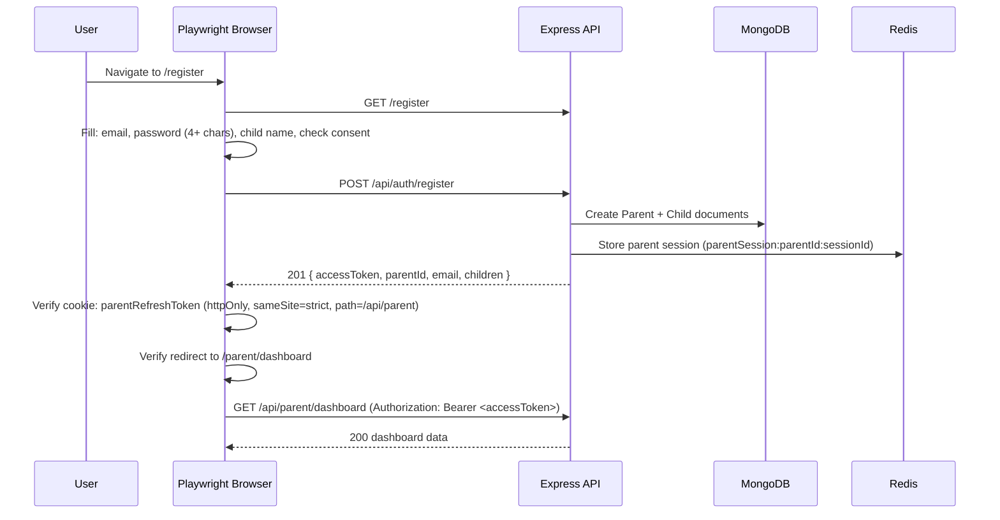
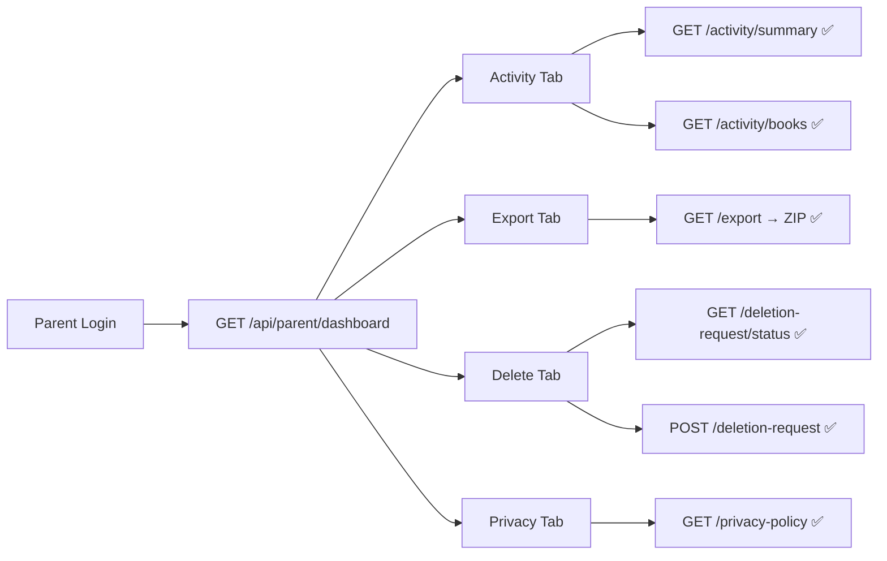
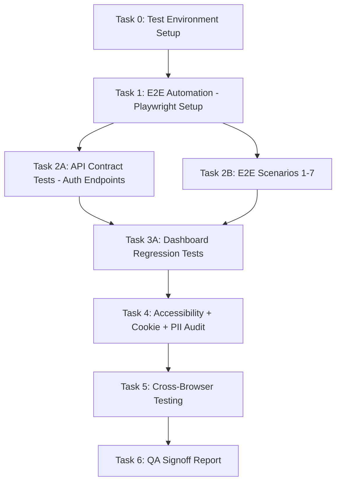

# STORY-061: Technical Analysis — Integration Testing & QA Signoff

**Parent Epic**: EPIC-011 (Simplified Parent-First Onboarding)
**Persona**: Mãe da Julia — The Caring Parent (Primary), Julia — The Young Author (Secondary)
**Priority**: Must Have
**Story Points**: 3

---

## Stack Reference

Source: `docs/architecture/TECH-STACK.md`

| Layer | Technology |
|-------|-----------|
| Runtime | Node.js 22 LTS |
| API Framework | Express 4.x |
| Primary Database | MongoDB 7 + Mongoose 8.x |
| Cache/Session | Redis 7 (ioredis) |
| Frontend | React 18 + Vite 5.x |
| State Management | Zustand + TanStack Query |
| HTTP Client | Axios |
| Validation | Zod |
| Logging | Pino |
| Rate Limiting | express-rate-limit |
| Testing (unit) | Vitest + Supertest |
| Testing (E2E) | Playwright (TBD — not yet installed) |

**Language**: Node.js (backend) + React/JS (frontend)
**Frontend-Backend Integration**: Node.js fullstack SPA — Vite dev proxy → Express API, cookie-based JWT auth, shared repo.

---

## 1. Test Environment Setup

### 1.1 Staging Environment

| Requirement | Detail |
|-------------|--------|
| Deploy target | Docker Compose staging (`docker-compose.staging.yml`) |
| Database | Fresh MongoDB 7 instance; run migration 003 (`npm run migrate:up`) |
| Redis | Redis 7 instance running and accessible at configured URL |
| Config | `NODE_ENV=staging`, `JWT_SECRET` set, `REDIS_URL` set |
| Seed data | Test parent account + child account fixtures via `npm run seed:dev` or custom seed script |

### 1.2 Environment Checklist

```
[ ] All STORY-056–060 code merged and deployed to staging
[ ] Migration 003 run on staging DB
[ ] Redis instance running (verify with `redis-cli ping`)
[ ] Test fixtures: parent (email: test-parent@example.com, password: test1234)
[ ] Test fixtures: child (firstName: Julia, linked to test parent)
[ ] nginx proxy running (TLS termination for cookie secure flag testing)
[ ] SMTP configured (or mocked) for any email-dependent flows
```

### 1.3 Test Tooling

| Tool | Purpose | Status |
|------|---------|--------|
| Vitest | Unit + integration tests | ✅ Installed (`backend`, `frontend`) |
| Supertest | API-level integration tests | ✅ Installed (backend devDep) |
| Playwright | E2E browser automation | ❌ Not yet installed — must add |
| Lighthouse CLI | WCAG AA audit | ❌ Not yet installed — must add |
| axe-core | Programmatic accessibility | Available via `@testing-library/react` ecosystem |

**Action required**: Install Playwright and Lighthouse CLI before E2E and accessibility testing phases.

```bash
# Backend
cd backend && npm install --save-dev @playwright/test playwright

# Frontend
cd frontend && npm install --save-dev @playwright/test playwright

# Global (for Lighthouse)
npm install -g lighthouse
```

---

## 2. E2E Automation Approach

### 2.1 Tool: Playwright

Playwright is the recommended E2E tool per STORY-061 technical notes. No existing E2E framework found (no `playwright.config.*` or `cypress.config.*`).

### 2.2 Test Architecture

```
e2e/
├── playwright.config.js          # Playwright config (baseURL, browsers)
├── fixtures/
│   ├── auth.setup.js              # Parent registration + login fixtures
│   └── test-data.js               # Shared test data (emails, passwords, names)
├── specs/
│   ├── registration.spec.js        # Scenario 1: Full registration flow
│   ├── login.spec.js               # Scenario 2: Parent login
│   ├── logout.spec.js              # Scenario 3: Parent logout
│   ├── session-timeout.spec.js     # Scenario 4: Session timeout (clock manipulation)
│   ├── validation.spec.js          # Scenario 5: Registration validation errors
│   ├── duplicate-registration.spec.js # Scenario 6: 409 duplicate email
│   ├── rate-limiting.spec.js       # Scenario 7: 429 rate limiting
│   ├── dashboard-regression.spec.js # Scenario 8: STORY-052 regression
│   ├── child-session.spec.js       # Scenario 9: Child session initiation
│   ├── accessibility.spec.js       # Scenario 10: WCAG AA audit
│   └── cookie-security.spec.js      # Cookie flag verification
└── utils/
    └── api-client.js               # Reusable Supertest-based API helper
```

### 2.3 E2E Test Scenarios

#### Scenario 1: Full Registration Flow



| Step | Assertion |
|------|-----------|
| Navigate `/register` | Page loads, form visible |
| Fill form + submit | POST `/api/auth/register` returns 201 |
| Response body | Contains `accessToken`, `parentId`, `email`, `children` |
| Cookie | `parentRefreshToken` set: httpOnly=true, sameSite=strict, path=/api/parent |
| Redirect | `/parent/dashboard` rendered with dashboard data |
| Child active | `children[0].isActive === true` |

#### Scenario 2: Parent Login

| Step | Assertion |
|------|-----------|
| Navigate `/login` | Login form visible |
| Fill email + password, submit | POST `/api/parent/login` returns 200 |
| Cookie | `parentRefreshToken` set with correct flags |
| Redirect | `/parent/dashboard` |

#### Scenario 3: Parent Logout

| Step | Assertion |
|------|-----------|
| From dashboard, click Logout | POST `/api/parent/logout` returns 200 |
| Cookie | `parentRefreshToken` cleared |
| Redis | Session key `parentSession:{parentId}:*` deleted |
| Redirect | `/login` |

#### Scenario 4: Session Timeout

> **Clock manipulation required**: Use Playwright's `page.clock` or Redis TTL manipulation to simulate 30-minute idle without waiting.

| Approach | Detail |
|----------|--------|
| Method A (preferred) | Fast-forward Redis TTL: `redis.expire('parentSession:{parentId}:{sessionId}', 1)` then make API call |
| Method B | Playwright `page.clock.install()` then `page.clock.fastForward(30 * 60 * 1000)` — only works for client-side timers, not server-side Redis TTL |

| Step | Assertion |
|------|-----------|
| Login, then simulate 30min idle | API call returns 401 `SESSION_EXPIRED` |
| Frontend | Redirect to `/login` with "Session expired" message |

#### Scenario 5: Registration Validation

| Input | Expected Error |
|-------|---------------|
| Invalid email (no @) | 400 `VALIDATION_ERROR` |
| Password < 4 chars | 400 `VALIDATION_ERROR` |
| ageConsent unchecked | 400 `VALIDATION_ERROR` |
| Empty fields | 400 `VALIDATION_ERROR` |

#### Scenario 6: Duplicate Registration

| Step | Assertion |
|------|-----------|
| Register with `test-parent@example.com` | 201 success |
| Register again with same email | 409 `DUPLICATE_EMAIL` with message "An account with this email already exists..." |

#### Scenario 7: Rate Limiting

| Endpoint | Limiter | Threshold |
|----------|---------|-----------|
| `POST /api/auth/register` | `registerParentLimiter` | 5 req/hour per IP:email-prefix |
| `POST /api/parent/login` | `parentLoginLimiter` | 5 req/15min per IP |

> **Note**: STORY AC says "10 req/min per IP" but current code uses 5 req/15min for login and 5 req/hour for register. Verify which threshold to test against — code is source of truth.

| Step | Assertion |
|------|-----------|
| Send N+1 rapid requests (N = limiter max) | N+1th returns 429 `RATE_LIMITED` |

#### Scenario 8: STORY-052 Regression (Dashboard Tabs)



| Endpoint | Auth Method | Assertion |
|----------|-------------|-----------|
| `GET /api/parent/dashboard` | Bearer token (parent) | Returns dashboard data, 200 |
| `GET /api/parent/activity/summary` | Bearer token (parent) | Returns activity summary, 200 |
| `GET /api/parent/activity/books` | Bearer token (parent) | Returns book list, 200 |
| `GET /api/parent/export` | Bearer token (parent) | Returns ZIP file, 200 |
| `GET /api/parent/deletion-request/status` | Bearer token (parent) | Returns deletion status, 200 |
| `POST /api/parent/deletion-request` | Bearer token (parent) | Creates deletion request, 200 |
| `GET /api/parent/privacy-policy` | Bearer token (parent) | Returns privacy content, 200 |

> **Critical regression**: These endpoints previously used child `authMiddleware` (Bearer header). STORY-056–060 changed parent auth to `parentAuthMiddleware` with Bearer token + Redis session validation. All endpoints must work with cookie-based refresh + Bearer access token.

#### Scenario 9: Child Session Initiation

| Step | Assertion |
|------|-----------|
| Parent registers/logs in | Parent dashboard shows child(ren) |
| Click "Start child session" | POST `/api/auth/child-login` or navigate to child bookshelf |
| Child redirected | Bookshelf loads with active child account |
| Child data | `isOnboardingComplete`, `childFirstName`, `childId` present |

#### Scenario 10: WCAG AA Audit

Covered in Section 5 below.

---

## 3. API Contract Tests (Supertest)

### 3.1 Auth Endpoints

| Endpoint | Method | Test Cases |
|----------|--------|------------|
| `/api/auth/register` | POST | Happy path (201), validation errors (400), duplicate email (409), rate limit (429) |
| `/api/parent/login` | POST | Valid credentials (200 + cookie), invalid password (401), missing fields (400), rate limit (429) |
| `/api/parent/logout` | POST | Valid session (200 + cookie cleared), no auth (401) |
| `/api/parent/refresh` | POST | Valid refresh cookie (200 + new cookie), expired/invalid refresh (401), missing cookie (401) |
| `/api/parent/me` | GET | Valid token (200), expired token (401), child token rejected (401) |
| `/api/auth/child-login` | POST | Valid childId + parentId (200), pending deletion (403) |

### 3.2 Parent Dashboard Endpoints (Regression)

| Endpoint | Method | Test Cases |
|----------|--------|------------|
| `/api/parent/dashboard` | GET | Returns data with parent Bearer token (200), child token rejected (401), no token (401) |
| `/api/parent/activity/summary` | GET | Returns summary (200) |
| `/api/parent/activity/books` | GET | Returns book list (200), pagination params |
| `/api/parent/export` | GET | Returns ZIP (200), password field excluded from export |
| `/api/parent/deletion-request/status` | GET | Returns status (200) |
| `/api/parent/deletion-request` | POST | Creates deletion request with confirmText (200) |
| `/api/parent/deletion-request/cancel` | POST | Cancels deletion (200) |
| `/api/parent/privacy-policy` | GET | Returns policy content (200) |

### 3.3 Cookie Verification Tests (Supertest)

```javascript
// Verify cookie flags on register response
const res = await request(app)
  .post('/api/auth/register')
  .send({ email, password, ageConsent: true, childFirstName: 'Julia' });

const cookies = res.headers['set-cookie'];
// Assert: parentRefreshToken has httpOnly, sameSite=strict, path=/api/parent
// Assert: secure flag present in production mode
```

---

## 4. Regression Tests for STORY-052

### 4.1 STORY-052 Original Scope

STORY-052 (Parent Authentication & Dashboard Access) established:
- Parent login flow (separate from child auth)
- Dashboard shell with 4 tabs: Activity, Export, Delete, Privacy
- 30-minute session timeout
- Visual distinction from child UI

### 4.2 Regression Test Matrix

| Area | Original Behavior | New Behavior (EPIC-011) | Regression Test |
|------|-------------------|------------------------|----------------|
| Parent auth | Email + password login | Same, but with cookie-based refresh tokens | ✅ Verify login sets `parentRefreshToken` cookie |
| Session management | JWT in Authorization header | JWT Bearer token + Redis session validation | ✅ Verify `parentAuthMiddleware` validates session in Redis |
| Dashboard tabs | All 4 tabs functional | Same endpoints, but auth via `parentAuthMiddleware` | ✅ Verify all endpoints accept parent Bearer token |
| Session timeout | 30-minute idle timeout | Same, but Redis TTL-based | ✅ Verify Redis session expires after 30 min |
| Auth isolation | Child cannot access parent dashboard | Same | ✅ Verify child token returns 401 on parent endpoints |
| Logout | Clear session | Clear session + revoke refresh cookie | ✅ Verify `parentRefreshToken` cookie cleared |

### 4.3 Key Files for Regression

| File | Purpose |
|------|---------|
| `backend/src/app/auth/auth-router.js` | Parent auth routes (register, login, logout, refresh, me) |
| `backend/src/app/auth/auth-manager.js` | Parent auth business logic |
| `backend/src/app/common/auth-middleware.js` | `parentAuthMiddleware` — JWT + Redis session validation |
| `backend/src/app/parent/parent-router.js` | Dashboard endpoints (all use `parentAuthMiddleware`) |
| `backend/src/app/parent/parent-manager.js` | Dashboard business logic |
| `backend/src/app/parent/parent-dao.js` | Dashboard data access |
| `frontend/src/hooks/useParentAuth.js` | Parent auth state (Zustand store) |
| `frontend/src/hooks/useParentDashboard.js` | Dashboard data fetching (TanStack Query) |
| `frontend/src/app/parent/ParentLoginPage.jsx` | Login page component |
| `frontend/src/app/parent/ParentDashboardPage.jsx` | Dashboard page component |
| `frontend/src/components/parent/ParentNavbar.jsx` | Dashboard navigation |
| `frontend/src/components/parent/ParentProtectedRoute.jsx` | Auth guard for parent routes |

---

## 5. WCAG AA Audit Scope

### 5.1 Pages Under Audit

| Page | Route | Priority |
|------|-------|----------|
| Registration | `/register` | Critical |
| Login | `/login` (parent) | Critical |
| Parent Dashboard | `/parent/dashboard` | Critical |

### 5.2 Audit Methodology

#### Automated (Lighthouse CLI)

```bash
# Registration page
lighthouse http://staging:8088/register --only-categories=accessibility --output=json --output-path=./lighthouse-register.json

# Login page
lighthouse http://staging:8088/login --only-categories=accessibility --output=json --output-path=./lighthouse-login.json

# Dashboard page (requires auth — use Playwright to set cookies first)
lighthouse http://staging:8088/parent/dashboard --only-categories=accessibility --output=json --output-path=./lighthouse-dashboard.json
```

**Target**: Accessibility score ≥ 95

#### Manual Keyboard Navigation

| Check | Criteria |
|-------|----------|
| Tab order | All form fields, buttons, links reachable via Tab |
| Focus indicators | Visible focus ring on all interactive elements |
| Form submission | Enter key submits forms |
| Skip navigation | Skip-to-content link present |
| Modal/dialog trap | Focus trapped inside modals (e.g., logout confirmation) |

#### Screen Reader (VoiceOver/NVDA)

| Check | Criteria |
|-------|----------|
| Form labels | All inputs have associated `<label>` or `aria-label` |
| Error announcements | Inline validation errors announced via `aria-live` |
| State changes | Button states (loading, disabled) announced |
| Navigation | Landmark regions (`<main>`, `<nav>`, `<form>`) announced |

#### Color Contrast

| Check | Criteria |
|-------|----------|
| Text on backgrounds | ≥ 4.5:1 ratio for normal text, ≥ 3:1 for large text |
| Interactive elements | Focus indicators ≥ 3:1 contrast |
| Error states | Error text meets contrast against background |

### 5.3 Known Issues from STORY-058

Per STORY-061 plan notes:
- `aria-controls` ID mismatch
- Landmark nesting issues
- Dynamic import accessibility

**These must be fixed before running the WCAG audit.**

---

## 6. Cookie Security Verification

### 6.1 Cookie Specification

Based on `auth-router.js` code analysis:

```javascript
res.cookie('parentRefreshToken', result.refreshToken, {
  httpOnly: true,
  secure: process.env.NODE_ENV === 'production',
  sameSite: 'strict',
  maxAge: 7 * 24 * 60 * 60 * 1000, // 7 days
  path: '/api/parent',
});
```

### 6.2 Verification Matrix

| Flag | Expected | Verification Method |
|------|----------|---------------------|
| `httpOnly` | `true` | Playwright: `page.context().cookies()` → check `httpOnly` field |
| `secure` | `true` in production, `false` in dev | Test in staging with `NODE_ENV=production`; verify in DevTools |
| `sameSite` | `strict` | Playwright: `page.context().cookies()` → check `sameSite` field |
| `path` | `/api/parent` | Playwright: `page.context().cookies()` → check `path` field |
| `maxAge` | `7 * 24 * 60 * 60 * 1000` (7 days) | Verify `expires` date is ~7 days from now |
| JS access | NOT accessible via `document.cookie` | Playwright: `page.evaluate(() => document.cookie)` → assert no `parentRefreshToken` |

### 6.3 Logout Cookie Clearing

```javascript
// Verify logout clears cookie
res.clearCookie('parentRefreshToken', { path: '/api/parent' });
```

| Check | Assertion |
|-------|-----------|
| After logout | `parentRefreshToken` cookie removed from browser |
| After logout | Redis session key `parentSession:{parentId}:{sessionId}` deleted |
| After logout | Access token blacklisted in Redis (`bl:{tokenHash}`) |

---

## 7. PII Audit

### 7.1 PII Fields in Auth Flow

| Field | Source | Storage | Must Be Hashed In Logs |
|-------|--------|---------|----------------------|
| Email | Registration/login request | Stored in MongoDB (encrypted at rest) | ✅ Yes |
| Password | Registration/login request | Stored as bcrypt hash | ✅ Never logged (bcrypt hash is internal) |
| Child first name | Registration request | Stored in MongoDB | ✅ Yes |
| IP address | All requests | Stored in `SessionAuditLog` | ✅ Yes |
| Device hint | All requests | Stored in `SessionAuditLog` | ⚠️ Sanitized (truncated to 100 chars, regex-cleaned) |

### 7.2 Audit Procedure

```bash
# 1. Run full E2E test suite on staging
# 2. Collect all application logs (pino output)
# 3. Grep for raw PII patterns:

# Check for raw email addresses
rg '[a-zA-Z0-9._%+-]+@[a-zA-Z0-9.-]+\.[a-zA-Z]{2,}' /var/log/contopia/*.log

# Check for raw child names (common Portuguese names — adjust as needed)
rg -i '(joão|maria|ana|pedro|julia|lucas)' /var/log/contopia/*.log

# Check for raw IP addresses
rg '\b(?:[0-9]{1,3}\.){3}[0-9]{1,3}\b' /var/log/contopia/*.log
```

### 7.3 Logging Code Analysis

From `auth-router.js`:
```javascript
logger.info({ parentId: result.parentId, requestId }, 'Parent registered and auto-logged in');
```

- ✅ `parentId` is a MongoDB ObjectId — not PII
- ✅ No raw email in log statement
- ✅ No raw child name in log statement

From `auth-manager.js` (based on NFR-PRV-06):
- Verify all `logger.info/error/warn` calls use hashed identifiers
- Verify no `logger.info({ email })` patterns exist

### 7.4 Structured Logging Verification (NFR-OBS-04)

| Required | Verification |
|----------|-------------|
| Request IDs in every log entry | Grep logs for `requestId` field |
| Hashed user IDs | Grep logs for `parentId` field (should be ObjectId, not email) |
| Timestamps | Verify Pino JSON output includes `time` field |
| No raw PII | See PII audit above |

---

## 8. Cross-Browser Scope

### 8.1 Browser Matrix

| Browser | Desktop | Mobile (375px) | Priority |
|---------|---------|----------------|----------|
| Chrome (latest) | ✅ | ✅ | Must Have |
| Safari (latest) | ✅ | ✅ | Must Have |
| Firefox (latest) | ✅ | ✅ | Must Have |

### 8.2 Playwright Cross-Browser Configuration

```javascript
// playwright.config.js
projects: [
  { name: 'chromium', use: { browserName: 'chromium' } },
  { name: 'firefox', use: { browserName: 'firefox' } },
  { name: 'webkit', use: { browserName: 'webkit' } },  // Safari
]
```

### 8.3 Mobile Viewport Tests

| Viewport | Width | Use Case |
|----------|-------|----------|
| iPhone SE | 375×667 | Minimum supported width |
| iPhone 12 | 390×844 | Common mobile |
| Desktop | 1280×720 | Standard desktop |

### 8.4 Cross-Browser Test Focus

| Feature | Chrome | Safari | Firefox |
|---------|--------|--------|---------|
| Registration form | Full flow | Full flow | Full flow |
| Login + cookie set | Cookie flags | Cookie flags | Cookie flags |
| Dashboard tabs | All functional | All functional | All functional |
| Logout + cookie clear | Verify | Verify | Verify |
| Session timeout | Redis TTL | Redis TTL | Redis TTL |

---

## 9. QA Signoff Criteria

### 9.1 Mandatory Pass Criteria

| # | Criterion | Verification |
|---|-----------|-------------|
| 1 | All 10 test scenarios pass | E2E test suite green |
| 2 | STORY-052 regression passes | All dashboard endpoints return 200 with parent auth |
| 3 | Lighthouse accessibility ≥ 95 on all 3 auth pages | CLI audit report |
| 4 | No raw PII in logs | Grep audit passes |
| 5 | Cookie flags verified | Playwright cookie assertion |
| 6 | Rate limiting verified | Automated burst test returns 429 |
| 7 | Cross-browser: Chrome, Safari, Firefox | All browsers pass core scenarios |
| 8 | Mobile viewport (375px) | Registration + login + dashboard functional |
| 9 | API contract tests pass (Supertest) | All auth + dashboard endpoints return correct status codes |
| 10 | Session timeout enforced | 30-min idle → 401 `SESSION_EXPIRED` |

### 9.2 Conditional Pass Criteria

| # | Criterion | Severity if Failed |
|---|-----------|-------------------|
| 1 | Lighthouse score exactly 100 | Low (95+ acceptable) |
| 2 | Keyboard navigation flawless | Medium (minor issues acceptable with documented exceptions) |
| 3 | Screen reader announces all errors | Medium (must announce critical errors) |
| 4 | All mobile viewports pixel-perfect | Low (functional > visual) |

### 9.3 Blockers (Auto-Fail QA)

- Any PII leak in logs
- Any auth bypass (child token accessing parent endpoints)
- Session not properly cleared on logout
- Rate limiting not enforced
- Cookie accessible via JavaScript (`document.cookie`)

---

## Execution Plan

### Task Breakdown



### SubAgent Assignments

| Task | Description | Agent |
|------|-------------|-------|
| 0 | Test environment setup (deploy, seed, configure) | TechLead coordinates |
| 1 | Playwright + Lighthouse installation, config, test fixtures | TestEngineer |
| 2A | API contract tests via Supertest (auth endpoints) | TestEngineer |
| 2B | E2E test scenarios 1-7 (Playwright) | TestEngineer |
| 3A | Dashboard regression tests + Scenario 8-9 | TestEngineer |
| 4 | WCAG AA audit + Cookie security + PII audit | QAAnalyst |
| 5 | Cross-browser testing (Chrome, Safari, Firefox) | QAAnalyst |
| 6 | QA signoff report | QAAnalyst |

### Execution Order

1. **Sequential**: Task 0 (environment) → Task 1 (Playwright setup)
2. **Parallel**: Tasks 2A + 2B (API tests + E2E scenarios) — no shared state
3. **Sequential**: Task 3A (regression) depends on Tasks 2A + 2B
4. **Sequential**: Task 4 (audit) depends on Task 3A
5. **Sequential**: Task 5 (cross-browser) depends on Task 4
6. **Sequential**: Task 6 (signoff) depends on all previous

---

## Impacted Components & Files

### Backend

| File | Impact | Reason |
|------|--------|--------|
| `backend/src/app/auth/auth-router.js` | Test coverage | Register, login, logout, refresh, child-login endpoints |
| `backend/src/app/auth/auth-manager.js` | Test coverage | Parent session management, registration logic |
| `backend/src/app/auth/auth-model.js` | Test coverage | Parent, Child, SessionAuditLog models |
| `backend/src/app/common/auth-middleware.js` | Test coverage | `parentAuthMiddleware`, `sessionTimeoutMiddleware` |
| `backend/src/app/common/validation-schemas.js` | Test coverage | `parentRegisterSchema`, `parentLoginSchema`, `parentRefreshSchema` |
| `backend/src/app/parent/parent-router.js` | Regression | Dashboard, activity, export, deletion, privacy endpoints |
| `backend/src/app/parent/parent-manager.js` | Regression | Dashboard business logic |
| `backend/src/app/parent/parent-dao.js` | Regression | Dashboard data access |

### Frontend

| File | Impact | Reason |
|------|--------|--------|
| `frontend/src/app/parent/ParentLoginPage.jsx` | E2E + a11y | Login form testing |
| `frontend/src/app/parent/ParentDashboardPage.jsx` | E2E + regression + a11y | Dashboard tabs |
| `frontend/src/components/parent/ParentNavbar.jsx` | E2E | Logout button |
| `frontend/src/components/parent/ParentProtectedRoute.jsx` | E2E | Auth guard redirect |
| `frontend/src/hooks/useParentAuth.js` | E2E | Auth state management |
| `frontend/src/hooks/useParentDashboard.js` | Regression | Dashboard data fetching |

### New Files (Test)

| File | Purpose |
|------|---------|
| `e2e/playwright.config.js` | Playwright configuration |
| `e2e/fixtures/auth.setup.js` | Auth setup fixtures |
| `e2e/specs/registration.spec.js` | Scenario 1 |
| `e2e/specs/login.spec.js` | Scenario 2 |
| `e2e/specs/logout.spec.js` | Scenario 3 |
| `e2e/specs/session-timeout.spec.js` | Scenario 4 |
| `e2e/specs/validation.spec.js` | Scenario 5 |
| `e2e/specs/duplicate-registration.spec.js` | Scenario 6 |
| `e2e/specs/rate-limiting.spec.js` | Scenario 7 |
| `e2e/specs/dashboard-regression.spec.js` | Scenario 8 |
| `e2e/specs/child-session.spec.js` | Scenario 9 |
| `e2e/specs/accessibility.spec.js` | Scenario 10 |
| `e2e/specs/cookie-security.spec.js` | Cookie verification |

---

## Risk Assessment

| Risk | Probability | Impact | Mitigation |
|------|------------|--------|------------|
| Playwright not installed/configured | Medium | High | Install early (Task 1); validate with smoke test |
| STORY-058 a11y issues block WCAG audit | Medium | Medium | Fix aria-controls, landmark nesting before audit |
| Rate limiter thresholds differ from AC | High | Low | Test against actual code thresholds (5 req/15min, 5 req/hour); document discrepancy |
| Session timeout test needs Redis manipulation | Medium | Medium | Use Redis `EXPIRE` command to fast-forward TTL; don't rely on real-time wait |
| Cross-browser cookie behavior differences | Low | Medium | Test `sameSite=strict` on Safari (known ITP issues); document any deviations |
| PII found in logs | Low | High | If found, fix logging before signoff; blocker if not resolved |
| Staging environment unavailable | Low | High | Docker Compose staging setup; can also use local Docker |

### Key Discrepancy: Rate Limiting Thresholds

The STORY AC states "10 requests in 1 minute" but the code implements:
- **Register**: 5 req/hour per IP:email-prefix
- **Login (parent)**: 5 req/15min per IP
- **Login (child)**: 5 req/15min per IP:childId-prefix
- **Refresh**: 10 req/15min per IP

**Recommendation**: Test against the code's actual thresholds. Update the STORY AC if needed, or adjust the code to match the AC. This is a clarification item, not a blocker.

---

## Architecture Diagram: Auth Flow Under Test

```mermaid
graph TB
    subgraph Client["Browser (Playwright)"]
        Reg["/register"]
        Login["/login"]
        Dash["/parent/dashboard"]
        ChildLogin["child-login"]
    end

    subgraph API["Express API"]
        AuthR["auth-router.js<br/>/api/auth/*"]
        ParentR["parent-router.js<br/>/api/parent/*"]
        ParentAuth["parentAuthMiddleware<br/>JWT + Redis session"]
    end

    subgraph Data["Data Layer"]
        Mongo[("MongoDB<br/>Parent, Child,<br/>SessionAuditLog")]
        Redis[("Redis<br/>Sessions +<br/>Blacklist +<br/>Rate Limit")]
    end

    Reg -->|"POST /register"| AuthR
    Login -->|"POST /parent/login"| AuthR
    AuthR -->|"bcrypt.compare"| Mongo
    AuthR -->|"store session"| Redis
    AuthR -->|"set cookie"| Client

    Dash -->|"GET /dashboard<br/>Bearer token"| ParentR
    ParentR -->|"validate"| ParentAuth
    ParentAuth -->|"check session"| Redis
    ParentAuth -->|"check blacklist"| Redis
    ParentR -->|"query"| Mongo

    ChildLogin -->|"POST /child-login"| AuthR
    AuthR -->|"create child session"| Redis