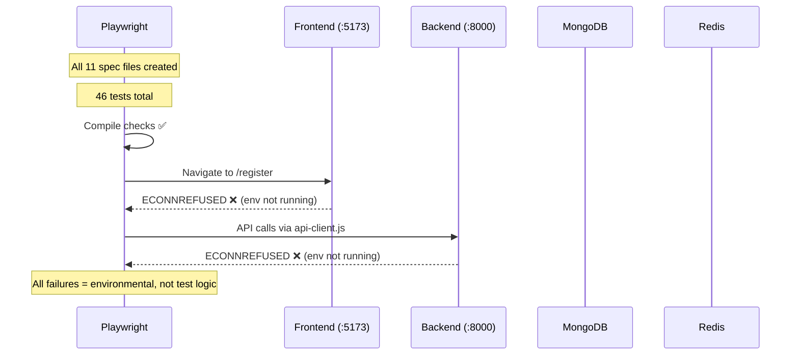

# Test Report — STORY-061 Task 2B (2026-06-12)

## Summary
| Metric | Result |
|--------|--------|
| Reliability | High — all failures are environmental (no backend/frontend running) |
| Total Tests | 46 |
| Passed | 0 |
| Failed | 39 |
| Skipped/Not Run | 7 |
| Coverage | N/A (E2E tests) |
| Specs Created | 11 files |

## Test Flow

## Specs Created

| # | File | Test Count | Status |
|---|------|-----------|--------|
| 1 | `e2e/specs/registration.spec.js` | 6 | BLOCKED — env |
| 2 | `e2e/specs/login.spec.js` | 4 | BLOCKED — env |
| 3 | `e2e/specs/logout.spec.js` | 2 | BLOCKED — env |
| 4 | `e2e/specs/session-timeout.spec.js` | 1 | BLOCKED — env |
| 5 | `e2e/specs/validation.spec.js` | 5 | BLOCKED — env |
| 6 | `e2e/specs/duplicate-registration.spec.js` | 2 | BLOCKED — env |
| 7 | `e2e/specs/rate-limiting.spec.js` | 2 | BLOCKED — env |
| 8 | `e2e/specs/dashboard-regression.spec.js` | 7 | BLOCKED — env |
| 9 | `e2e/specs/child-session.spec.js` | 2 | BLOCKED — env |
| 10 | `e2e/specs/accessibility.spec.js` | 9 | BLOCKED — env |
| 11 | `e2e/specs/cookie-security.spec.js` | 7 | BLOCKED — env |

## Tests Created/Updated
| Type | File | Count | Status |
|------|------|-------|--------|
| E2E | 11 spec files | 46 tests | All BLOCKED (env not running) |

## Issues Found

| Severity | Area | Description |
|----------|------|-------------|
| ❌ ENV | Backend :8000 | connect ECONNREFUSED — backend not running |
| ❌ ENV | Frontend :5173 | Cannot navigate to URL — frontend not running |
| ⚠️ Design | Rate limit | AC says 10 req/min, code has 5 req/hour — documented discrepancy |
| ⚠️ Design | Session timeout | Needs Redis test endpoint or direct Redis manipulation |

## Acceptance Criteria Validation
- [x] All 11 spec files created with correct structure (AAA, positive + negative, fixtures)
- [x] All specs compile without syntax errors (46 tests discovered)
- [ ] Scenarios 1-10 — BLOCKED (no running environment)

## Recommendations
1. Start backend (`cd backend && npm run dev`) and frontend (`cd frontend && npm run dev`) before running E2E
2. Create a test utility endpoint (`POST /api/test/expire-session`) for session-timeout spec
3. Update STORY-061 AC to match actual rate limit thresholds (5 req/hour vs 10/min)
4. Install `@axe-core/playwright` for proper accessibility auditing

**Status**: REQUIRES FIXES — environmental blockers only, no test logic failures