# STORY-061: Integration Testing & QA Signoff

**Epic**: EPIC-011
**Persona**: Mãe da Julia — The Caring Parent (Primary), Julia — The Young Author (Secondary)
**Priority**: Must Have
**Story Points**: 3
**Dependencies**: STORY-056, STORY-057, STORY-058, STORY-059, STORY-060

## User Story
As the product team, I want end-to-end validation of the entire parent-first onboarding flow — from registration through dashboard to child bookshelf — so I can confidently launch the closed beta knowing all auth paths work correctly and no regressions exist.

## Description
Validate the complete EPIC-011 implementation through comprehensive integration testing. This story covers: full registration flow (register → auto-login → dashboard), parent login/logout, session timeout enforcement, child session initiation from parent dashboard, rate limiting verification, STORY-052 regression testing (parent dashboard tabs: Activity, Export, Delete, Privacy), WCAG 2.1 AA accessibility audit on auth pages, cookie security flag verification, and cross-browser testing. This is the final QA gate before closed beta launch.

## Context
EPIC-011 replaced the original magic-link onboarding with a simplified parent-first model across 5 implementation stories (STORY-056 through STORY-060). STORY-061 is the integration test and QA signoff story that validates the entire chain works end-to-end. Per PM-HANDOFF-PIVOT: "Must run after all other stories." The test scenarios defined here are the minimum required for QA signoff. STORY-052 (Parent Dashboard) must be regression-tested to ensure it works with the new cookie-based auth (not Bearer header auth from the old model).

## Acceptance Criteria (Verifiable)
- [ ] GIVEN a new user visits `/register`
      WHEN they fill the form with valid email, password (min 4 chars), child first name, and check age consent, then submit
      THEN they are redirected to `/parent/dashboard`, a JWT httpOnly cookie is set, and a child account is created and active
- [ ] GIVEN a registered parent visits `/login`
      WHEN they enter valid email and password and submit
      THEN they are redirected to `/parent/dashboard` with a valid session cookie
- [ ] GIVEN a parent is on the dashboard
      WHEN they click "Logout"
      THEN they are redirected to `/login`, the cookie is cleared, and the session is revoked in Redis
- [ ] GIVEN a parent is logged in and idle for 30 minutes
      WHEN they attempt any action
      THEN they receive a 401 response and are redirected to `/login` with a "Session expired" message
- [ ] GIVEN the registration form
      WHEN a user submits with invalid email, password < 4 chars, or unchecked age consent
      THEN validation errors are displayed inline and no account is created
- [ ] GIVEN a registered parent email
      WHEN a user attempts to register again with the same email
      THEN they receive a 409 response: "An account with this email already exists. Please log in instead."
- [ ] GIVEN a user rapidly submits the registration form
      WHEN they exceed 10 requests in 1 minute from the same IP
      THEN the 11th attempt returns 429: "Too many attempts. Please try again later."
- [ ] GIVEN a parent is logged in with the new cookie-based auth
      WHEN they access each parent dashboard tab (Activity, Export Data, Delete Account, Privacy Policy)
      THEN all tabs are functional and respond correctly (STORY-052 regression)
- [ ] GIVEN a parent has registered and is on the dashboard
      WHEN they initiate a child session
      THEN the child is redirected to their bookshelf with an active child account
- [ ] GIVEN the registration, login, and dashboard pages
      WHEN audited for WCAG 2.1 AA accessibility
      THEN all forms are keyboard-navigable, screen readers announce errors, and color contrast meets 4.5:1 minimum

## NFRs
- NFR-SEC-03: Session timeout verified (30-minute idle → 401)
- NFR-SEC-04: Input validation verified (Zod schemas reject invalid inputs)
- NFR-SEC-06: Rate limiting verified (429 on 11th request in 1 minute)
- NFR-PRV-06: Audit logs verified — no raw PII in log output (email hashed, child name hashed)
- NFR-ACC-01: WCAG 2.1 AA verified on registration, login, and dashboard pages
- NFR-ACC-04: Color contrast 4.5:1 verified on all auth pages
- NFR-OBS-04: Structured logging verified — request IDs, hashed user IDs, timestamps present

## Definition of Done (DoD)
- [ ] Code reviewed by CodeReviewer
- [ ] Tests with coverage >= 90%
- [ ] Integration tests passing
- [ ] QA approved by QAAnalyst
- [ ] Documentation updated
- [ ] PR created by MergeRequestCreator

## Technical Notes
- **Test environment**: Staging environment with fresh database (run migration 003), Redis instance, and all STORY-056 through STORY-060 code deployed.
- **Test automation**: Use Playwright or Cypress for browser-based E2E tests. API-level integration tests via Supertest.
- **Cookie verification**: Use Browser DevTools or Playwright's `page.context().cookies()` to verify httpOnly, secure, sameSite flags.
- **Rate limiting test**: Automated burst test — send 11 rapid requests and assert 429 on the 11th.
- **WCAG audit**: Use Lighthouse CLI (`lighthouse --only-categories=accessibility`) or axe-core. Target score ≥ 95.
- **Cross-browser**: Test on Chrome, Safari, Firefox (desktop) + mobile viewport (375px width).
- **Regression test (STORY-052)**: Verify all dashboard endpoints accept cookie-based auth:
  - `GET /api/parent/dashboard` — returns dashboard data
  - `GET /api/parent/export` — returns data export (password field excluded)
  - `DELETE /api/parent/account` — deletes parent + child + all associated data
  - `GET /api/parent/privacy` — returns privacy policy content
- **PII audit**: Grep logs for raw email addresses, child names, or IP addresses. All must be hashed.

## User Flow

```mermaid
flowchart TD
    subgraph "Test Scenario 1: Full Registration"
        A1[Visit /register] --> A2[Fill Form: email + password + child name + age consent]
        A2 --> A3[Submit]
        A3 --> A4[Redirect to /parent/dashboard]
        A4 --> A5[JWT Cookie Set + Child Account Active]
    end

    subgraph "Test Scenario 2: Login"
        B1[Visit /login] --> B2[Enter email + password]
        B2 --> B3[Submit]
        B3 --> B4[Redirect to /parent/dashboard]
    end

    subgraph "Test Scenario 3: Logout"
        C1[Dashboard] --> C2[Click Logout]
        C2 --> C3[Redirect to /login]
        C3 --> C4[Cookie Cleared + Session Revoked]
    end

    subgraph "Test Scenario 4: Session Timeout"
        D1[Login] --> D2[Idle 30 minutes]
        D2 --> D3[Attempt Action]
        D3 --> D4[401 + Redirect to /login]
    end

    subgraph "Test Scenario 8: STORY-052 Regression"
        E1[Parent Dashboard] --> E2[Activity Tab]
        E1 --> E3[Export Data Tab]
        E1 --> E4[Delete Account Tab]
        E1 --> E5[Privacy Policy Tab]
    end

    subgraph "Test Scenario 9: Child Session"
        F1[Parent Dashboard] --> F2[Start Child Session]
        F2 --> F3[Child Redirected to Bookshelf]
    end

    subgraph "Test Scenario 10: WCAG AA Audit"
        G1[Registration Page] --> G2[Keyboard Nav + Screen Reader]
        G1 --> G3[Contrast Check 4.5:1]
        G4[Login Page] --> G2
        G4 --> G3
        G5[Dashboard] --> G2
        G5 --> G3
    end
```

## Test Scenarios
- Scenario 1: Full registration flow — register → auto-login → dashboard → JWT cookie set → child account active
- Scenario 2: Parent login — valid credentials → dashboard with session cookie
- Scenario 3: Parent logout — cookie cleared, session revoked, redirected to /login
- Scenario 4: Session timeout — idle 30m → 401 → redirected to /login with expired message
- Scenario 5: Registration validation — invalid email / short password / no consent → errors displayed, no account created
- Scenario 6: Duplicate registration — existing email → 409 with "account exists" message
- Scenario 7: Rate limiting — 11 rapid registration attempts → 429 on 11th
- Scenario 8: STORY-052 regression — all dashboard tabs functional with cookie-based auth
- Scenario 9: Child session after parent registration — parent registers → child bookshelf loads with active account
- Scenario 10: WCAG AA audit — keyboard navigation, screen reader, contrast 4.5:1 on all auth pages
