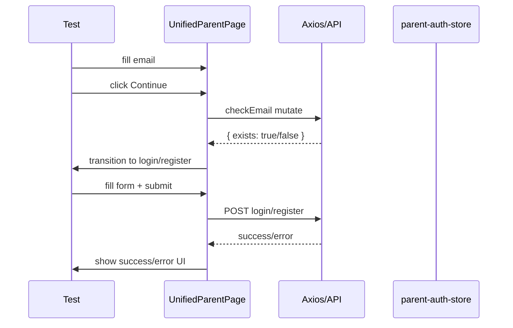

# Test Report — feat/STORY-062-unified-parent-auth (2026-06-19)

## Summary
| Metric | Result |
|--------|--------|
| Reliability | High |
| Total Tests | 30 |
| Passed | 30 |
| Failed | 0 |
| Coverage (UnifiedParentPage.jsx) | 95.71% Stmts, 92.2% Branch, 100% Funcs |

## Test Flow

## Tests Created/Updated
| Type | File | Count | Status |
|------|------|-------|--------|
| Component | UnifiedParentPage.test.jsx | 24 | PASS |
| Hook | useCheckEmail.test.js | 6 | PASS |

## Tests Added (this session)
| Test | Description |
|------|-------------|
| Age consent validation error | Verify `register.errorAgeConsent` shown when consent unchecked |
| Confirm password mismatch | Verify `unifiedAuth.errorPasswordMismatch` on mismatch |
| Weak password rules | Verify password rule validators fire for weak passwords |
| Login submitting spinner | Verify Spinner appears in login button during submission |
| Register generic error | Verify `unifiedAuth.errorGeneric` shown on register failure |

## Issues Found
| Severity | Area | Description | Owner |
|----------|------|-------------|-------|
| None | — | All tests pass, no regressions | — |

## Acceptance Criteria Validation
- [x] GIVEN a user visits `/parent`, THEN the email form is shown with "Continuar" button
- [x] GIVEN a user enters an invalid email, THEN validation error is shown
- [x] GIVEN a user enters an existing email, THEN the login form is shown
- [x] GIVEN a user enters a new email, THEN the register form is shown
- [x] GIVEN a user submits registration without age consent, THEN age consent error is shown
- [x] GIVEN a user enters mismatched passwords, THEN mismatch error is shown
- [x] GIVEN checkEmail fails, THEN appropriate error is shown (rate limit / generic)
- [x] GIVEN login is submitting, THEN spinner is shown
- [x] GIVEN register fails with 409, THEN user is switched to login mode
- [x] GIVEN expired=true query param, THEN session expired alert is shown

## Coverage (UnifiedParentPage.jsx)
- Statements: 95.71%
- Branch: 92.2%
- Functions: 100%
- Lines: 95.71%

**Status**: PASSED