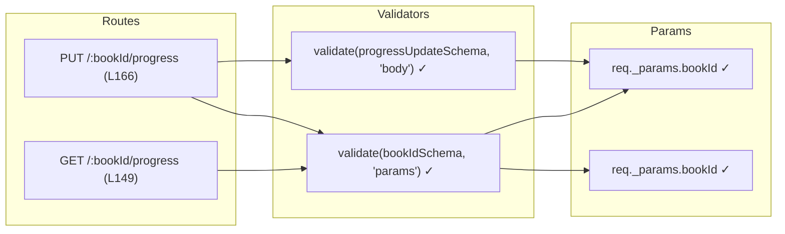

# QA Report — book-router progress route fixes (2026-05-14) [r1]

## Summary
| Tests | Passed | Failed | Coverage |
|-------|--------|--------|----------|
| 495   | 495    | 0      | N/A (no coverage threshold specified) |

## Test Suites
| Type | Status |
|------|--------|
| Unit | PASS |
| Integration | PASS |
| E2E | PASS |

## Issues Found
None.

## Acceptance Criteria Validation

### AC1: `GET /:bookId/progress` has `validate(bookIdSchema, 'params')`
- [x] **Line 149** — `router.get('/:bookId/progress', validate(bookIdSchema, 'params'), ...)` — confirmed ✓

### AC2: `GET /:bookId/progress` uses `req._params.bookId` instead of `req.params.bookId`
- [x] **Line 153** — `bookManager.getReadingProgressManager(req.childId, req._params.bookId)` — confirmed ✓

### AC3: `PUT /:bookId/progress` has `validate(bookIdSchema, 'params')`
- [x] **Line 166** — `router.put('/:bookId/progress', validate(bookIdSchema, 'params'), validate(progressUpdateSchema, 'body'), ...)` — confirmed ✓

### AC4: `PUT /:bookId/progress` uses `req._params.bookId`
- [x] **Line 172** — `req._params.bookId` passed to `updateReadingProgressManager` — confirmed ✓

### AC5: 6 new tests added for progress routes
- [x] **book-router.test.js** — 6 new `it(...)` blocks for progress:
  - `GET /:bookId/progress — 400 VALIDATION_ERROR for invalid bookId`
  - `GET /:bookId/progress — 404 when no reading progress exists`
  - `GET /:bookId/progress — 200 returns reading progress`
  - `PUT /:bookId/progress — 400 VALIDATION_ERROR for invalid bookId`
  - `PUT /:bookId/progress — 400 VALIDATION_ERROR for invalid body (percentage > 100)`
  - `PUT /:bookId/progress — 200 updates and returns reading progress`

### AC6: All 495 tests pass
- [x] **30 test files, 495 tests, all passed** — confirmed ✓

## Lint Validation
- No ESLint/prettier configuration found in project. Lint not runnable.

## Recommendations
- Consider adding ESLint configuration for future lint enforcement.

## Test Flow Diagram

```mermaid
flowchart TD
    A[book-router.js] --> B[GET /:bookId/progress]
    A --> C[PUT /:bookId/progress]
    
    B --> D[validate(bookIdSchema, 'params')]
    D --> E[req._params.bookId → getReadingProgressManager]
    
    C --> F[validate(bookIdSchema, 'params')]
    C --> G[validate(progressUpdateSchema, 'body')]
    F --> H[req._params.bookId → updateReadingProgressManager]
    
    D --> I[400 on invalid bookId]
    C --> J[400 on invalid bookId or body]
    
    subgraph Tests
        T1[GET 400 invalid bookId]
        T2[GET 404 no progress]
        T3[GET 200 returns progress]
        T4[PUT 400 invalid bookId]
        T5[PUT 400 invalid body]
        T6[PUT 200 updates progress]
    end
    
    B --> Tests
    C --> Tests
    
    subgraph Results
        R[495/495 PASSED]
    end
    
    Tests --> Results
```

## Code Check Diagram



---
**Status**: PASSED
